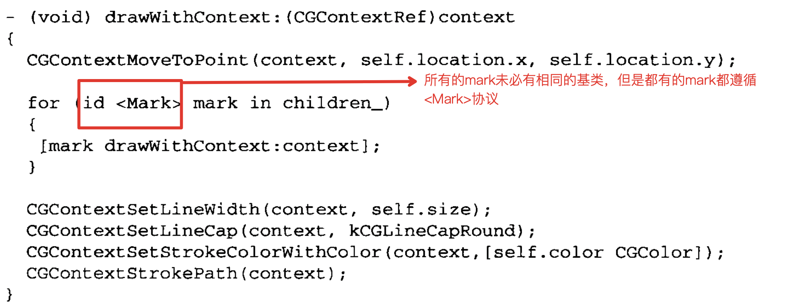

# 第二章

# ViewController之间的解耦

### 问题

使用系统的跳转方式，会对ViewController之间产生依赖，并且会将绑定跳转事件的控件也耦合进去。

### 中介者模式

用一个对象来封装一组对象之间的逻辑。它避免了对象之间的显式引用。

书中引入了一个中介者`CoordinatingController`，在这个类中，整合了另外三个类的跳转关系

```objective-c
#import "CanvasViewController.h"
#import "PaletteViewController.h"
#import "ThumbnailViewController.h"
```

后续修改只在`CoordinatingController`中即可，它会根据按钮的点击事件，以及按钮的`tag`（这里，相当于按钮根据tag，知道自己要做什么事情，跳转哪个VC），从而做对应的处理

# 第三章 原型模式

- 深复制和浅复制
- NSObject的深复制，实现`CopyWithZone`协议

在`Mark.h`文件中，声明`copy`接口，要求子类实现

```objective-c
@protocol Mark <NSObject, NSCopying, NSCoding>

- (id) copy;
```

子类`Dot.h`中，实现`copyWithZone`的方法

```objective-c

- (id)copyWithZone:(NSZone *)zone
{
  Dot *dotCopy = [[[self class] allocWithZone:zone] initWithLocation:location_];
  // copy the color
  [dotCopy setColor:[UIColor colorWithCGColor:[color_ CGColor]]];
  // copy the size
  [dotCopy setSize:size_];
  
  return dotCopy;
}

```

> Mark协议采用了NSObject协议，而Mark的具体类采用了Mark协议并且子类化NSObject类。NSObject协议没有声明copy方法，但是NSObject声明了。NSObject型的接收器收到copy消息时，NSObject依次向其采用了NSCopying协议的子类转发消息。子类要实现所需的在NSCopying中定义的copyWithZone:zone方法，返回自身的副本。如果子类没有实现此方法，那么会抛出NSInvalidArgumentException异常实例。

我推测合理的解释是说：其实每个子类本身都实现了copyWithZone方法，那么调用copy方法的时候，自然而然会走copyWithZone方法。但是子类并没有继承一个NSCopying协议，为了使得编译通过，所以在Mark协议中，声明了copy方法。

# 第四章 工厂模式

> 定义：定义创建对象的接口，让子类决定实例化哪一个类。工厂方法使得一个类的实例化延迟到其子类。

场景：

- 编译时，无法准确预期要创建对象的类；
- 类想让子类决定运行时创建什么；
- 类有若干辅助类为其子类，而你香江返回哪个子类这一信息局部化

CoacoTouch中的NSNumber用到了，例如[NSNumber numberWithBool:YES];

# 第五章 抽象工厂

 抽象工厂提供了一个固定的接口，用于创建一系列有关联或者相互依存的对象，而不必指定其具体类或者创建细节。

Client只知道抽象工厂。工厂方法把实际的创建过程推迟到重载它的子类中。

抽象工厂与工厂方法的区别

| 抽象工厂                         | 工厂方法                                 |
| -------------------------------- | ---------------------------------------- |
| 通过对象的组合创建抽象产品       | 通过类继承创建抽象产品                   |
| 创建多系列产品                   | 创建一种产品                             |
| 必须修改父类的接口才能支持新产品 | 子类化创建者并重载工厂方法，以创建新产品 |

类簇，NSNumber本身是一个高度抽象的工厂，NSCFBoolean和NSCFNumber是具体工厂的子类。

外部只使用抽象工厂类，而不是直接使用子类

## 参考链接


[抽象工厂模式和工厂模式的区别](https://www.zhihu.com/question/20367734)

# 第六章 生成器模式

# 第七章 单例模式

子类化一个单例

```objective-c

@interface Singleton : NSObject 
{

}

+ (Singleton *) sharedInstance;

- (void) operation;


@end

@implementation Singleton
static Singleton *sharedSingleton_ = nil;
+ (Singleton *) sharedInstance
{
  if (sharedSingleton_ == nil)
  {
    sharedSingleton_ = [NSAllocateObject([self class], 0, NULL) init];
  }
  
  return sharedSingleton_;
}
@end

  
@interface MySingleton : Singleton
{

}

@end
  
@implementation MySingleton

- (id) init
{
  
  return self; 
}

- (void) operation
{
  // do something
  NSLog(@"MySingleton");
}
@end
```


# 第八章 适配器（包装器）模式

客户端在访问数据的时候，可能目前接口不能提供对应的能力，使用适配器模式，主要是委托模式（Delegate）和块（Block）来实现。


客户端需要的数据，与依赖实例或者类提供的数据格式不一致，需要用适配器进行转换。·

# 第十五章 访问者

# 第十六章 装饰

以UIImage为例，想为UIImage添加新的接口或者能力，不采用子类化的形式，就可以采用装饰器的方式。

定义UIImage的范畴 ImageComponent。UIImage本身自己带了一些方法，另外还遵循ImageComponent协议的方法。

```objc
// ImageComponent.h
@protocol ImageComponent <NSObject>

// We will intercept these
// UIImage methods and add
// additional behavior
@optional
- (void) drawAsPatternInRect:(CGRect)rect; 
- (void) drawAtPoint:(CGPoint)point;
- (void) drawAtPoint:(CGPoint)point blendMode:(CGBlendMode)blendMode alpha:(CGFloat)alpha;
- (void) drawInRect:(CGRect)rect;
- (void) drawInRect:(CGRect)rect blendMode:(CGBlendMode)blendMode alpha:(CGFloat)alpha;

@end

// UIImage+ImageComponent.h
#import "ImageComponent.h"

@interface UIImage (ImageComponent) <ImageComponent>

@end
```

谁是装饰器呢？

遵循了`ImageComponent`的类`ImageFilter`是装饰器。这个类中的`apply`方法提供了额外的行为。任何继承自`ImageFilter`类的子类，在响应方法时，会走到`ImageComponent`协议的方法。

1. 执行`UIImage`的drawInRect方法

```objective-c
- (void)drawRect:(CGRect)rect 
{
  // Drawing code.
  [image_ drawInRect:rect];
}
```

2. 这个方法被`ImageFilter`进行了转发。这里`forwarding`在`ImageComponent`协议中声明的那些方法，相当于做了一层Hook。

```objective-c
// ImageFilter.m
- (id) forwardingTargetForSelector:(SEL)aSelector
{
  NSString *selectorName = NSStringFromSelector(aSelector);
  if ([selectorName hasPrefix:@"draw"])
  {
    [self apply];  //实际是ImageFilter的方法
  }
  
  return component_;  //返回对应的Filter
}

```

在初始化的时候，image被转换为遵循`ImageComponent`的对象。因为`ImageTransformFilter`中，没有对应协议中的方法，所以调用了`forwardingTargetForSelector`这个方法，在父类`ImageFilter`中实现了方法转发。

```objc
 UIImage *image = [UIImage imageNamed:@"Image.png"];
id <ImageComponent> transformedImage =[[ImageTransformFilter alloc] initWithImageComponent:image
                                                                                       transform:finalTransform];
- (id) initWithImageComponent:(id <ImageComponent>)component 
                    transform:(CGAffineTransform)transform
{
  if (self = [super initWithImageComponent:component])
  {
    [self setTransform:transform];
  }
  
  return self;
}
```


3. 子类`ImageTransformFilter`实现了`apply`方法

```objective-c
//ImageTransformFilter.m
- (void) apply
{
  CGContextRef context = UIGraphicsGetCurrentContext();
  
  // setup transformation
  CGContextConcatCTM(context, transform_);
}
```

> **重点 重点 重点：**
>
> 在 forwardingTargetForSelector中先调用自己的apply方法，然后返回它所引用的component.
>
> 1.因为ImageFilter装饰器中没有draw:方法，所以向Image对象发送[self setNeedDisplay]消息时，ImageFilter对象会调用自己的forwardingTargetForSelector方法，这方法内包含了当前装饰器的功能扩展，会执行扩展功能。
>
> 2.方法的最后有return component; 这一句是进行消息转发，让component对象进行处理这次绘制。
>
> **调用流程如下：**
>
> 1.向ImageTransformFilter发送 drawInRect消息
>
> 2.ImageTransformFilter因为没有drawInRect方法，而调用父类的forwardingTargetForSelector方法
>
> 3.在父类的forwardingTargetForSelector方法中 包含 [selfapply];
>
> 4.当在父类中调用[selfapply];代码时，会执行ImageTransformFilter的apply方法。（方法的泛型）
>
> 5.最后调用returncomponent_;，将消息传给下一个图像滤镜组件。
>
> 6.重复1-5的过程。完成了消息的转发过程，形成任务处理链条。


# 第十七章 责任链模式

将子类处理不了的场景，转发给父类，即设置一个`nextHandler`作为兜底。每个子类在初始化完成以后，都会设置自己的一个`nextHandler`。当处理不了的时#候，触发父类的方法，并在`nextHandler`中得到处理

# 第二十章 命令模式

`NSInvocation`的使用


`NSUndoManager`


# 第二十一章 享元模式

1. 工厂模式，创建享元池。

```objc
typedef enum {
    HXBookType_Zero,
    HXBookType_One,
    HXBookType_Two,
    HXBookType_Three,
    HXBookType_Four,
    HXBookType_Five,
    HXBookType_Total // 计数用
}HXBookType;

@interface HXBookFactory : NSObject

// 缓存池, 存放享元对象
@property (nonatomic, strong) NSMutableDictionary *bookPool;

// 创建花的工厂方法
- (HXBookModel *)bookWithType:(HXBookType)type;

@end

```


2. 每次需要对象的时候，从享元池取。

```objective-c
- (HXBookModel *)bookWithType:(HXBookType)type {
    // 去享元池里面取
    HXBookModel *book = [self.bookPool objectForKey:[NSNumber numberWithInteger:type]];
    
    // 如果没取到就创建并加入享元池
    if (!book) {
        book = [[HXBookModel alloc] init];
        switch (type) {
            case HXBookType_Zero:
                book.name = @"0";
                book.imageName = @"0-0";
                break;
                
            case HXBookType_One:
                book.name = @"1";
                book.imageName = @"0-1";
                break;
                
            case HXBookType_Two:
                book.name = @"2";
                book.imageName = @"0-2";
                break;
                
            case HXBookType_Three:
                book.name = @"3";
                book.imageName = @"0-3";
                break;
                
            case HXBookType_Four:
                book.name = @"4";
                book.imageName = @"0-4";
                break;
                
            case HXBookType_Five:
                book.name = @"5";
                book.imageName = @"0-5";
                break;
                
            default:
                break;
        }
        [self.bookPool setObject:book forKey:[NSNumber numberWithInt:type]];
    }
    return book;
}

```

3. 外部访问

```objectivec
@interface ViewController ()
// 借来的书
@property (nonatomic, strong) NSMutableArray *bookArray;
// 图书工厂实例
@property (nonatomic, strong) HXBookFactory *bookFactory;

@end

  
@implementation ViewController

- (void)touchesBegan:(NSSet<UITouch *> *)touches withEvent:(UIEvent *)event {
    [self lookLook];
}

// 看一看
- (void)lookLook {
    for (NSInteger i = 0; i < 1000 * 500; i++) {

        /** 享元模式借阅 */
        HXBookType type = arc4random_uniform(HXBookType_Total);
        HXBookModel *model = [self.bookFactory bookWithType:type];
        [self.bookArray addObject:model];
        
        /** 普通方式借阅 */
        //        HXBookModel *model = [[HXBookModel alloc] init];
        //        model.name = @"1";
        //        model.imageName = @"1-1";
        //        [self.bookArray addObject:model];

    }
}

- (NSMutableArray *)bookArray {
    if (!_bookArray) {
        _bookArray  = [[NSMutableArray alloc] init];
    }
    return _bookArray;
}

- (HXBookFactory *)bookFactory {
    if (!_bookFactory) {
        _bookFactory  = [[HXBookFactory alloc] init];
    }
    return _bookFactory;
}
```

## 优点

显著降低内存占用


# 第二十二章 代理

使用`NSProxy`技术，不需要创建对象，只是弱持有，并实现方法的转发，主要实现下面两个接口：

```objc
- (void)forwardInvocation:(NSInvocation *)invocation;

- (NSMethodSignature *)methodSignatureForSelector:(SEL)sel;
```

举个例子：

```objective-c
@interface MyProxy : NSProxy{
//再内部hold住一个要hook的对象
id _innerObject;
}
+(instancetype)proxyWithObj:(id)object;
@end

@interface Dog : NSObject
-(NSString *)barking:(NSInteger)months;
@end


@implementation MyProxy
+(instancetype)proxyWithObj:(id)object{
    MyProxy *proxy = [MyProxy alloc];
    //hold住要hook的对象
    proxy->_innerObject = object;
    //注意返回的值是Proxy对象
    return proxy;
}
- (NSMethodSignature *)methodSignatureForSelector:(SEL)sel{
    //这里可以返回任何NSMethodSignature对象，你也可以完全自己构造一个
    return [_innerObject methodSignatureForSelector:sel];
}
- (void)forwardInvocation:(NSInvocation *)invocation{
    if([_innerObject respondsToSelector:invocation.selector]){
        NSString *selectorName = NSStringFromSelector(invocation.selector);
        NSLog(@"Before calling %@",selectorName);
       
        //消息转发
        [invocation invokeWithTarget:_innerObject];
      
       // 或者
       // [invocation setTarget:self.objc];
       // [invocation invoke];
    }
}
@end

@implementation Dog
-(NSString *)barking:(NSInteger)months{
    return months > 3 ? @"wang wang!" : @"eng eng!";
}
@end
```


注意，调用获取参数接口时，需要声明为`__weak`或者`__unsafe_unretained`的属性，否则会出现崩溃

```objective-c
__weak id obj;    //这儿必须用弱持有修饰
[invocation getArgument:&obj atIndex:i];
```


# Coding Tips

## 协议的使用

Protocol在iOS编程中，经常被用到。传统的实现多个子类实现某个方法的方式是，所有子类继承一个基类，而基类自己有一个未被实现的公有方法，所以继承的子类自己覆盖这个方法。这样做的缺点就是，实现某个方法的前提是，所有的类必须有一个基类。

在《第二章》中，看到一个操作。既可以保证这个类能实现对应的方法，也不用确保这个类继承自某个具体的类。只需要让**所有需要实现这个方法**的类，都遵循一个协议即可。



## 未重载异常

当父类的方法需要子类重载，但是没有被重载时，抛出异常

```objective-c
#define BMWCMethodNotImplemented() \
    @throw [NSException exceptionWithName:NSInternalInconsistencyException \
                                   reason:[NSString stringWithFormat:@"You must override %@ in a subclass.", NSStringFromSelector(_cmd)] \
                                 userInfo:nil]

// 其实就是下面这个
@throw [NSException exceptionWithName:NSInternalInconsistencyException \
                                   reason:[NSString stringWithFormat:@"You must override %@ in a subclass.", NSStringFromSelector(_cmd)] \
                                 userInfo:nil]

```

