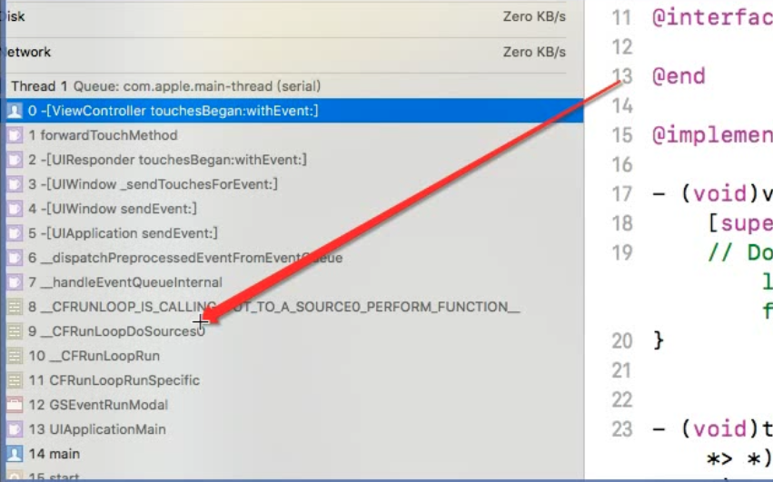
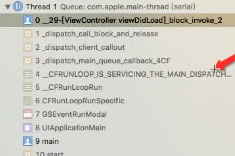

## items

### CFRunLoop

```c
struct __CFRunLoop {
    CFRuntimeBase _base;
    pthread_mutex_t _lock;			/* locked for accessing mode list */
    __CFPort _wakeUpPort;			// used for CFRunLoopWakeUp 
    Boolean _unused;
    volatile _per_run_data *_perRunData;              // reset for runs of the run loop
    pthread_t _pthread;
    uint32_t _winthread;
    CFMutableSetRef _commonModes;           //公共模式，设置为commodes的timer，会被加入到下面的items里
    CFMutableSetRef _commonModeItems;       //公共模式下的items
    CFRunLoopModeRef _currentMode;
    CFMutableSetRef _modes;                 //其他非公共模式
    struct _block_item *_blocks_head;
    struct _block_item *_blocks_tail;
    CFAbsoluteTime _runTime;
    CFAbsoluteTime _sleepTime;
    CFTypeRef _counterpart;
};
c
```


### Source

`CFRunLoopSource`

```c
struct __CFRunLoopSource {
    CFRuntimeBase _base;
    uint32_t _bits;      
    pthread_mutex_t _lock;
    CFIndex _order;			/* immutable */
    CFMutableBagRef _runLoops;
    union {
	CFRunLoopSourceContext version0;	/* immutable, except invalidation */
        CFRunLoopSourceContext1 version1;	/* immutable, except invalidation */
    } _context;
};

```

Source0：需要把bits位标记才处理 

Source1：系统自动处理

#### NSPort

1. NSPort是什么?
    通信通道的抽象类。

2. 能干什么?
    我们能够使用端口进行线程间的一个通信。 

3. 要接收传入消息，必须将NSPort对象添加到NSRunLoop对象中作为输入源 

4. 端口用完之后，如果不用， 要释放， 不然产生的端口对象可能会逗留并创建内 存泄漏。要使端口对象无效，请调用它的**invalidate**方法。 

5. Foundation定义了NSPort的三个具体子类。

   NSMachPort和NSMessagePort只允许本地(在同一台机器上)通信。NSSocketPort支持本地和远程通信，但是对于本地情 况，可能比其他的要昂贵。在使用allocWithZone:或port创建NSPort对象时，将创建 一个NSMachPort对象。 

## Mode

### **kCFRunLoopDefaultMode**

### **UITrackingRunLoopMode**

UI跟踪模式，ScrollView滚动时切换

### NSRunLoopCommonModes

commonModes并不是一个具体模式，而是一个标记，用来操作common items。

```c
void CFRunLoopAddTimer(CFRunLoopRef rl, CFRunLoopTimerRef rlt, CFStringRef modeName) {    
    CHECK_FOR_FORK();

    //如果要添加timer的Runloop对象已经正在释放了，就不要添加了，直接返回
    if (__CFRunLoopIsDeallocating(rl)) return;

    //判断timer对象是否存在，timer关联的runloop是否存在，
    //并且timer当前关联的runloop不能是要添加它的runloop，如果是的话直接返回，不需要添加了
    if (!__CFIsValid(rlt) || (NULL != rlt->_runLoop && rlt->_runLoop != rl)) return;

    //给当前的runloop加锁，防止在其他地方操作
    __CFRunLoopLock(rl);

    //如果当前要将timer添加到Runloop的commonModes集合下的话
    if (modeName == kCFRunLoopCommonModes) {
        //先判断Runloop对象是否有commonModes集合
        //如果有 : 则直接拿到集合，否则set为NULL
        CFSetRef set = rl->_commonModes ? CFSetCreateCopy(kCFAllocatorSystemDefault, rl->_commonModes) : NULL;
        //如果RunLoop对象没有commonModesItems
        if (NULL == rl->_commonModeItems) {
            //创建一个RunLoop的commonModes集合
            rl->_commonModeItems = CFSetCreateMutable(kCFAllocatorSystemDefault, 0, &kCFTypeSetCallBacks);
        }
        //将timer添加到RunLoop的commonModeItems集合里面
        CFSetAddValue(rl->_commonModeItems, rlt);
        //如果RunLoop的commonModes集合不为空
        if (NULL != set) {
            //把runloop对象和timer包装成数组
            CFTypeRef context[2] = {rl, rlt};
            //添加一个新的commonModesItems，也就是添加一个新的事件到RunLoop里面
            /* add new item to all common-modes */
            //这里就是遍历commonModes集合，然后对每一个标示(defaultMode和trackingMode)调用
            //第二个参数那个函数,也就是在每一个commonModes的mode对象中都注册了一个timer的事件源
            CFSetApplyFunction(set, (__CFRunLoopAddItemToCommonModes), (void *)context);
            CFRelease(set);
        }
    } else {
      
    }
    __CFRunLoopUnlock(rl);
}
```


> 有时你需要一个 Timer，在两个 Mode 中都能得到回调，一种办法就是将这个 Timer 分别加入这两个 Mode。还有一种方式，就是将 Timer 加入到顶层的 RunLoop 的 “commonModeItems” 中。”commonModeItems” 被 RunLoop 自动更新到所有具有”Common”属性的 Mode 里去。


## 作用

### 触发事件



触发事件，触发了Source1，Source1再触发了Source0  


### GCD

```objective-c
 dispatch_async(dispatch_get_global_queue(0, 0), ^{
        dispatch_async(dispatch_get_main_queue(), ^{
            NSLog(@"%s", __func__);  //回到主线程，runloop参与
        });
    });
```




从线程回到主线程时，也是runloop操作的


### 线程保活

未开启runloop，下面的定时器不启动。创建的`thread`直接销毁

```objective-c
 PLHThread *thread = [[PLHThread alloc] initWithBlock:^{
      [NSTimer scheduledTimerWithTimeInterval:1 repeats:YES block:^(NSTimer * _Nonnull timer) {
          NSLog(@"定时打招呼!!!");
      }];
      
      // 下面这句开启runloop
      [[NSRunLoop currentRunLoop] run];
}];
    
  [thread start];
```

开启Runloop`[[NSRunLoop currentRunLoop] run];`


## 接口

- 获取runloop所有支持的模式

  ```c++
  CFArrayRef array = CFRunLoopCopyAllModes(mode);
  ```

- 获取runloo当前的模式

  ```
  CFRunLoopMode mode = CFRunLoopCopyCurrentMode(mainRunLoop);
  ```

## 其他

- RunLoop实现休眠的原理

  1. 调用了内核API`mach_msg`，进入内核态。由内核将线程置于休眠
  2. 有消息时，唤醒线程，回到用户态，来处理消息 

  