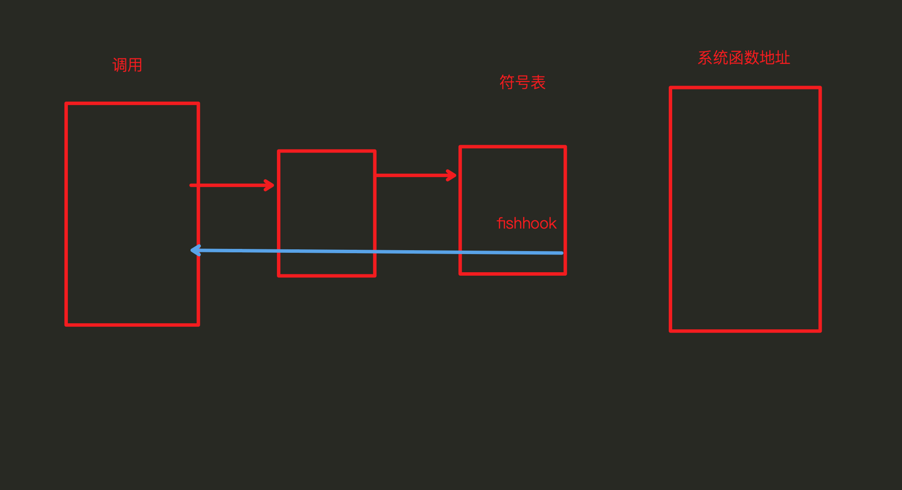

 # Hook原理

示例代码

```objective-c
#import "fishhook.h"

@interface ViewController ()

@end

@implementation ViewController

- (void)viewDidLoad {
    [super viewDidLoad];
    // Do any additional setup after loading the view.
    
    func("测试");
    NSLog(@"123");
    struct rebinding nslogBind;
    // 函数名称
    nslogBind.name = "NSLog";

    // 新的函数地址
    nslogBind.replacement = myNSLog;
    // 保存原始函数地址的变量的指针（因为原始符号表，根本就没有这个地址）
    // 不能hook自己写的函数，是因为符号表里根本没有func方法
    nslogBind.replaced = (void *)&old_nslog;

    struct rebinding rebs[] = {nslogBind};
    rebind_symbols(rebs, 1);
    rebind_symbols((struct rebinding [1]){"func",newFunc,(void *)&funcP}, 1);
    
}

static void (*old_nslog)(NSString *format, ...);

static void (*funcP)(const char *);

void newFunc(const char *str){
    NSLog(@"hook上了");
    funcP(str);
}

void func(const char * str){
    NSLog(@"%s",str);
}

void  myNSLog(NSString *format, ...){
    format = [format stringByAppendingString:@"==我的NSLog方法"];

    //调用原来的NSLog
    old_nslog(format);
}

- (void)touchesBegan:(NSSet<UITouch *> *)touches withEvent:(UIEvent *)event
{
    NSLog(@"点击了屏幕");
    func("hook一下");
}

@end

```


## fishhook是如何实现hook系统函数的

1. MachO被谁加载的？

   Dyld动态加载

2. ASLR技术

   MachO文件加载的时候，用的是随机地址

3. PIC位置代码独立（苹果独家）

   1）MachO内部需要调用系统的库函数时，

   2)先在**_DATA**段中建立一个指针（即符号），指向外部函数（fishhook修改了这个符号，使之指向了内部函数）

   <font color='blue'>3) dyld会进行动态绑定，将MachO中_DATA段中的指针指向外部函数</font>


## 查找关系

### 用MachOView查看NSLog的偏移


### 动态调试

找到MachO文件的加载地址为`` 0x0000000104940000``


将懒加载表的偏移与MachO的加载地址相加 `` 0x000000010494c000``


x命令是读取指针的值

这里得到的5c 82 67……这些，就是符号表绑定的地址（即外部函数的地址）

### 反汇编

使用dis -s命令反汇编


### 单步走，让rebind生效

再次用x命令，查看`` 0x000000010494c000``地址中的内容， 会发现发生了变化，此时，再用dis -s反汇编，得到结果


## fishhook是如何通过字符串找到对应的函数地址？

懒加载表（Lazy Symbol Pointers)与之对应的动态符号表(Dynamic Symbol Table)，两者一一对应


==>去Dynamic Symbol Table找


==>去**Symbol Table** 找到偏移


Data值为F5，十进制85.那么在Symbol Table中找到偏移为245的值


==>去**String Table**找


在String Table中的偏移是DD，十进制为204。





# Hook自己写的函数

```
void func(){

}
```

在编译后，生成一个地址，<font color='red'>没有函数名称！！！</font>全是地址。调用全是地址调用

```
0xF12309123
{

//一堆汇编代码

}
```

