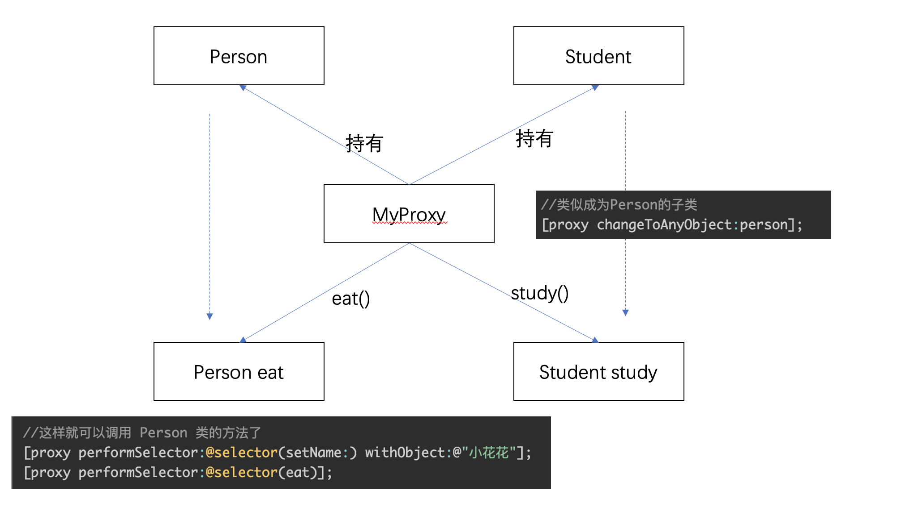

# 简介

`NSProxy` 是一个抽象类，它实现了`protocol NSObject` 所要求的基本方法，譬如内省相关的`isKindOfClass`：派发消息相关的`performSelector` 系列相关方法等；

但是**不能直接使用它创建对象**

子类化`NSProxy `的要求也很简单，实现`-forwardInvocation: `和`-methodSignatureForSelector: `这两个方法即可，显然，这两个方法与消息转发相关，实现这两个方法的典型姿势是：

```objective-c
@interface THProxyA : NSProxy
@property (nonatomic, strong) id target;
@end
@implementation THProxyA
- (id)initWithObject:(id)object {
    self.target = object;
    return self;
}
- (NSMethodSignature *)methodSignatureForSelector:(SEL)selector {
    return [self.target methodSignatureForSelector:selector];
}
- (void)forwardInvocation:(NSInvocation *)invocation {
    [invocation invokeWithTarget:self.target];
}
@end
```

## 与NSObject消息转发的不同

NSObject：在经历了`resolveInstanceMethod`和`forwardingTargetForSelector`这两个方法之后，才会去调用`forwardInvocation`和`methodSignatureForSelector`方法

NSProxy：找不到实现的方法时，直接调用`forwardInvocation`和`methodSignatureForSelector`方法

## init

没有定义init方法，创建对象时，不需要使用 `[super init]`初始化，直接`return self`

```objc
- (instancetype)initWithObj:(id)obj{
    _innerObject = obj;
    return self;
}
```

## 遵循`<NSObject>`协议

这里补充说明下protocal NSObject协议，与NSObject不同。在NSProxy中，他实现了这些方法

```objc
@protocol NSObject

- (BOOL)isEqual:(id)object;
@property (readonly) NSUInteger hash;

@property (readonly) Class superclass;
- (Class)class OBJC_SWIFT_UNAVAILABLE("use 'type(of: anObject)' instead");
- (instancetype)self;

- (id)performSelector:(SEL)aSelector;
- (id)performSelector:(SEL)aSelector withObject:(id)object;
- (id)performSelector:(SEL)aSelector withObject:(id)object1 withObject:(id)object2;

- (BOOL)isProxy;

- (BOOL)isKindOfClass:(Class)aClass;
- (BOOL)isMemberOfClass:(Class)aClass;
- (BOOL)conformsToProtocol:(Protocol *)aProtocol;

- (BOOL)respondsToSelector:(SEL)aSelector;

- (instancetype)retain OBJC_ARC_UNAVAILABLE;
- (oneway void)release OBJC_ARC_UNAVAILABLE;
- (instancetype)autorelease OBJC_ARC_UNAVAILABLE;
- (NSUInteger)retainCount OBJC_ARC_UNAVAILABLE;

- (struct _NSZone *)zone OBJC_ARC_UNAVAILABLE;

@property (readonly, copy) NSString *description;
@optional
@property (readonly, copy) NSString *debugDescription;

@end
```


# 用途

## 作为消息转发的代理类

只能处理接口中定义的部分方法，在Category中定义的方法，无法被NSProxy找到

# 模拟多继承（代理）



