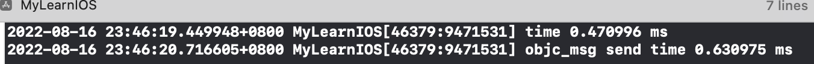

# isa

什么是isa指针？

```c
union isa_t {
    isa_t() { } // 构造函数
    isa_t(uintptr_t value) : bits(value) { }

    Class cls;
    uintptr_t bits;
#if defined(ISA_BITFIELD)
    struct { 					 // 位域的声明
        ISA_BITFIELD;  // defined in isa.h
    };
#endif
};
```

- 区别non_pointer和pointer的优化

手机做了non-pointer的优化，而PC没有做优化

- isa_t使用的是联合体结构

共有3个成员 cls、bits和struct结构的一个字段，共用一个地址

 对某一个成员赋值，会覆盖其他成员的值（也不奇怪，因为他们共享一块内存。但前提是成员所占字节数相同，当成员所占字节数不同时只会覆盖相应字节上的值，比如对char成员赋值就**不会把整个int成员覆盖掉**，因为char只占一个字节，而int占四个字节） [iOS底层-isa结构(isa_t)](https://www.jianshu.com/p/6b6bf1c27d8e)

- 位域

什么是位域？位域的优势？

```c
struct
{
  type [member_name] : width ;
};
```

Type:只能为 int(整型)，unsigned int(无符号整型)，signed int(有符号整型) 三种类型，决定了如何解释位域的值。

member_name:位域的名称。

width:位域中位的数量。宽度必须小于或等于指定类型的位宽度，而且最小值为1。

- cls

`Class`是`objc_class`结构体指针类型，`cls`在64位架构下是占8字节。

- bits

`bits` 是一个无符号长整形，占 8 个字节。

# objc_object

```c
struct objc_object {
	Class isa  OBJC_ISA_AVAILABILITY;
};

struct objc_object {
private:
    isa_t isa;
public:
  // ISA() assumes this is NOT a tagged pointer object
  Class ISA();
}
```

## id

一个指向类的实例指针

```c
/// A pointer to an instance of a class.
typedef struct objc_object *id;
```


## 初始化

当传入为pointer isa时，被当做普通的指针初始化

当传入nonpointer为true时，也即是手机端的程序

```c
inline void 
objc_object::initIsa(Class cls, bool nonpointer, bool hasCxxDtor) 
{ 
    ASSERT(!isTaggedPointer()); 
    
    if (!nonpointer) {
        isa = isa_t((uintptr_t)cls);  //被当做普通的指针初始化
    } else {
        isa_t newisa(0);
        newisa.bits = ISA_MAGIC_VALUE;
        // isa.magic is part of ISA_MAGIC_VALUE
        // isa.nonpointer is part of ISA_MAGIC_VALUE
        newisa.has_cxx_dtor = hasCxxDtor;
        newisa.shiftcls = (uintptr_t)cls >> 3;
        isa = newisa;
    }
}
```


# objc_class

```c
struct objc_class {
    Class isa  OBJC_ISA_AVAILABILITY;
#if !__OBJC2__
    Class super_class;
    const char *name;
    long version;
    long info;
    long instance_size;
    struct objc_ivar_list *ivars;
    **struct objc_method_list **methodLists**;
    **struct objc_cache *cache**;
    struct objc_protocol_list *protocols;
#endif
};
```


## 继承关系


这张图注意两点

- NSObject的父类 是 nil
- NSObject元类的父类是 NSObject

### objcect_getClass

```c++
+ (Class)class {
    return self;
}

- (Class)class {
    return object_getClass(self);
}

Class object_getClass(id obj)
{
    if (obj) return obj->getIsa();
    else return Nil;
}

inline Class objc_object::getIsa() 
{
    return ISA();
}

inline Class objc_object::ISA() 
{
    return (Class)(isa.bits & ISA_MASK);
}

```

getClass方法，获取自己的isa指针，类的isa指针是元类，实例的isa指针是类

### isKindOfClass

```c
+ (BOOL)isKindOfClass:(Class)cls {
    for (Class tcls = object_getClass((id)self); tcls; tcls = tcls->superclass) {
        if (tcls == cls) return YES;
    }
    return NO;
}

- (BOOL)isKindOfClass:(Class)cls {
    for (Class tcls = [self class]; tcls; tcls = tcls->superclass) {
        if (tcls == cls) return YES;
    }
    return NO;
}
```


### isMemeberOfClass

```
+ (BOOL)isMemberOfClass:(Class)cls {
    return object_getClass((id)self) == cls;
}

- (BOOL)isMemberOfClass:(Class)cls {
    return [self class] == cls;
}
```


# objc_method_list


```c
struct objc_method_list {
    struct objc_method_list *obsolete;
    int method_count;

#ifdef __LP64__
    int space;
#endif

    /* variable length structure */
    struct objc_method method_list[1];
};

struct objc_method {
    SEL method_name;
    char *method_types;    /* a string representing argument/return types */
    IMP method_imp;
};
```


# 对象的析构

## release 引用技术减一

执行release方法，根本上是`objc_object::rootRelease(bool performDealloc, objc_object::RRVariant variant)`

```c
ALWAYS_INLINE bool 
objc_object::rootRelease(bool performDealloc, bool handleUnderflow)
{
    //判断是否是TaggedPointer
    if (isTaggedPointer()) return false;

    bool sideTableLocked = false;

    isa_t oldisa;
    isa_t newisa;

 retry:
    do {
        oldisa = LoadExclusive(&isa.bits);
        newisa = oldisa;
        //是否是优化过的isa指针
        if (slowpath(!newisa.nonpointer)) {
            ClearExclusive(&isa.bits);
            if (sideTableLocked) sidetable_unlock();
            return sidetable_release(performDealloc);
        }
        
        // don't check newisa.fast_rr; we already called any RR overrides
        uintptr_t carry;
        newisa.bits = subc(newisa.bits, RC_ONE, 0, &carry);  // extra_rc--
        if (slowpath(carry)) {
            // don't ClearExclusive()
            goto underflow;
        }
    } while (slowpath(!StoreReleaseExclusive(&isa.bits, 
                                             oldisa.bits, newisa.bits)));

    if (slowpath(sideTableLocked)) sidetable_unlock();
    return false;

 underflow:
    // newisa.extra_rc-- underflowed: borrow from side table or deallocate

    // abandon newisa to undo the decrement
    newisa = oldisa;
    //是否has_sidetable_rc为true，引用计数是否存在sideTable中
    if (slowpath(newisa.has_sidetable_rc)) {
        if (!handleUnderflow) {
            ClearExclusive(&isa.bits);
            return rootRelease_underflow(performDealloc);
        }

        // Transfer retain count from side table to inline storage.

        if (!sideTableLocked) {
            ClearExclusive(&isa.bits);
            sidetable_lock();
            sideTableLocked = true;
            // Need to start over to avoid a race against 
            // the nonpointer -> raw pointer transition.
            goto retry;
        }

        // Try to remove some retain counts from the side table.        
        size_t borrowed = sidetable_subExtraRC_nolock(RC_HALF);

        // To avoid races, has_sidetable_rc must remain set 
        // even if the side table count is now zero.

        if (borrowed > 0) {
            // Side table retain count decreased.
            // Try to add them to the inline count.
            // 引用计数-1
            newisa.extra_rc = borrowed - 1;  // redo the original decrement too
            bool stored = StoreReleaseExclusive(&isa.bits, 
                                                oldisa.bits, newisa.bits);
            if (!stored) {
                // Inline update failed. 
                // Try it again right now. This prevents livelock on LL/SC 
                // architectures where the side table access itself may have 
                // dropped the reservation.
                isa_t oldisa2 = LoadExclusive(&isa.bits);
                isa_t newisa2 = oldisa2;
                if (newisa2.nonpointer) {
                    uintptr_t overflow;
                    newisa2.bits = 
                        addc(newisa2.bits, RC_ONE * (borrowed-1), 0, &overflow);
                    if (!overflow) {
                        stored = StoreReleaseExclusive(&isa.bits, oldisa2.bits, 
                                                       newisa2.bits);
                    }
                }
            }

            if (!stored) {
                // Inline update failed.
                // Put the retains back in the side table.
                sidetable_addExtraRC_nolock(borrowed);
                goto retry;
            }

            // Decrement successful after borrowing from side table.
            // This decrement cannot be the deallocating decrement - the side 
            // table lock and has_sidetable_rc bit ensure that if everyone 
            // else tried to -release while we worked, the last one would block.
            sidetable_unlock();
            return false;
        }
        else {
            // Side table is empty after all. Fall-through to the dealloc path.
        }
    }

    // Really deallocate.

    if (slowpath(newisa.deallocating)) {
        ClearExclusive(&isa.bits);
        if (sideTableLocked) sidetable_unlock();
        return overrelease_error();
        // does not actually return
    }
    newisa.deallocating = true;
    if (!StoreExclusive(&isa.bits, oldisa.bits, newisa.bits)) goto retry;

    if (slowpath(sideTableLocked)) sidetable_unlock();

    __sync_synchronize();
    if (performDealloc) {
        ((void(*)(objc_object *, SEL))objc_msgSend)(this, SEL_dealloc);
    }
    return true;
}
```

## dealloc方法

##### 一、dealloc调用流程

1、首先调用`_objc_rootDealloc()`

2、然后调用`rootDealloc()`

3、判断是否可以被释放，判断依据为，是否有以下5中情况：
 （1）`NONPointer_ISA`
 （2）`weakly_reference`
 （3）`has_assoc`
 （4）`has_cxx_dtor`
 （5）`has_sidetable_rc`

4、如果有以上5中情况中的任意一种，则调用`object_dispose()`方法；如果没有其中任意一种，表明可以执行释放操作，执行C函数的`free()`。

5、执行完毕。

```c
inline void objc_object::rootDealloc()
{
    if (isTaggedPointer()) return;  // fixme necessary?

    if (fastpath(isa.nonpointer                     &&
                 !isa.weakly_referenced             &&
                 !isa.has_assoc                     &&
#if ISA_HAS_CXX_DTOR_BIT
                 !isa.has_cxx_dtor                  &&
#else
                 !isa.getClass(false)->hasCxxDtor() &&
#endif
                 !isa.has_sidetable_rc))
    {
        assert(!sidetable_present());
        free(this);
    } 
    else {
        object_dispose((id)this);
    }
}

```

##### 二、object_dispose()调用流程

1、调用`objc_destructInstance()`

2、调用C函数的`free()`


##### 三、objc_destructInstance()调用流程

1、判断`has_cxx_dtor`，如果有C++相关内容，要调用`objc_cxxDestruct()`，销毁C++相关内容。

2、判断`hasAssociatatedObjects`，如果有，要调用`objc_remove_associations()`，销毁关联对象的一系列操作。

3、调用`clearDeallocating()`。

4、执行完毕。

```c
void *objc_destructInstance(id obj) 
{
    if (obj) {
        // Read all of the flags at once for performance.
        bool cxx = obj->hasCxxDtor();
        bool assoc = obj->hasAssociatedObjects();

        // This order is important.
        if (cxx) object_cxxDestruct(obj);
        if (assoc) _object_remove_assocations(obj, /*deallocating*/true);
        obj->clearDeallocating();
    }

    return obj;
}
```


##### 四、clearDeallocating()调用流程

1、执行`sideTable_clearDeallocating()`。

2、执行`weak_clear_no_lock`，在这一步骤中，会将指向该对象的弱引用指针置为nil。

3、执行`table.refcnts.eraser()`，从引用计数表中擦除改对象的引用计数。

4、至此，dealloc执行流程结束。

# 消息传递

## 直接调用

很显然，直接知道方法的地址来调用，比消息转发要快一些。使用`methodForSelector:`直接获取某个target下面的某个方法的地址

```c
void (*setter)(id, SEL, BOOL);
setter = (void (*)(id, SEL, BOOL))[self methodForSelector:@selector(setDirectBl:)];
```

获取self下面`setDirectBl`的地址。


比较直接调用和消息转发的耗时。

```c
 CFAbsoluteTime startTime =CFAbsoluteTimeGetCurrent();
for (int i = 0; i < 100000; i++) {
    setter(self, @selector(setDirectBl:),YES);
}
CFAbsoluteTime linkTime = (CFAbsoluteTimeGetCurrent() - startTime);

NSLog(@"time %f ms", linkTime *1000.0);
    
CFAbsoluteTime startTime =CFAbsoluteTimeGetCurrent();
for (int i = 0; i < 100000; i++) {
    [self setDirectBl:YES];
}
CFAbsoluteTime linkTime = (CFAbsoluteTimeGetCurrent() - startTime);
NSLog(@"objc_msg send time %f ms", linkTime *1000.0);
```



两者的调用时间，在10000次调用的时候，大概有0.2ms的差距。直接调用具有更好的优势。


