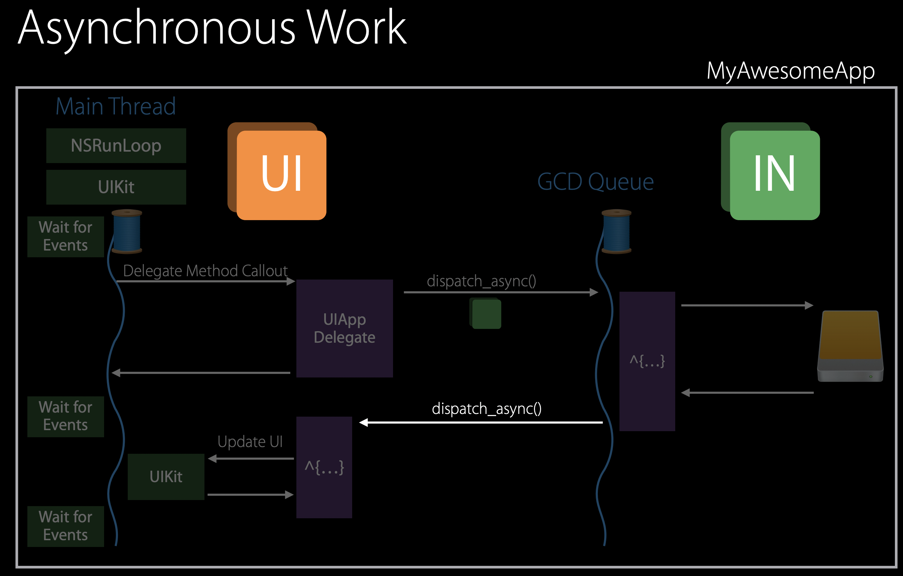
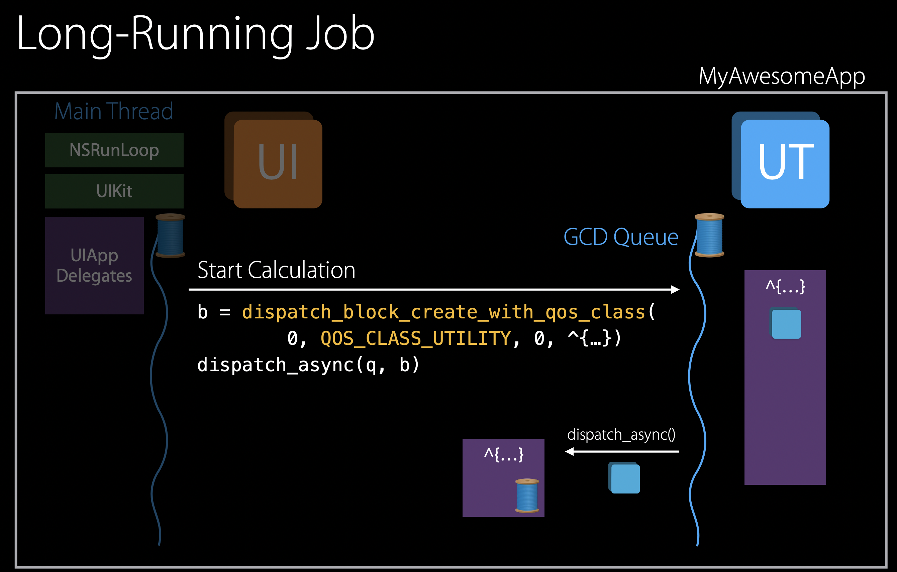
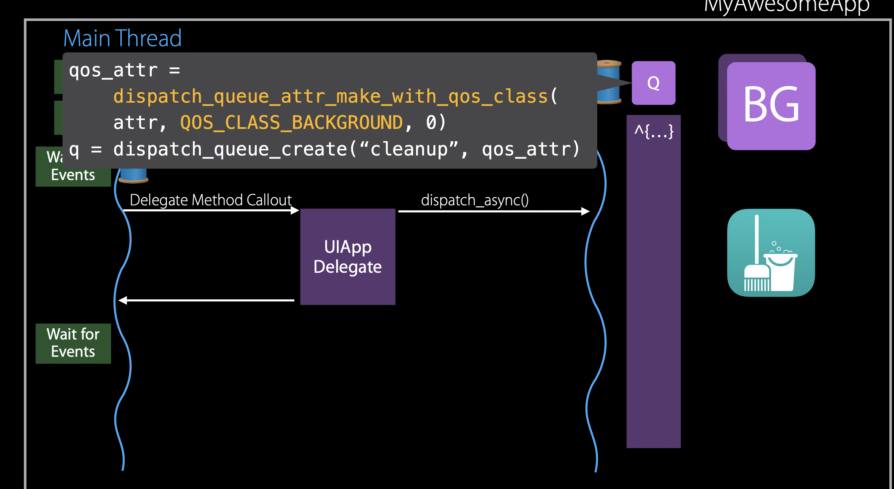
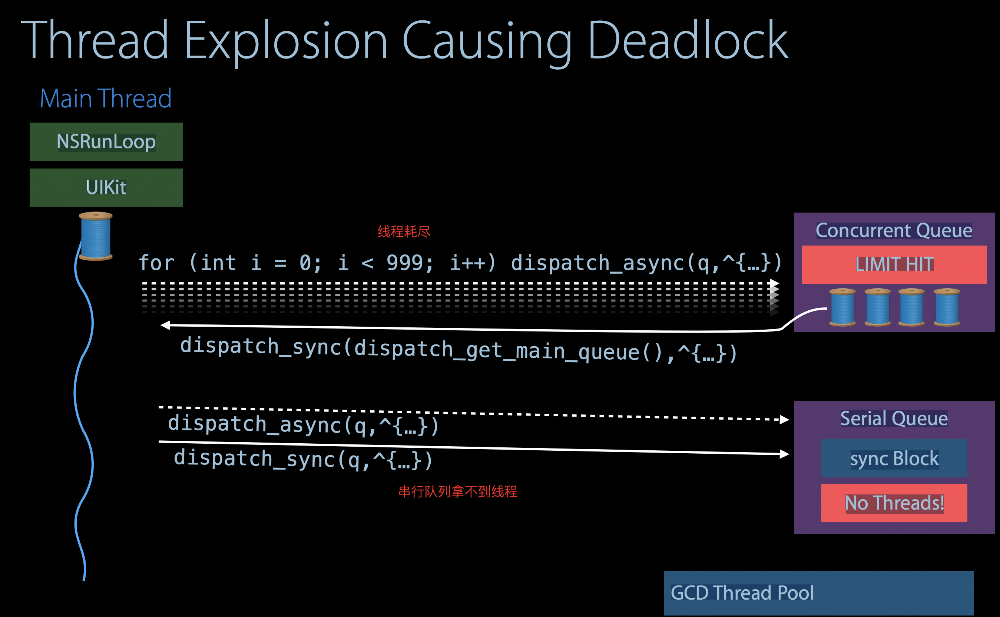
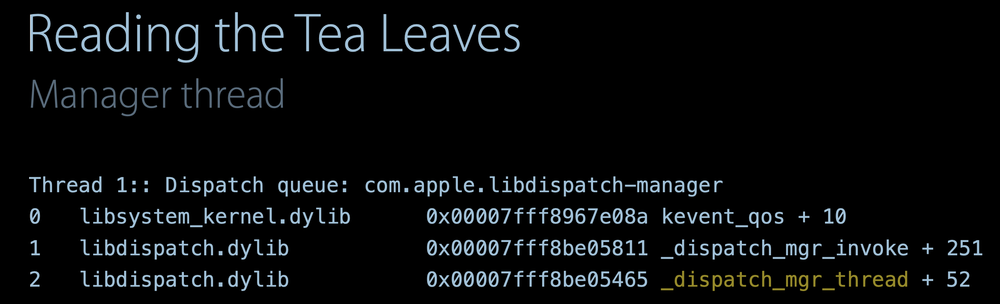
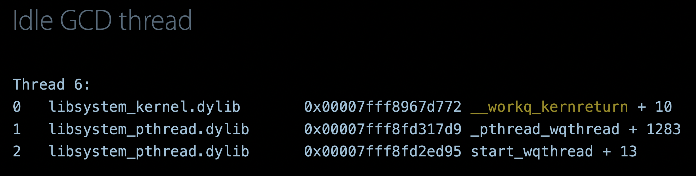
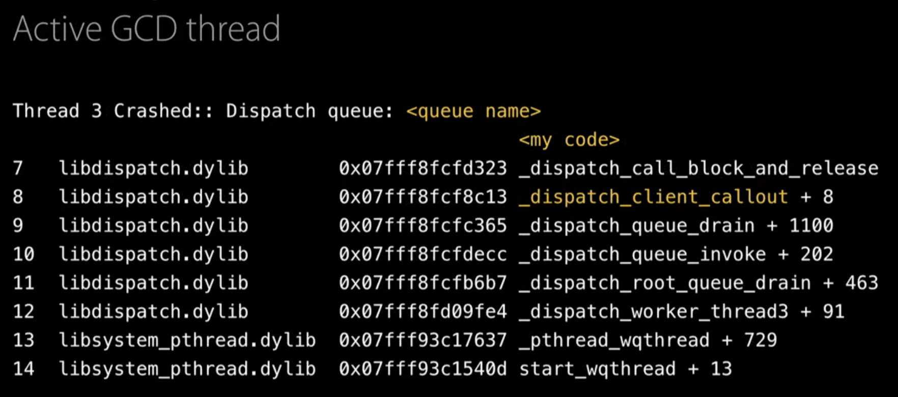
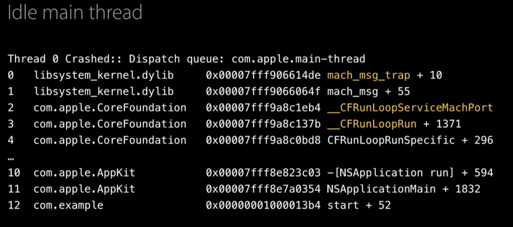
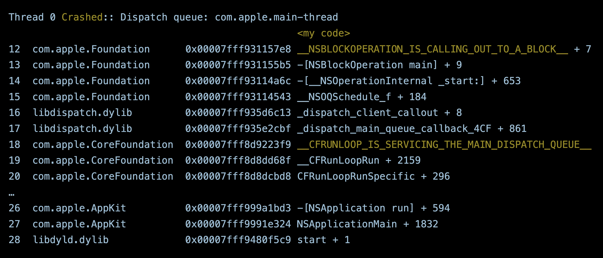

# Quality of Service Class

## User Interactive

使用场景：主线程，动画

## User Initiated

使用场景：即时结果

## Utility

使用场景：长时间运行的任务

## Backgroud

使用场景：无用户交互

# GCD Design Patterns with QoS


## 异步任务




## 长时间任务



```
dispatch_block_t blk =
dispatch_block_create_with_qos_class(0, QOS_CLASS_UTILITY, 0, ^{

});
dispatch_async(dispatch_get_main_queue(), blk);
```

用户不想影响APP的使用，UI能够正常加载，但是右侧是一个长耗时的操作。

解决方案：

- 将长耗时的任务，放到一个QoS的block里


## 保持状态任务

用户可能会退出APP或者切到后台

- 创建一个具备qos属性的队列




## 解决优先级翻转的问题

高QoS的任务被提交到串行队列中，但是队列中此时已经有低QoS的任务执行

解决：当更高级的QoS任务被加入到队列时，GCD自动启动QoS

## 使用串行队列上锁

- 必须使用同步操作来上锁

```objective-c
dispatch_queue_t queue = dispatch_queue_create("com.demo.queue", DISPATCH_QUEUE_SERIAL);

dispatch_sync(queue, ^{
        
    });
```

# RunLoop 与串行队列

当block内部的任务执行完成后，线程会被马上释放。不会再执行delay 1s以后的语法。原因在于`block`内部创建的线程，是临时线程池中的线程。block结束以后，就会被释放。

```
dispatch_queue_t queueA = dispatch_queue_create("queueA", NULL);
    dispatch_async(queueA, ^{
        [self performSelector:@selector(test2) withObject:[NSObject new] afterDelay:1.0];
    });
```


RunLoop

- 与一个线程绑定
- 获取代理方法作为回调
- 有自己的autoreleasePool，并且在每次循环中，会释放。唤醒前，以及退出前
- 循环可以被重新进入使用 （can be used reentrantly)

Serial Queue

- 使用GCD中的线程池的临时线程
- 使用block作为回调
- 当线程结束时，autoreleasepool弹出。当线程空闲时间，才会有autoreleasepool
- 不可重入

## 计时器

Runloop

- `-[NSObject performSelector:(SEL)aSelector withObject:(nullable id)anArgument afterDelay:(NSTimeInterval)delay]`
- `+[NSTimer scheduledTimeWithTimeInterval:]`

Serial Queue

- `dispatch_after()`
- `dispatch_source_set_timer()`

## 线程爆炸（Explosion）



- 不提倡的编程

使用栅栏函数

```c
dispatch_queue_t con = dispatch_queue_create("myqueue", DISPATCH_QUEUE_CONCURRENT);
    for (int i = 0; i < 999; i++) {
        dispatch_async(con, ^{
            NSLog(@"%d",i);
        });
    }
dispatch_barrier_sync(con, ^{
    // do sth.
});
```

- 提倡的编程

将线程调度，交给GCD

```c
dispatch_apply(999, con, ^(size_t i) {
        NSLog(@"%d",i);
    })
```

也可以用信号量解决，semaphore

# GCD & Crash Reports

- `com.apple.libdispatch-manager` : 线程管理的根框架（可忽略）



- `__workq_kernreturn `:这个线程当前正空闲



- `_dispatch_client_callout`：正活跃的线程



- `mach_msg_trap`：主线程闲置 且 `CFRunLoopRun`正在运行



- `__CFRUNLOOP_IS_SERVICING_THE_MAIN_DISPATCH_QUEUE_`: RunLoop正在服务于主队列



