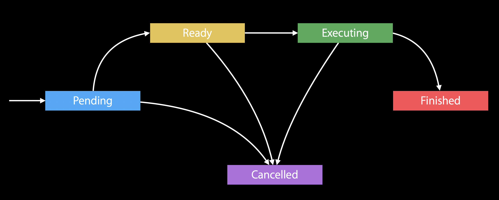

# NSOperationQueue

## 介绍

- 更高级别对`dispatch_queue_t`的封装
- 可取消
- 可设置最大并发数（默认是并发的）

# NSOperation

## 介绍

- 更高级别的`dispatch_block_t`

- 适合长时间执行的任务（秒级到几分钟）
- 可被继承，分为子类

## 生命周期

1. 初始化
2. Pending
3. Ready 态
4. Excuting态
5. Finished

在2，3，4三个状态下，都可以进入Cancel态

## Cacelled

属性级别的取消，所以改变为Cacel状态时，只是Operation属性的改变。所以子类在取消任务时，需要观察`cacelled`属性变化，从而做出对应的操作。

假设有这样的场景，你的操作是在后台线程中做的，但是你现在有个取消按钮，要取消这个任务。那么意味着，需要将主线程的消息，同步到后台队列，这段是需要耗时的。那么，如果任务恰好已经完成了，这个取消操作可能会失败。

## Ready

指当前任务已经准备好了，可以执行了。

### ★★★执行顺序

在串行队列中，**最先Ready的任务,最先执行**（区别于GCD队列！！！）；而不是最先被添加进去的任务先执行。如果两个任务同时Ready，那么按照被添加到队列的先后顺序执行。

## Beyond Basics

