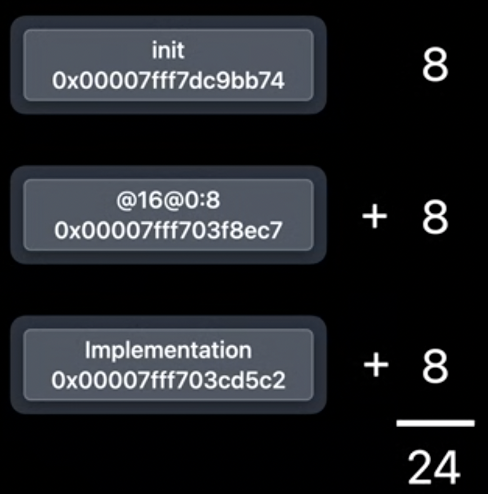
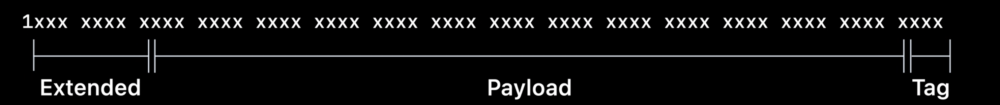

 一开始，演讲者就说了，你们基本不用改任何代码，但是你们APP的运行速度和性能会得到显著提升~因为这些改进是在太Cool了


# 数据结构的变化

 在磁盘上，你的App二进制文件中，类是这个样子的


存储类额外信息的结构体`class_ro_t`，包括了类名、方法、协议和实例变量的信息


当类从磁盘加载到内存中时，有些东西会发生变化。

所有的类都会链接成一个树状结构 这是通过使用 First Subclass 和 Next Sibling Class 指针实现的 这允许运行时遍历当前使用的所有类 这对于使方法缓存无效非常有用。当类被加载到内存中时，类结构会发生变化。


**Clean Memory** 

- 加载后不会发生改变的内存，例如`class_ro_t`
- 可以进行清除，节省内存空间

**Dirty Memory ** 

- 在进程运行时会发生改变的内存，比如说类的结构，在运行时会写入新数据，例如创建一个新的方法缓存，并从类中指向他
- Mac OS可以使用Swap技术置换出Dirty Memory，但iOS不能
- 这就是为什么类被分割成两部分的原因（一部分`class_ro_t`，一部分为`class_rw_t`)

这样设计的思路，是为了让保存在clean memory的数据越多越好。

将`class_rw_t`的结构进一步扩展


但是90%的类，用不到扩展方法或者是协议

## 检测某个APP中的`class_rw`

检测Mail App中，class_rw内存的占用

```shell
$heap Mail | egrep 'class_rw|COUNT'
```

**运行时**做了节省内存的事情，将`class_rw_ext_t`的内存节省起来


## APIs

- `class_getName`
- `class_getSuperclass`
- `class_copyMethodList`

这些方法，不会引起任何变化

# 方法列表的变化

每个类都附带一个方法列表。每个方法都包含三个信息：

- 方法名称，选择器，具有唯一性

- 方法的类型编码：表示参数和返回类型，运行时intropsetions和forwarding

- 方法地址


以`Init`方法为例，在64位系统中，每个数据都是一个指针，这意味着需要存储24个字节。



一个进程的放大图，包括堆、栈、二进制执行文件（蓝色区域）。如下：


方法在AppKit中的二进制如图所示：


二进制image可以加载到内存中的任何地方，这取决于动态链接器决定把它放在哪里

这意味着链接器需要将指针解析到image中 ，并在加载时将其修正为指向其在内存中的实际位置，而这也是有代价的。 现在 ，请注意一个来自二进制文件的类方法入口（声明），永远只指向该二进制文件内的方法实现。无法将方法的入口和实现放在两个二进制文件中。


所以，这些方法并需要整个64位空间的寻址，方法入口和实现很靠近，因此不要64位的绝对寻址，只需要32位的相对偏移即可。

优势如下：

- 相对偏移量始终相同，所以image从磁盘加载后不需要修正
- 存储在只读内存中，更加安全
- 内存使用加减少了一半

## how about swizzling？

为了解决Swizzling的问题，使用了一张全局表

1. 将方法映射到被Swizzle的实现上
2. 这个表很紧凑，内存每次都是按照页面来“弄脏”的
3. 使用一个表entry


## 支持的系统

- Big Sur
- iOS 14
- tvOS 14
- watchOS 7

工具自动根据二进制文件生成列表。Xcode也会按照旧的方式，生成方法列表。一个App可以同时使用两个格式。

# tagger pointer格式的变化

什么tagger pointer？


实际上，最低三位不会被使用，用于内存对齐，用到的只是中间部分——因为必须位于指针大小为整数倍的空间里

高地址始终为0。

在Inter设备上，tagger pinter把最后位置为1。以NSNumber为例：


在Swift中， 可以自定义tag的标签类型。

在ARM设别上， 最高位被设置为1，原因是对objc_msgSend的一个小优化，希望最快的找到方法路径，而最常见的场景是一个普通指针（非tag pointer）。从而节省了条件分支 


在iOS 14中的改动，tag被移动到了最后的三位



原因：

现有的工具 比如动态链接 会忽略指针的前 8 位 这是由于 一个名为 Top Byte Ignore 的 ARM 特性

而我们会把扩展标签 放在 Top Byte Ignore 位

对于一个对齐指针 底部 3 个位总是 0

但我们可以改变这一点 只需要通过在指针上添加一个小数字

我们将添加 7 以将低位设置为 1 请记住 7 表示这是一个扩展标签

这意味着我们实际上可将上面的这个指针 放入一个扩展标签指针有效负载中

这个结果是 一个 tagged pointer 以及 其有效负载中包含一个正常指针


使用APIs进行校验，例如`isKindOfClass`