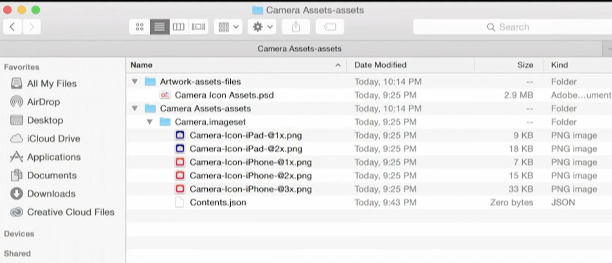

# 苹果如何改善App的发布

## What's in an App?

- 可执行代码（Excutable Code）：armv7 arm64
- 资源（Resource）

## 举个例子

以一个App为例，里面既用到了OpenGL ES，又用到了Metal，以适应不同的内存大小设备

## 解决方案

### App Slicing

根据不同的设备，App会根据架构进行切割，例如iPad，当运行时

- 运行armv7的切割
- 决定执行哪些资源
- 对于3X的设备，例如Plus，下载的时候，下载3X的资源

### Can We do better?

基于时间线，优先部署用户当前阶段下，最需要的资源

- Asset packs由Xcode built
- 可以包括任何不可执行的assets
- 由APP Store保存，作为IPA的一部分被提交上去，但是APP Store会把他们分开
- 当需要的时候，进行下载

#### Code

#### Basic interface and artwork

## 工作原理

### assets的内容

- Named Image
- Named Data：
  - 在Xcode 7 ，iOS 9 引入，随心所欲的储存内容
  - 存入的内容，会根据硬件内容分类
  - 使用`NSDataAsset`相关的接口检索
- Sprite Atlases
  - 与Sprite Kit整合
  - 自动创建纹理图集

### Asset Catalogs来瘦身App

每个asset有描述资源相关特征，及有用的特征

有效的组织assets

# 如何减小App体积

## Create Asset Catalog

方案一：创建catalog首要的方法，使用Xcode的资源目录管理器创建

方案二：使用外部工具链

将image和data sets从assets pipeline中导出--XCAsset Source Artifact Format

### Content.json文件

#### image

#### Data

#### Example ：Image Set Creation

##### Create

1. 从PS中生成imageset

从PhotoShop的工作流中，导出下面的格式的文件

##### Build

每次building的时候，都会根据当前设备进行适配。在Build Setting里面，打开下面的开关，会对assets根据设备编译进行简化。如果因为简化带来了问题，可以操作这个开关来排查

##### Distribute

- App Store

- Test Flight

- Ad-hoc/Enterprise Distribution

在Xcode中增加了一个功能，为特定的设备导出特定的IPA

include mainfest for over-the-air installation：当Xcode导出IPA时，也生成了app的变体，生成一个含有URL的显示清单。设备将自动根据URL下载适合它类型的变体

​	

- Xcode Server