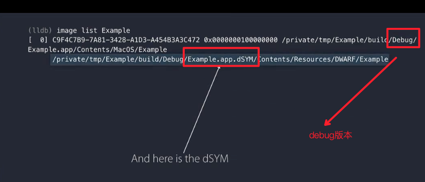

# 选择自己的终端调试

在Edit Schema中，设置如下（前提必须是Mac OS相关的开发，iOS的不行）：


启动一个控制台，这个调试与LLDB是分开的


# 将LLDB作为一款命令行工具

- 提供一个包括LLDB命令的文件

```shell
$lldb --source <filename>
```

- 直接使用lldb命令，而不需要提供文件

```shell
$lldb --one-line <cammond> -o <camnond2>
```

- 运行系列的命令，并退出

```shell
$lldb --batch --source <filename>
```

# LLDB and Xcode 8

- 多个dugger版本的支持，支持不同的语言
  - 自动选择Debugger
  - Swift 3使用最新的Debugger，而Swift 2.3使用 Xcode 7.3.1-era debugger
  - 开源的Swift也会使用匹配的debugger
- Xcode可以继续运行，而LLDB退出

# 定制LLDB

## Cammand Alias

内嵌使用`shell`

```
$cammand alias -h "Run ……" -- shell platform shell
```

 

### Python API

-  在初始化`~/.lldbinit`路径下，自定义自己的命令

```
command script import <yourfile.py>
```

- 或者指定在Xcode下使用的lldb命令，那么在`~/.lldbinit-Xcode`路径下

### p & po & frame

- p
  - 运行一次代码
- po
  - 运行两次代码
  - 并打印自定义类型 

- frame
  - frame没有执行代码的能力


### New : parray & poarray

`parray`和`poarry`专门用来处理数组

```shell
parray <count> <expression>
poarray <count> <expression>
```

- parray
- poarray

- demo

当我们需要查看数组的元素时候，使用`parray count yourarray`命令来展示


遍历数组里所有的元素，在知道count的前提下。倒单引号，能够提取命令，并将命令中的值替换

```shell
parray `count` dataset
```

## Low Level Debugging

- register

根据Objective-C 方法的特性，读取寄存器中的数据$arg1(self),$arg2(selector )

```
register read $arg1 $arg2
```

- frame


```
# 上移命令
$up 
# 下移命令
$down
```

- 反汇编 

```
$up
……

$disassemble --frame
```


问题出在了getGlobalToken上面，然后单步跳过getGlobalToken命令的调用

```
(lldb)ni
```

假设，恰好知道%rax寄存器里保存的是一个返回的值，从rag中读取返回值


再做单步跳过

```
(lldb)si
(lldb)reg read $arg1  # 从第一个参数中读取数据
```

补充说明s,n,si,ni命令


## SDK调试

当出现如下错误时：无法找对对应的属性，需要导入SDK


那么，之前老的做法是：

```
p @import AppKit
p [NSApplication sharedApplication].undoManager
```


现在LLDB会检查源文件中导入了哪些头文件，然后就可以直接使用了


### Defining Resuable Functions

#### 函数

在C，C++和OC中，在LLDB中，定义自定义的函数

- 输入命令`expr --top-level --`
- 输入函数`int $addTwo(int a,int b)`，最后多一个回车结束
- 执行函数，`expr $addTwo(1,2)`

```{
(lldb) expr --top-level --
Enter expressions, then terminate with an empty line to evaluate:
1 int $addTwo(int a,int b){
2 	return a+b;
3 }
4 
(lldb) expr $addTwo(1,2)
(int) $1 = 3
```

#### 匿名函数

也可以在定义匿名函数，即Block

```
(lldb) p int (^$add)(int,int) = ^(int a,int b){return a + b;}
(lldb) p $add(1,2)
(int) $2 = 3
```

#### 任务

LLDB中，实现在指定队列上执行任务

```
(lldb) p dispatch_sync(dispatch_get_global_queue(0, 0), ^{printf("hello world\n");});
hello world
```

#### 类

C++，自定义类

```
(lldb) expression
Enter expressions, then terminate with an empty line to evaluate:
1 class $myClass{
2 int m_a;
3 $myClass(int a):m_a(a){}
4 }
5 
(lldb) expr $myClass(1)
($myClass) $3 = (m_a = 1)
```

### Breakpoint and TroubleShooting

当我们在Xcode里面，源代码旁边设置断点时，其实执行的是以下命令

```
(lldb)break set --line 行号 --file 文件名.m
```

设置断点

```
(lldb)break set --name main
```


### 断点表达式

更精确的查找断点

```
// 下面的操作，获得两个位置的main函数
(lldb)break set --fullname main 
// Sketch
// libpcap.A.dylib

// 设置指定包下的main函数
(lldb)break set --fullname main --shlib Sketch
```

给文件中的所有接口，都设置断点（支持正则表达式）

```
(lldb)break set -r "\[ClassName \.*\]"
```

给SDK中的所有函数设置断点

```
(lldb)break set -r ".*" --shlib YourModule
```

### 使用模式匹配断点解决复杂函数多返回值的问题

- 有一个复杂的函数，里面有很多return
- 在它返回为Null时候，暂停

使用源匹配模式，当返回为某个值时中断

```
(lldb)break set -p "return *nullptr" -X Foo::StateMatchine -f Foo.cpp
```

### 给指定的线程或者队列下断点

- thread-id

```
--thread-id(or -t)
```

- 通过thread name，前提是由pthread_setname_np()命名的

```
--thread-name (or -T)
```

- 服务于指定名字的队列上的线程

```
--queue-name (or -q)
```


## 在Xcode中添加断点

### 使用自己的.lldb

在添加符号断点时，添加Action，在框里输入如下命令：

```
command source YourFile.lldb
```


### 快速的单步跳入

```
(lldb)step -t doSomething --endlinenumber 40
```

或者使用别名

```
(lldb)sif doSomething
```


## 使用的二进制文件

- 当build release和debug的时候，知道在用的是哪个版本
- 有一个DSYM文件，如何知道它已经被读取

使用以下命令

```
(lldb)image list [<Module Name>]
```



## 在所用文件中，共享调试信息

Clang Module Debug Infomation

- 使用PCH文件
- 在Build Settings中调用 Clange Module Debugging
- 设置Compiler flag `-gmodules`

