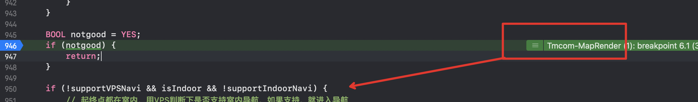
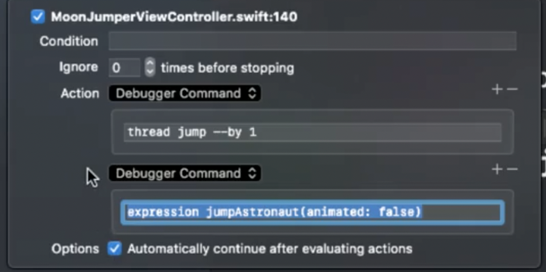

# Swift调试的一些问题

## 1. 设置一个断点，动态改变一个值，并使得系统继续运行


1. 右键`Edit breakpoint`
2. 在`Action`中，添加`expression XXX = NO`
3. 勾选`options`中的Automatically continue after evalutating actions


PS：expression命令，还可以动态的执行方法，例如

```
expression XXX.delegate = self
```

## 2. Symbolic Excetpion设置


当符号断点被设置完成以后，左侧的断点列表中，会被系统解析。如果没有子条目，说明没有被正常解析。


## 3. 如果是跟到了未开源库里的函数

在iOS中，大部分的库是不开源的。如果要跟踪参数的话，必须了解OC语言的工作原理，既`msg_send`方法


```shell
# 打印消息接收者 self
po $arg1

# 打印方法 selector
po (SEL)$arg2

# 打印第一个参数
po $arg3
```

## 4. 在某个函数上设置一个临时断点，只被执行一次

设置一个临时断点，这个断点被触发一次后，就会被删除

```shell
$breakpoint set --one-shot true --name "-[UILabel setText:]"
```

将上面的命令，添加对应位置处的`Action`里。


## 5. 跳过某个指令

当断点来到某个位置的时候，右侧绿色条表示这个线程会执行的下一条指令。

挪动右侧绿色的命令条，可以跳过中间的指令（但不保证APP是否正常，可能会使用到未初始化的对象等等）。如图所示，往下拖动一个命令，



就可以跳过`return`了


在Breakpoint的`Action`中编辑，单步跳过一行代码

```
thread jump --by 1
```



1. 先执行跳过一步的代码
2. 再执行命令


## 6. 自定义debugDescrption

```objective-c
- (NSString *)debugDescription
{
    return [NSString stringWithFormat:@"<%@: %p> <#additional format string#>", [self class], self, <#additional arguments#>];
}
```

自定义debug的description，在`po`时，输出这个描述


## 7. Watchpoint

在变量列表中，右键->Watchpoint，给变量动态的添加。当watch的属性，有变化时，程序暂停


在左侧DebugView中，出现了观察属性的断点

## 8. 在Swift中动态调用OC方法

Swift调试中，不能直接调用OC的方法，必须加入 `-l objc`才行

```
expression -l objc -O -- [`self.view` recursiveDescription]
```

反引号的意思，是告诉LLDB，先评估当前帧的内容

## 9. LLDB使用alias

```shell
(LLDB)command alias poc expression -l objc -O --
(LLDB)poc 0x1234123c
```

## 10. 刷新当前帧

告诉CAAnimation 刷新当前UI

```shell
(LLDB)po frame.y = 300
(LLDB)expression CATransaction.flush()
```

# LLDB

## 1.使用Python访问LLDB的API

在Python脚本中，调用LLDB的视图API


## 2.自定义LLDB

在命令行中输入如下命令：

```shel
$vim ~/.lldbinit
```

在.lldbinit文件中，添加一行命令

```shell
command script import yourPythonFile.py
command alias poc expression -l objc -O -- # 也可以添加命令的别名
```

回到Xcode中LLDB中，执行下面的命令，来实现自定义脚本的安装

```shell
command script import yourPythonFile.py
```


## 3. 各个命令比较


注意，`frame`命令是不需要编译和评估的，它可以直接读取内存里变量的值，然后使用LLDB内置格式化程序

# 高级视图调试（Advanced View Debugging)

## 1.ViewDebug中的空间

启动ViewDebuger时，可以复制App的控件地址，达到调试的目的：

1. 选中要复制的控件
2. Xcode顶部->Edit->Copy
3. 进入LLDB，po (Ctrl + V)即可


## 2. 创建约束的回溯栈

启用约束的回溯栈，可以看到约束是如何被创建的。


在Edit Scheme中，设置


# 参考链接

[WWDC2018通过Xcode和LLDB进行高级调试](chrome-extension://ikhdkkncnoglghljlkmcimlnlhkeamad/pdf-viewer/web/viewer.html?file=https%3A%2F%2Fdevstreaming-cdn.apple.com%2Fvideos%2Fwwdc%2F2018%2F412zw88j5aa4mr9%2F412%2F412_advanced_debugging_with_xcode_and_lldb.pdf)

