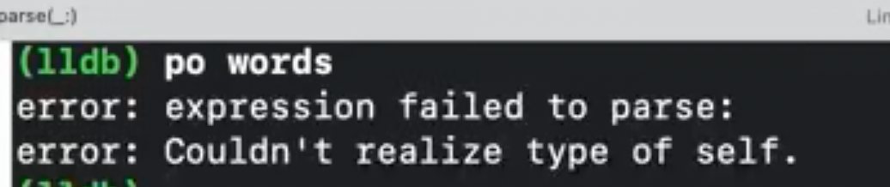
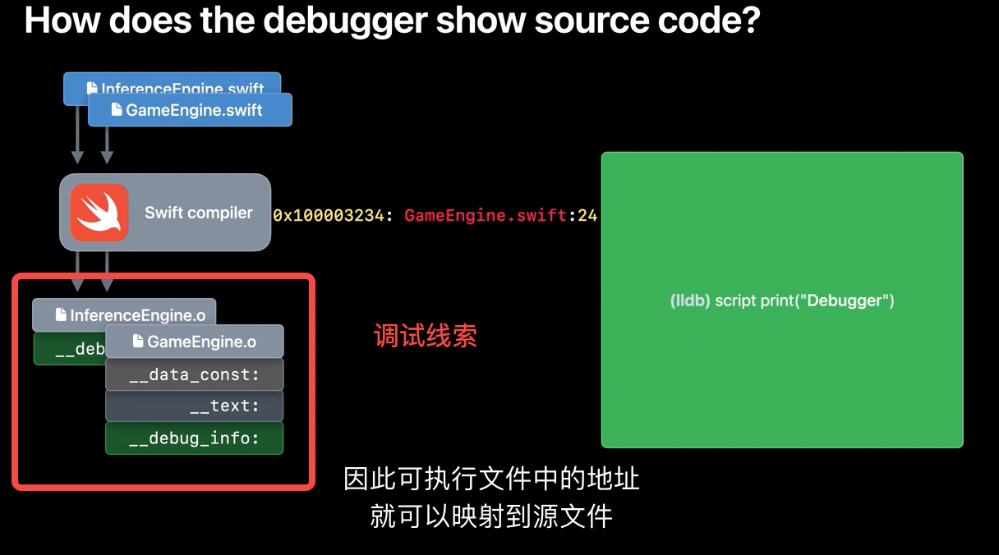
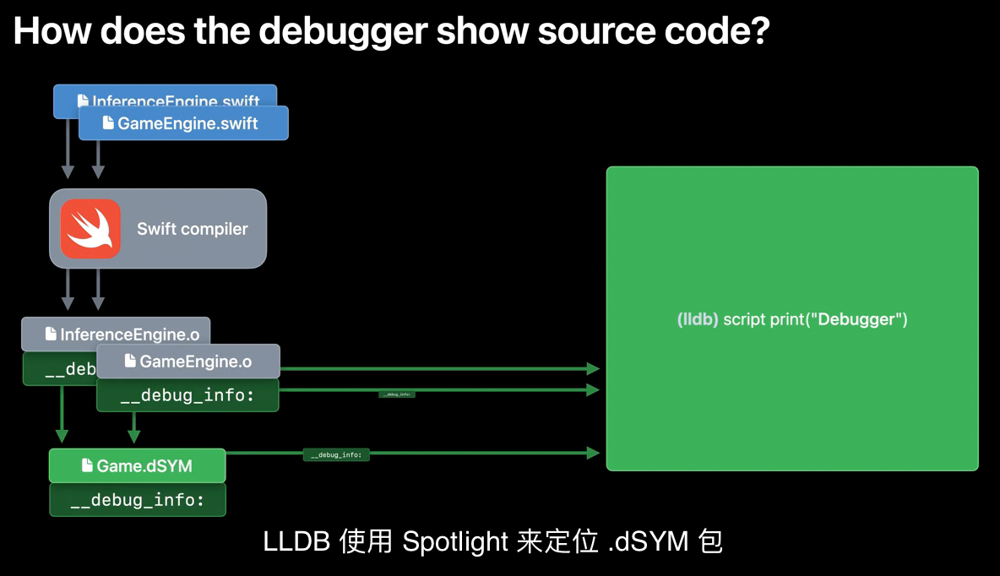

# 打印变量 po



遇到`po var`不生效，报错 。

系统集成了某个框架，比如说UIKitFramework

## 调试的原理

当我们实现一个函数的时候，编译器会把它编译成机器码，同时为调试器留下回溯的线索，比如行号。



这些存档信息，存在了App中。为了存档和发布，这些调试可以和DSYM关联。

LLDB使用spotlight来实现关联。




第一步，使用下面的命令来查看当前app下所有的库

```
image list
```

使用下面的命令，找到你想要的库

```
image list yourFramework
```


使用下面的命令，来查看这个方法在哪个库里

```
image lookup -va 函数地址
```


输入下面的指令，来查看当前image中的库(以UIKitFrameWork为例，他对应的库为TerminalInterface)

```
$image list TerminalInterface
```


设置库的映射文件


也可以额通过Edit Scheme设置每次LLDB加载的源码库地址

