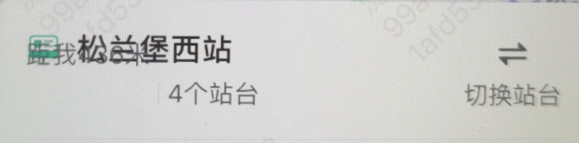
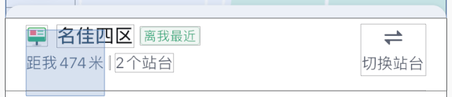
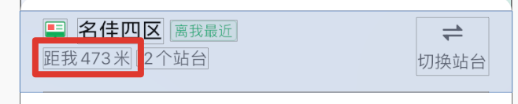

最近QA反馈了一个bug，说在一些设备上有压盖的现象。



我看了下我写的约束

```objective-c
[self.stationDisLabel mas_remakeConstraints:^(MASConstraintMaker *make) {
    make.left.equalTo(self.locationIconView);
    make.top.equalTo(self.locationIconView).bottom.offset(4);
}];
```

重点看`top`的约束，我原来理解为那个label是在image的`bottom`下，偏移4个像素布局。但实际用Lookin分析来看；



```objective-c
make.top.equalTo(self.locationIconView).bottom.offset(4);
```

这句话的意思是，

- 给这个label添加一个top的约束，距离image的top的偏移为4；
- 同时添加一个底部的约束，距离父级 View的偏移为4

用代码分解为

```objc
[self.stationDisLabel mas_remakeConstraints:^(MASConstraintMaker *make) {
    make.left.equalTo(self.locationIconView);
    make.top.equalTo(self.locationIconView).offset(4);
    make.bottom.equalTo(self).bottom.offset(4);
}];
```

正确的写法应该是：

```objective-c
[self.stationDisLabel mas_remakeConstraints:^(MASConstraintMaker *make) {
    make.left.equalTo(self.locationIconView);
    make.top.equalTo(self.locationIconView.mas_bottom).offset(4);
}];
```

使用LookIn 看到的效果如图



效果布局就正常了~

看来我还是菜啊T_T。。。。