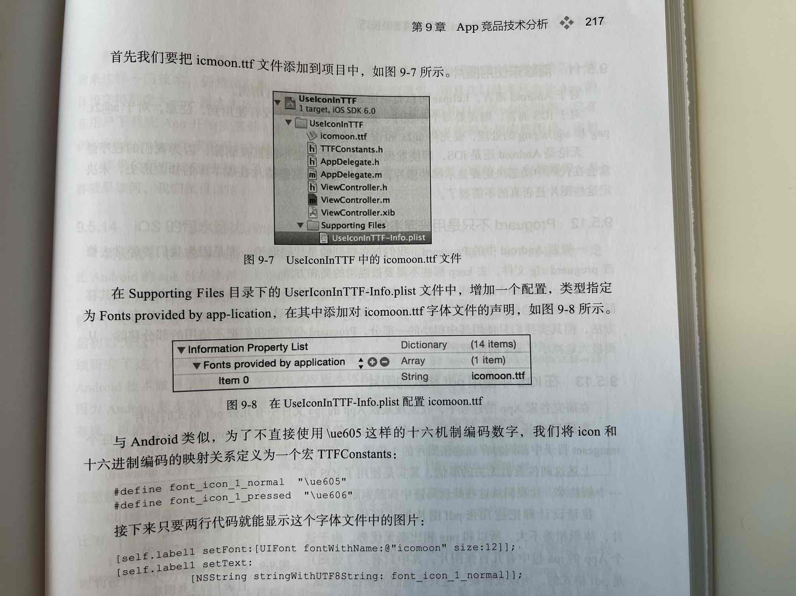

# 1. 视图

## 按钮点击范围

```objective-c
- (BOOL)pointInside:(CGPoint)point withEvent:(UIEvent*)event {
    CGRect bounds = self.bounds;
     bounds = CGRectInset(bounds, -10, -10);
   // CGRectContainsPoint  判断点是否在矩形内
    return CGRectContainsPoint(bounds, point);
}

// // 改变图片的点击范围
- (BOOL)pointInside:(CGPoint)point withEvent:(UIEvent *)event {
    
    // 控件范围宽度多40，高度20
    CGRect bounds = CGRectInset(self.bounds, -20, -20);
    NSLog(@"point = %@",NSStringFromCGPoint(point));
  // 贝塞尔曲线
    UIBezierPath *path1 = [UIBezierPath bezierPathWithRect:CGRectMake(-20, 0, 40, 120)];
    UIBezierPath *path2 = [UIBezierPath bezierPathWithRect:CGRectMake(self.frame.size.width - 20, 0, 40, 120)];
    if (([path1 containsPoint:point] || [path2 containsPoint:point])&& CGRectContainsPoint(bounds, point)){
        //如果在path区域内，返回YES
        return YES;
    }
    return NO;
}
```

``CGRectContainsPoint``接口，用于判断某个点是否在某个矩形区域内


# 2. 巧用类别来添加属性

一般，我们使用Category去实现原有的类不具备的功能，但是Category不支持添加属性。假设有这样的一个需求，内部需要添加属性，而对外部来说，这个属性不可见。

外部，仍然访问的是Sark.h文件，只有name属性可以访问到

```objective-c
// Sark.h
@interface Sark : NSObject
@property (nonatomic, copy) NSString *name;
@end
```

在内部使用的类中，添加新的属性（以Extension的形式添加）

```objective-c
//Sark+Internal.h
#import "Sark.h"

NS_ASSUME_NONNULL_BEGIN

@interface Sark ()
@property (nonatomic, copy) NSString *creditCardPassword;
@end

@interface Sark (Internal)

@end

NS_ASSUME_NONNULL_END
```


内部其他类，访问Sark的`creditCardPassword`属性

```objc
// PrivateSarkWife.m
#import "PrivateSarkWife.h"
#import "Sark+Internal.h" // <--- 私有依赖
@implementation PrivateSarkWife

- (void)robAllMoneyFromCreditCardOfSark:(Sark *)sark {
    NSString *password = sark.creditCardPassword; // oh yeah!
}

@end
```

# 3. 单色icon转字体文件

将图片做成字体文件，从而减少包体积。不过仅适用于单色图片

使用工具https://icomoon.io/ 将单色icon转成字体文件

将转换后的ttf文件，放到项目中




# 4. 检测重复代码的工具

[Simian](http://www.harukizaemon.com/simian/installation.html)

