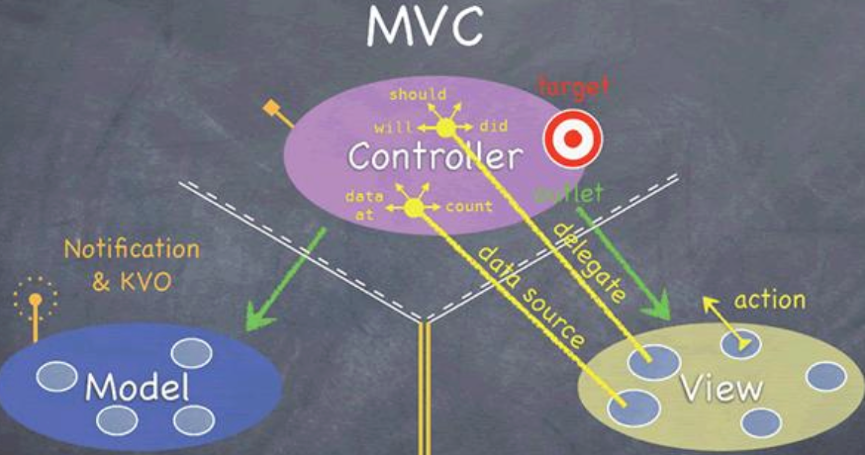

# iOS面试整理

## Runtime

### 消息发送机制和消息转发机制

消息发送机制：使用运行时，通过Selector快速去查找IMP的过程

消息转发机制：

1. 动态方法解析

2. 备用接收者

3. 完整的消息转发

### Objc_msgSend

关于`objc_msgSend`的四种写法

```c
id (*sendMessage)(id, SEL, id, id, id) = (id (*)(id, SEL, id, id, id))objc_msgSend;
float (*sendFloatMessage)(id, SEL, id, id, id) = (float (*)(id, SEL, id, id, id))objc_msgSend;
BOOL (*sendBOOLMessage)(id, SEL, id, id, id) = (BOOL (*)(id, SEL, id, id, id))objc_msgSend;
void (*sendVoidMessage)(id, SEL, id, id, id) = (void (*)(id, SEL, id, id, id))objc_msgSend;
```

### 为什么OC不支持重载？

相同的方法有相同的SEL，如果SEL相同的话，IMP地址也相同，而不是跟参数有关（参数不同时，可以C++重载）

## 设计模式





- MVC 中介者模式
- Delegate 代理模式
- KVO观察者模式
- Target-Action 命令模式 


### MVC与MVP的区别及优缺点

MVC

View与Model没有交互，但开发的时候，Model还是会传数据给View，Model和View的耦合性很高


MVVM

View Model 利用KVO双向绑定


MVP（面向协议编程）

优点：

1. View与Model解耦，两者数据由Present层进行传输
2. Present负责数据的获取，或许这个获取可能还是由Model来完成，但是以协议的方式，让View去实现对数据的处理
3. 保密性好，只需要把数据接口暴露

举例：

在`ViewController`中，有网络请求，我们一般会设置数据，`setModel`这种。如下

```objective-c
@implementation ViewController
  
- (void)viewDidLoad {
    [super viewDidLoad];
    // Do any additional setup after loading the view, typically from a nib.
    self getData:params
      successBlk:^(id data){
        [self setModel];
        [self.tableView reloadData]
      }
  		failBlk:^(NSError *error){
			}
}
@end
```

但是有了present之后，通过协议的回调，来填充。

```objective-c
@interface ViewController () <UITableViewDataSource, UserViewDelegate>
@property (weak, nonatomic) IBOutlet UITableView *tableView;
@property (nonatomic, strong) NSArray<UserViewData *> *userViewDatas;
@property (nonatomic, strong) UserPresenter *userPresenter;

@end

@implementation ViewController

- (void)viewDidLoad {
    [super viewDidLoad];
    // Do any additional setup after loading the view, typically from a nib.
    self.userPresenter = [[UserPresenter alloc] init];
    self.tableView.dataSource = self;
    self.userPresenter.delegate = self;
    // 调userPresenter里面的方法
    [self.userPresenter getUsers];
}

#pragma mark - UserViewDelegate
- (void)startloading {
    self.indicator.hidden = NO;
    [self.indicator startAnimating];
}
- (void)finishLoading {
    [self.indicator stopAnimating];
    self.indicator.hidden = YES;

}
#pragma mark - UserViewDelegate
// 用户界面的数据
- (void)setUsers:(NSArray<UserViewData *> *)userViewData {
  	//在设置数据
    self.userViewDatas = userViewData;
    [self.tableView reloadData];
}

// 数据是空的时候,显示
- (void)setEmptyUsers {
    //...
}
@end
```

设置`UserViewDelegate`，遵循这个协议即可

```objective-c
@protocol UserViewDelegate <NSObject>

- (void)startloading;
- (void)finishLoading;

// 用户界面的数据
- (void)setUsers:(NSArray<UserViewData *> *)userViewData;
// 数据是空的时候,显示
- (void)setEmptyUsers;

@end

@interface UserPresenter : NSObject
@property (nonatomic, weak) id<UserViewDelegate> delegate;

- (void)getUsers;
@end

@implementation UserPresenter

- (void)getUsers {
    // 设置网络请求的回调
  if ([self.delegate respondsToSelector:@selector(setUsers:)]) {
       [self.delegate setUsers:userViewDatas];
   }
}
```


## APP

### 怎么解决iOS打包成功后，运行在iPhone端会闪退，黑屏的问题？

- 证书是否正确
- 设备不在开发者账户中
- ipa包中，`embedded.mobileprovision`查看设备号

```
security cms -D -i embedded.mobileprovision > entitlements_full.plist
```


## OC的数据结构

### OC中字典的实现原理

哈希表

