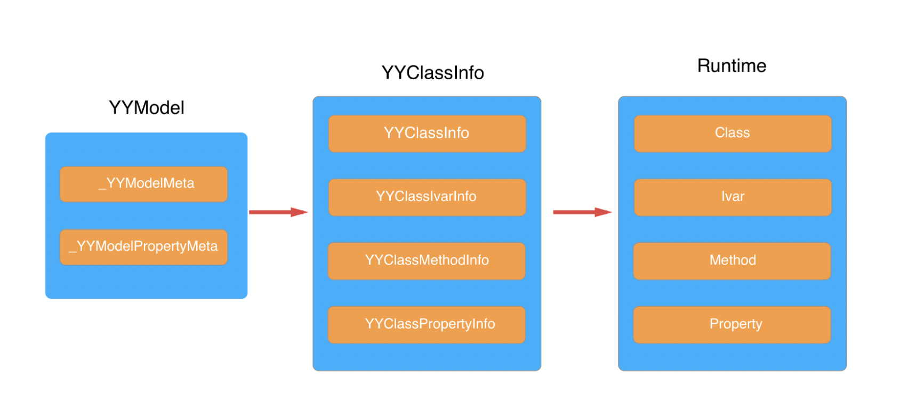
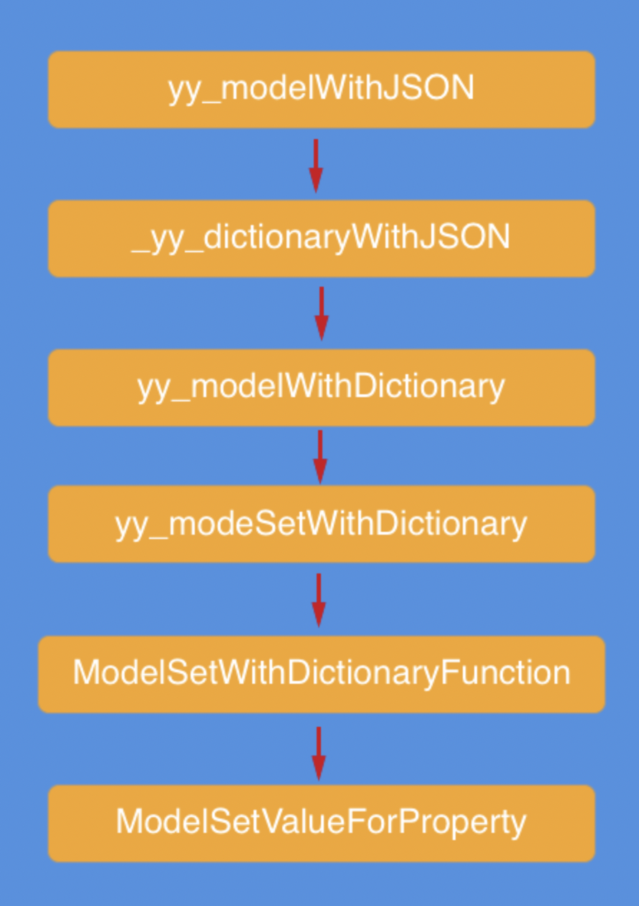

# YYModel

## YYClassInfo



- YYClassIvarInfo

  该类对应实例变量信息（ivars），包含：名称，偏移量，类型编码，类型

- YYClassMethodInfo

  方法的信息类，包含，方法名称，SEL，IMP，参数类型编码，返回值类型编码等。

- YYClassPropertyInfo

  属性信息类，包含名称，类型，类型编码，ivar名称，类，协议列表，setter/getter等。

- YYClassInfo：类信息。

## 字典转Model

整体流程如下：




### 初始化MetaClass

```objective-c
+ (instancetype)modelWithDictionary:(NSDictionary *)dictionary {
    _YYModelMeta *modelMeta = [_YYModelMeta metaWithClass:cls];
    if (modelMeta->_hasCustomClassFromDictionary) {
        cls = [cls modelCustomClassForDictionary:dictionary] ?: cls;
    }
    
    NSObject *one = [cls new];
    if ([one modelSetWithDictionary:dictionary]) return one;
    return nil;
}
```

在初始化过程中，自动生成了`setter`方法

```objective-c
// YYClassInfo.h
if (_name.length) {
    if (!_getter) {
        _getter = NSSelectorFromString(_name);
    }
    if (!_setter) {
        _setter = NSSelectorFromString([NSString stringWithFormat:@"set%@%@:", [_name substringToIndex:1].uppercaseString, [_name substringFromIndex:1]]);
    }
}
```

### 设置Model的属性

获取字典中的key，value值，并赋值给model对应的属性

```objc
// 获取到字典的键值对，和上下文信息。
static void ModelSetWithDictionaryFunction(const void *_key, const void *_value, void *_context) {
    // 上下文，包含模型元，模型实例，字典
    ModelSetContext *context = _context;
    //模型元
    __unsafe_unretained _YYModelMeta *meta = (__bridge _YYModelMeta *)(context->modelMeta);
    //在模型元属性字典中查找键值为key的属性
    __unsafe_unretained _YYModelPropertyMeta *propertyMeta = [meta->_mapper objectForKey:(__bridge id)(_key)];
    // 模型实例
    __unsafe_unretained id model = (__bridge id)(context->model);
    // 核心内容，遍历所有的属性元。知道_next = nil
    while (propertyMeta) {
        if (propertyMeta->_setter) {
                // 最终转换（高潮）
            ModelSetValueForProperty(model, (__bridge __unsafe_unretained id)_value, propertyMeta);
        }
        propertyMeta = propertyMeta->_next;
    };
}
```

核心函数`ModelSetValueForProperty`，我们以`NSString`为例

```objective-c
static void ModelSetValueForProperty(__unsafe_unretained id model,
                                     __unsafe_unretained id value,
                                     __unsafe_unretained _YYModelPropertyMeta *meta) {
            switch (meta->_nsType) {
                case YYEncodingTypeNSString:
                case YYEncodingTypeNSMutableString: {
                    if ([value isKindOfClass:[NSString class]]) {
                        if (meta->_nsType == YYEncodingTypeNSString) {
                            ((void (*)(id, SEL, id))(void *) objc_msgSend)((id)model, meta->_setter, value);
                        }
                                     }
```

当Json数据为`{name : "Harray"}`时，设置属性执行下面的方法。此时

- `model`为YYBook
- `meta->_setter`的方法名为`setName:`
- `value`为`"Harry"`

```
((void (*)(id, SEL, id))(void *) objc_msgSend)((id)model, meta->_setter, value);
```


## Coding Tips

### 强制内连

```
#define force_inline __inline__ __attribute__((always_inline))
```

`__inline__ __attribute__((always_inline))` 的意思是强制内联.所有加  `__inline__ __attribute__((always_inline))` 修饰的函数在被调用的时候不会被编译成函数调用,而是直接扩展到调用函数体内.

### 常量定义

```
#if __has_include(<YYModel/YYModel.h>)
FOUNDATION_EXPORT double YYModelVersionNumber;
FOUNDATION_EXPORT const unsigned char YYModelVersionString[];
#import <YYModel/NSObject+YYModel.h>
#import <YYModel/YYClassInfo.h>
#else
#import "NSObject+YYModel.h"
#import "YYClassInfo.h"
#endif
```

拓展：

1. `FOUNDATION_EXPORT`是用来定义常量的，另外一个经常用到的`#define`定义常量。

   那么两者的区别？
   假设分别使用两者定义字符串常量，前者可以通过`==`来判断字符串是否相等，后者则需要使用`isEqualToString:`来判断。因为，前者比较的是字符串指针地址，后者比较每个字符，因此前者效率更高。

2. `__has_include()`

   ```c
   #if __has_include(&lt;UIKit/UIKit.h&gt;)
   // 包含
   #else
   // 不包含
   #endif          
   ```

   判断`UIKit`库是否存在。

### 多线程编程

初始化防止多线程竞争，实现目标：

- 仅被执行一次，初始化在内存中，使用`dispatch_once`
- 防止多线程的竞争调度，使用`dispatch_semaphore_create`

```objective-c
/// Returns the cached model class meta
+ (instancetype)metaWithClass:(Class)cls {
    if (!cls) return nil;
    static CFMutableDictionaryRef cache;
    static dispatch_once_t onceToken;
    static dispatch_semaphore_t lock;
    dispatch_once(&onceToken, ^{
        cache = CFDictionaryCreateMutable(CFAllocatorGetDefault(), 0, &kCFTypeDictionaryKeyCallBacks, &kCFTypeDictionaryValueCallBacks);
        lock = dispatch_semaphore_create(1);
    });
    dispatch_semaphore_wait(lock, DISPATCH_TIME_FOREVER);
    _YYModelMeta *meta = CFDictionaryGetValue(cache, (__bridge const void *)(cls));
    dispatch_semaphore_signal(lock);
    if (!meta || meta->_classInfo.needUpdate) {
        meta = [[_YYModelMeta alloc] initWithClass:cls];
        if (meta) {
            dispatch_semaphore_wait(lock, DISPATCH_TIME_FOREVER);
            CFDictionarySetValue(cache, (__bridge const void *)(cls), (__bridge const void *)(meta));
            dispatch_semaphore_signal(lock);
        }
    }
    return meta;
}
```


## 参考链接

[从YYModel源码中可以学到什么：前篇](https://blog.51cto.com/13533483/2055771)

[从YYModel源码中可以学到什么：后篇](https://blog.51cto.com/13533483/2055772)

# YYCache


# YYImage

## Coding Tips

### @package关键字

这个关键字用于制作框架中，

> @package变量，
>  对于framework内部，相当于@protected， 自己和子类都能使用
>  对于framework外部，相当于@private，只能自己使用，外部无法使用
>  这个特性，很适合用于开发第三方的静态类库，因为多数人并不希望让别人知道自己属性的值。

### 信号量实现锁

创建信号量

```objc
dispatch_semaphore_t _lock; ///< lock for _buffer

_lock = dispatch_semaphore_create(1);
```

定义锁的宏，这里使用信号量，替代了`NSLock`，性能提优

```c
#define LOCK(...) dispatch_semaphore_wait(self->_lock, DISPATCH_TIME_FOREVER); \
__VA_ARGS__; \
dispatch_semaphore_signal(self->_lock);
```

使用

```c
LOCK(
      // 需要上锁的代码块
    );
```

### 使用NSProxy解决CADisplayLink的循环引用

