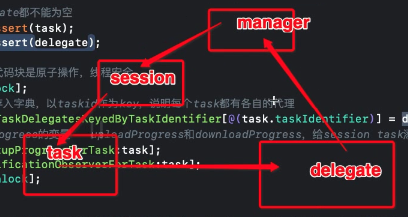

# AFNetworking 3.0

## NSURLSession

### NSURLSession的流程：

- 创建`NSURLSessionConfig`对象
- 用`NSURLSessionConfig`创建`NSURLSession`对象
- 用`NSURLSession` 创建对应的task对象，并用`resume`执行
- 在`NSURLSessionDelegate` 和`NSURLSessionTaskDelegate`代理中或者`completionHandler block`中响应网络事件及数据 

### 两种响应数据的方式

- 代理

  - `NSURLSessionDelegate`主要关于会话的，比如会话关闭，会话收到挑战。
  - `NSURLSessionTaskDelegate`主要关于任务的，可以理解为任务共用的协议，比如任务完成或失败，任务收到挑战，任务将要执行HTTP重定向。
  - `NSURLSessionDataDelegate`也遵循`NSURLSessionDelegate`，类似于继承关系

  ```objective-c
  #import "ViewController.h"
  
  @interface ViewController ()<NSURLSessionDelegate,NSURLSessionTaskDelegate>
  @end
  
  @implementation ViewController
  
  - (void)viewDidLoad {
      [super viewDidLoad];
      // Do any additional setup after loading the view, typically from a nib.
      [self sendRequest];
  }
  - (void)sendRequest{
      //创建请求
      NSURL *url = [NSURL URLWithString:@"http://httpbin.org/get"];
      NSMutableURLRequest *request = [NSMutableURLRequest requestWithURL:url];
      //设置request的缓存策略（决定该request是否要从缓存中获取）
      request.cachePolicy = NSURLRequestReturnCacheDataElseLoad;
      
      //创建配置（决定要不要将数据和响应缓存在磁盘）
      NSURLSessionConfiguration *configuration = [NSURLSessionConfiguration defaultSessionConfiguration];
      //configuration.requestCachePolicy = NSURLRequestReturnCacheDataElseLoad;
      
      //创建会话
      NSURLSession *session = [NSURLSession sessionWithConfiguration:configuration delegate:self delegateQueue:nil];
      //生成任务
      NSURLSessionDataTask *task = [session dataTaskWithRequest:request];
      //创建的task是停止状态，需要我们去启动
      [task resume];
  }
  //1.接收到服务器响应的时候调用
  - (void)URLSession:(NSURLSession *)session dataTask:(NSURLSessionDataTask *)dataTask
  didReceiveResponse:(NSURLResponse *)response
   completionHandler:(void (^)(NSURLSessionResponseDisposition disposition))completionHandler{
      NSLog(@"接收响应");
      //必须告诉系统是否接收服务器返回的数据
      //默认是completionHandler(NSURLSessionResponseAllow)
      //可以再这边通过响应的statusCode来判断否接收服务器返回的数据
      completionHandler(NSURLSessionResponseAllow);
  }
  
  //2.接受到服务器返回数据的时候调用,可能被调用多次
  - (void)URLSession:(NSURLSession *)session dataTask:(NSURLSessionDataTask *)dataTask didReceiveData:(NSData *)data{
      NSLog(@"接收到数据");
      //一般在这边进行数据的拼接，在方法3才将完整数据回调
     	// 在这里进行数据解析
  	  NSDictionary *dic = [NSJSONSerialization JSONObjectWithData:data options:0 error:nil];
  }
  
  //3.请求完成或者是失败的时候调用
  - (void)URLSession:(NSURLSession *)session task:(NSURLSessionTask *)task
  didCompleteWithError:(nullable NSError *)error{
      NSLog(@"请求完成或者是失败");
      //在这边进行完整数据的解析，回调
  }
  
  //4.将要缓存响应的时候调用（必须是默认会话模式，GET请求才可以）
  - (void)URLSession:(NSURLSession *)session dataTask:(NSURLSessionDataTask *)dataTask
   willCacheResponse:(NSCachedURLResponse *)proposedResponse
   completionHandler:(void (^)(NSCachedURLResponse * _Nullable cachedResponse))completionHandler{
      //可以在这边更改是否缓存，默认的话是completionHandler(proposedResponse)
      //不想缓存的话可以设置completionHandler(nil)
      completionHandler(proposedResponse);
  }
  @end
  ```

  

- Block

  ```objective-c
  NSURL *url = [NSURL URLWithString:@"http://www.connect.com/login"];
  NSMutableURLRequest *request = [NSMutableURLRequest requestWithURL:url];
  request.HTTPMethod = @"POST";
  request.HTTPBody = [@"username=Tom&pwd=123" dataUsingEncoding:NSUTF8StringEncoding];
  
  //使用全局的会话
  NSURLSession *session = [NSURLSession sharedSession];
  // 通过request初始化task
  NSURLSessionTask *task = [session dataTaskWithRequest:request
                                     completionHandler:^(NSData *data, NSURLResponse *response, NSError *error) { 
      NSLog(@"%@", [NSJSONSerialization JSONObjectWithData:data options:kNilOptions error:nil]);
   }];
  //创建的task是停止状态，需要我们去启动
  [task resume];
  ```

  

## AFHTTPSessionManager

### 初始化

- 初始化session和`NSURLSessionConfiguration`，并持有`NSURLSessionConfiguration`

- 创建session的串行队列，将`operationQueue`的最大并发数设置为<font color='red'>**1**</font>（但多个task的回调是并发的）

  ```objective-c
  self.session = [NSURLSession sessionWithConfiguration:self.sessionConfiguration delegate:self delegateQueue:self.operationQueue];
  ```

  这里调用了系统方法，因为在iOS 9以后，使用`NSURLSession`来管理网络请求

- 设置序列化及默认证书

- 初始化任务ID字典，其中键值对为`<taskid, delegate>`，保存起来后，通过taskid操作 

- 创建锁`NSLock`确保线程安全

  ```objc
  //默认为json解析
  self.responseSerializer = [AFJSONResponseSerializer serializer];
  
  //设置默认证书 无条件信任证书https认证
  self.securityPolicy = [AFSecurityPolicy defaultPolicy];
  
  // 为什么要收集: cancel resume supend : task : id
  //delegate= value taskid = key
  self.mutableTaskDelegatesKeyedByTaskIdentifier = [[NSMutableDictionary alloc] init];
  
  //使用NSLock确保线程安全
  self.lock = [[NSLock alloc] init];
  self.lock.name = AFURLSessionManagerLockName;
  ```

  

### 发送请求

#### KVC & KVO 

在设置`AFHTTPRequestSerializer`时，观察其某个属性是否被设置，被修改

AFNetworking 改自动触发为手动触发

```objective-c
@interface AFHTTPRequestSerializer ()
//某个request需要观察的属性集合
@property (readwrite, nonatomic, strong) NSMutableSet *mutableObservedChangedKeyPaths;

@end
  
@implementation AFHTTPRequestSerializer
  
- (instancetype)init {
   // KVO的使用
    self.mutableObservedChangedKeyPaths = [NSMutableSet set];
    for (NSString *keyPath in AFHTTPRequestSerializerObservedKeyPaths()) {
        if ([self respondsToSelector:NSSelectorFromString(keyPath)]) {
            //自己给自己的方法添加观察者
            [self addObserver:self forKeyPath:keyPath options:NSKeyValueObservingOptionNew context:AFHTTPRequestSerializerObserverContext];
        }
    }
}

#pragma mark - NSKeyValueObserving
/**
 如果kvo的触发机制是默认出发。则返回true，否则返回false。在这里，只要是`AFHTTPRequestSerializerObservedKeyPaths`里面的属性，我们都取消自动出发kvo机制，使用手动触发。
 为什么手动，我猜应该是为了在监听这些属性时可以用于某些特殊的操作，比如测试这些属性变化是否崩溃等。
 @param key kvo的key
 @return bool值
 */
+ (BOOL)automaticallyNotifiesObserversForKey:(NSString *)key {
    if ([AFHTTPRequestSerializerObservedKeyPaths() containsObject:key]) {
        return NO;
    }

    return [super automaticallyNotifiesObserversForKey:key];
}

- (void)observeValueForKeyPath:(NSString *)keyPath
                      ofObject:(__unused id)object
                        change:(NSDictionary *)change
                       context:(void *)context
{
    if (context == AFHTTPRequestSerializerObserverContext) {
        if ([change[NSKeyValueChangeNewKey] isEqual:[NSNull null]]) {
            [self.mutableObservedChangedKeyPaths removeObject:keyPath];
        } else {
            [self.mutableObservedChangedKeyPaths addObject:keyPath];
        }
    }
}

- (NSMutableURLRequest *)requestWithMethod:(NSString *)method
                                 URLString:(NSString *)URLString
                                parameters:(id)parameters
                                     error:(NSError *__autoreleasing *)error
{
       //将request的各种属性遍历,给NSMutableURLRequest自带的属性赋值
      for (NSString *keyPath in AFHTTPRequestSerializerObservedKeyPaths()) {
          //给设置过得的属性，添加到request（如：timeout）
          if ([self.mutableObservedChangedKeyPaths containsObject:keyPath]) {
              //通过kvc动态的给mutableRequest添加value
              [mutableRequest setValue:[self valueForKeyPath:keyPath] forKey:keyPath];
          }
      }                                
}


// Workarounds for crashing behavior using Key-Value Observing with XCTest
// See https://github.com/AFNetworking/AFNetworking/issues/2523
//也就是说你只要使用了keyPath对应的的setter方法，就会响应observerValueForKeyPath这个方法，从而将对应的keyPath添加到了mutableObservedChangedKeyPaths
//手动开启kvo
- (void)setAllowsCellularAccess:(BOOL)allowsCellularAccess {
    [self willChangeValueForKey:NSStringFromSelector(@selector(allowsCellularAccess))];
    _allowsCellularAccess = allowsCellularAccess;
    [self didChangeValueForKey:NSStringFromSelector(@selector(allowsCellularAccess))];
}


@end
```

AFNetworking的另外一种KVO妙用，是把get方法也作为监听属性去监听。

以`countOfBytesReceived`为例，它是一个从服务端收到字节长度的属性

```objc
/* number of body bytes already received */
@property (readonly) int64_t countOfBytesReceived;

// 调用 countOfBytesReceived 方法
if ([keyPath isEqualToString:NSStringFromSelector(@selector(countOfBytesReceived))]) {
            if ([object countOfBytesExpectedToReceive] > 0) {
                dispatch_async(dispatch_get_main_queue(), ^{
                    [self setProgress:[object countOfBytesReceived] / ([object countOfBytesExpectedToReceive] * 1.0f) animated:self.af_downloadProgressAnimated];
                });
            }
        }
        
//给task和progress添加kvo
[task addObserver:self
       forKeyPath:NSStringFromSelector(@selector(countOfBytesReceived))
          options:NSKeyValueObservingOptionNew
          context:NULL];

// KVO回调方法
- (void)observeValueForKeyPath:(NSString *)keyPath ofObject:(id)object change:(NSDictionary<NSString *,id> *)change context:(void *)context {
    //是task
    if ([object isKindOfClass:[NSURLSessionTask class]] || [object isKindOfClass:[NSURLSessionDownloadTask class]]) {
        //给进度条赋新值
        if ([keyPath isEqualToString:NSStringFromSelector(@selector(countOfBytesReceived))]) {
            self.downloadProgress.completedUnitCount = [change[NSKeyValueChangeNewKey] longLongValue];
}


```


#### dataTask

AFN先生成了`request`，再生成`datatask`

```objective-c
NSMutableURLRequest *request = [self.requestSerializer requestWithMethod:method URLString:[[NSURL URLWithString:URLString relativeToURL:self.baseURL] absoluteString] parameters:parameters error:&serializationError];
```

#### 多线程的解决

一个`manager`可以执行多个GET方法（以GET为例），使用多线程并发操作。

【解决方案】使用串行队列

```objc
//为了解决iOS8一下的一个bug，调用一个串行队列来创建dataTask
__block NSURLSessionDataTask *dataTask = nil;
url_session_manager_create_task_safely(^{
    //原生的方法
    //使用session来创建一个NSURLSessionDataTask对象
    dataTask = [self.session dataTaskWithRequest:request];
});
//为什么要给task添加代理呢？
[self addDelegateForDataTask:dataTask uploadProgress:uploadProgressBlock downloadProgress:downloadProgressBlock completionHandler:completionHandler];

return dataTask;
```

1. 构造串行队列，并`dispatch_sync()`同步插入

```objc
//task和block不匹配
//taskid应该是唯一的，并发的创建的task，id不唯一
static void url_session_manager_create_task_safely(dispatch_block_t block) {
    NSLog(@"NSFoundationVersionNumber = %f",NSFoundationVersionNumber);
    if (NSFoundationVersionNumber < NSFoundationVersionNumber_With_Fixed_5871104061079552_bug) {
        // Fix of bug
        // Open Radar:http://openradar.appspot.com/radar?id=5871104061079552 (status: Fixed in iOS8)
        // Issue about:https://github.com/AFNetworking/AFNetworking/issues/2093
        dispatch_sync(url_session_manager_creation_queue(), block);//同步
    } else {
        block();
    }
}

//创建一个用于创建task的串行队列
static dispatch_queue_t url_session_manager_creation_queue() {
    static dispatch_queue_t af_url_session_manager_creation_queue;
    static dispatch_once_t onceToken;
    dispatch_once(&onceToken, ^{
        af_url_session_manager_creation_queue = dispatch_queue_create("com.alamofire.networking.session.manager.creation", DISPATCH_QUEUE_SERIAL);
    });

    return af_url_session_manager_creation_queue;
}

```


#### task的代理

已经有sessionDelegate了，还创建了`AFURLSessionManagerTaskDelegate`

- `AFURLSessionManagerTaskDelegate`是一个NSObject，并不是一个纯粹的代理

- `delegate`持有了manager，还有`completionHandler`
- `AFURLSessionManagerTaskDelegate`与`NSURLSessionDataTask`是一一绑定的关系，key为task id，value 为delegate对象

```objective-c
/*
 注意addDelegateForDataTask:这个函数并不是AFURLSessionManagerTaskDelegate的函数，而是AFURLSessionManager的一个函数。这也侧面说明了AFURLSessionManagerTaskDelegate和NSURLSessionTask的关系是由AFURLSessionManager管理的。
 */
- (void)addDelegateForDataTask:(NSURLSessionDataTask *)dataTask
                uploadProgress:(nullable void (^)(NSProgress *uploadProgress)) uploadProgressBlock
              downloadProgress:(nullable void (^)(NSProgress *downloadProgress)) downloadProgressBlock
             completionHandler:(void (^)(NSURLResponse *response, id responseObject, NSError *error))completionHandler
{
    // 1:home : task
    // 2: 创建临时变量 : task.id = delegate
    
    // detail  : task
    //2: 创建另外临时变量 task.id = delegate
    
    // 初始化delegate
    AFURLSessionManagerTaskDelegate *delegate = [[AFURLSessionManagerTaskDelegate alloc] init];
    delegate.manager = self;
    delegate.completionHandler = completionHandler;
    
    /*
     taskidentifier=key delegate=value,确保task唯一
     taskDescription自行设置的，区分是否是当前的session创建的
     */
    dataTask.taskDescription = self.taskDescriptionForSessionTasks;
    //函数字面意思是将一个session task和一个AFURLSessionManagerTaskDelegate类型的delegate变量绑在一起，而这个绑在一起的工作是由我们的AFURLSessionManager所做。至于绑定的过程，就是以该session task的taskIdentifier为key，delegate为value，赋值给mutableTaskDelegatesKeyedByTaskIdentifier这个NSMutableDictionary类型的变量。知道了这两者是关联在一起的话，马上就会产生另外的问题 —— 为什么要关联以及怎么关联在一起？
    [self setDelegate:delegate forTask:dataTask];
    //设置回调块
    // task deleaget
    delegate.uploadProgressBlock = uploadProgressBlock;
    delegate.downloadProgressBlock = downloadProgressBlock;
}


//为task设置关联的delegate
- (void)setDelegate:(AFURLSessionManagerTaskDelegate *)delegate
            forTask:(NSURLSessionTask *)task
{
    //task和delegate都不能为空
    NSParameterAssert(task);
    NSParameterAssert(delegate);

    //加锁确保中间代码块是原子操作，线程安全
    [self.lock lock];
    //将delegate存入字典，以taskid作为key，说明每个task都有各自的代理
    self.mutableTaskDelegatesKeyedByTaskIdentifier[@(task.taskIdentifier)] = delegate;
    //设置两个NSProgress的变量 - uploadProgress和downloadProgress，给session task添加了两个KVO事件
    [delegate setupProgressForTask:task];
    [self addNotificationObserverForTask:task];
    [self.lock unlock];
}
```

完成了下面的一种绑定关系：




这样利用代理的形式，实现多个`task`管理的模式。每个`task`都有一个代理`delegate`

#### resume的Hook

task的resume，已经被AFN 在`+load`方法中被hook了

- `_AFURLSessionTaskSwizzling`不是task的分类
- 动态判断`NSURLSessionTask`是否存在
- 动态生成一个task实例，去hook它的resume方法（秒啊~~~）
- 在Hook的方法中，加入了通知，告诉外部这个方法被调用了（这个方法可以用在页面统计中） 

```objective-c
@interface _AFURLSessionTaskSwizzling : NSObject

@end

@implementation _AFURLSessionTaskSwizzling

+ (void)load {
    /**
     WARNING: Trouble Ahead
     https://github.com/AFNetworking/AFNetworking/pull/2702
     */

    if (NSClassFromString(@"NSURLSessionTask")) { 
        /**
         iOS 7和iOS 8在NSURLSessionTask实现上有些许不同，这使得下面的代码实现略显trick
         关于这个问题，大家做了很多Unit Test，足以证明这个方法是可行的
         目前我们所知的：
         - NSURLSessionTasks是一组class的统称，如果你仅仅使用提供的API来获取NSURLSessionTask的class，并不一定返回的是你想要的那个（获取NSURLSessionTask的class目的是为了获取其resume方法）
         - 简单地使用[NSURLSessionTask class]并不起作用。你需要新建一个NSURLSession，并根据创建的session再构建出一个NSURLSessionTask对象才行。
         - iOS 7上，localDataTask（下面代码构造出的NSURLSessionDataTask类型的变量，为了获取对应Class）的类型是 __NSCFLocalDataTask，__NSCFLocalDataTask继承自__NSCFLocalSessionTask，__NSCFLocalSessionTask继承自__NSCFURLSessionTask。
         - iOS 8上，localDataTask的类型为__NSCFLocalDataTask，__NSCFLocalDataTask继承自__NSCFLocalSessionTask，__NSCFLocalSessionTask继承自NSURLSessionTask
         - iOS 7上，__NSCFLocalSessionTask和__NSCFURLSessionTask是仅有的两个实现了resume和suspend方法的类，另外__NSCFLocalSessionTask中的resume和suspend并没有调用其父类（即__NSCFURLSessionTask）方法，这也意味着两个类的方法都需要进行method swizzling。
         - iOS 8上，NSURLSessionTask是唯一实现了resume和suspend方法的类。这也意味着其是唯一需要进行method swizzling的类
         - 因为NSURLSessionTask并不是在每个iOS版本中都存在，所以把这些放在此处（即load函数中），比如给一个dummy class添加swizzled方法都会变得很方便，管理起来也方便。
         
         一些假设前提:
         - 目前iOS中resume和suspend的方法实现中并没有调用对应的父类方法。如果日后iOS改变了这种做法，我们还需要重新处理
         - 没有哪个后台task会重写resume和suspend函数
         
         */
        
        // 1) 首先构建一个NSURLSession对象session，再通过session构建出一个_NSCFLocalDataTask变量
        NSURLSessionConfiguration *configuration = [NSURLSessionConfiguration ephemeralSessionConfiguration];
        NSURLSession * session = [NSURLSession sessionWithConfiguration:configuration];
#pragma GCC diagnostic push
#pragma GCC diagnostic ignored "-Wnonnull"
        NSURLSessionDataTask *localDataTask = [session dataTaskWithURL:nil];
#pragma clang diagnostic pop
        // 2) 获取到af_resume实现的指针
        IMP originalAFResumeIMP = method_getImplementation(class_getInstanceMethod([self class], @selector(af_resume)));
        Class currentClass = [localDataTask class];
        // 3) 检查当前class是否实现了resume。如果实现了，继续第4步
        while (class_getInstanceMethod(currentClass, @selector(resume))) {
            // 4) 获取到当前class的父类（superClass）
            Class superClass = [currentClass superclass];
            // 5) 获取到当前class对于resume实现的指针
            IMP classResumeIMP = method_getImplementation(class_getInstanceMethod(currentClass, @selector(resume)));
           //  6) 获取到父类对于resume实现的指针
            IMP superclassResumeIMP = method_getImplementation(class_getInstanceMethod(superClass, @selector(resume)));
           // 7) 如果当前class对于resume的实现和父类不一样（类似iOS7上的情况），并且当前class的resume实现和af_resume不一样，才进行method swizzling。
            if (classResumeIMP != superclassResumeIMP &&
                originalAFResumeIMP != classResumeIMP) {
                [self swizzleResumeAndSuspendMethodForClass:currentClass];
            }
            // 8) 设置当前操作的class为其父类class，重复步骤3~8
            currentClass = [currentClass superclass];
        }
        
        [localDataTask cancel];
        [session finishTasksAndInvalidate];
    }
}

+ (void)swizzleResumeAndSuspendMethodForClass:(Class)theClass {
    // 因为af_resume和af_suspend都是类的实例方法，所以使用class_getInstanceMethod获取这两个方法
    Method afResumeMethod = class_getInstanceMethod(self, @selector(af_resume));
    Method afSuspendMethod = class_getInstanceMethod(self, @selector(af_suspend));
// 给theClass添加一个名为af_resume的方法，使用@selector(af_resume)获取方法名，使用afResumeMethod作为方法实现
    if (af_addMethod(theClass, @selector(af_resume), afResumeMethod)) {
        // 交换resume和af_resume的方法实现
        af_swizzleSelector(theClass, @selector(resume), @selector(af_resume));
    }

    if (af_addMethod(theClass, @selector(af_suspend), afSuspendMethod)) {
        af_swizzleSelector(theClass, @selector(suspend), @selector(af_suspend));
    }
}


- (void)af_resume {
    NSAssert([self respondsToSelector:@selector(state)], @"Does not respond to state");
    NSURLSessionTaskState state = [self state];
    [self af_resume];
    // 因为经过method swizzling后，此处的af_resume其实就是之前的resume，所以此处调用af_resume就是调用系统的resume。但是在程序中我们还是得使用resume，因为其实际调用的是af_resume
    // 如果之前是其他状态，就变回resume状态，此处会通知调用taskDidResume
    if (state != NSURLSessionTaskStateRunning) {
        [[NSNotificationCenter defaultCenter] postNotificationName:AFNSURLSessionTaskDidResumeNotification object:self];
    }
}
}
@end
```


#### 节省内存操作

AFN内部，对返回的数据data做了内存节省操作。

```objc
//Performance Improvement from #2672
//具体可以查看#issue 2672。这里主要是针对大文件的时候，性能提升会很明显
NSData *data = nil;
if (self.mutableData) {
    data = [self.mutableData copy];
    //We no longer need the reference, so nil it out to gain back some memory.
    self.mutableData = nil;
}
```

另外，`mutableData`是`AFURLSessionManagerTaskDelegate`的一个属性，而这个delegate与task id是强绑定的，所以说只要有task id，就能拿到数据

## 序列化

### NSCoding  && NSSecureCoding

NSCoding ： 数据存储，简单，将模型对象，转化成文件，文件加载到内存中（不需要文件的解析）

异常：文件解析出来的对象，与Key值不同 

NSSecureCoding：保证安全性，如果key不匹配，抛异常

> 关于NSCoding的不安全性《[NSSecureCoding](https://nshipster.cn/nssecurecoding/)》

### multi part/form-data的处理

- 构造request的时候，参数传的nil
- 主要构造`AFStreamingMultipartFormData`
- POST放到请求体中，不需要百分号%编码，所以直接调用`AFQueryStringPairsFromDictionary`

```objc
//构建一个multipartForm的request。并且通过`AFMultipartFormData`类型的formData来构建请求体
- (NSMutableURLRequest *)multipartFormRequestWithMethod:(NSString *)method
                                              URLString:(NSString *)URLString
                                             parameters:(NSDictionary *)parameters
                              constructingBodyWithBlock:(void (^)(id <AFMultipartFormData> formData))block
                                                  error:(NSError *__autoreleasing *)error
{
    NSParameterAssert(method);
    //method不能是get、head
    NSParameterAssert(![method isEqualToString:@"GET"] && ![method isEqualToString:@"HEAD"]);

    // para : nil
    NSMutableURLRequest *mutableRequest = [self requestWithMethod:method URLString:URLString parameters:nil error:error];
    // 使用initWithURLRequest:stringEncoding:来初始化一个AFStreamingMultipartFormData变量
    // 主要是为了构建bodyStream
    __block AFStreamingMultipartFormData *formData = [[AFStreamingMultipartFormData alloc] initWithURLRequest:mutableRequest stringEncoding:NSUTF8StringEncoding];

    
    if (parameters) {
        // query 一对一对
      	// POST放到请求体中，不需要百分号%编码
        for (AFQueryStringPair *pair in AFQueryStringPairsFromDictionary(parameters)) {
            NSData *data = nil;
            if ([pair.value isKindOfClass:[NSData class]]) {
                data = pair.value;
            } else if ([pair.value isEqual:[NSNull null]]) {
              	// 防御编程
                data = [NSData data];
            } else {
                //通常nslog打印会调用description，打印出来的是地址，但是可以重写description，来实现打印出我们想要的类型
                data = [[pair.value description] dataUsingEncoding:self.stringEncoding];
            }
            

            if (data) {
                // bodyStream构造最主要的部分就在这了（虽然后面requestByFinalizingMultipartFormData函数还会稍微处理一下）
                // 根据data和name构建Request的header和body，后面详解
                [formData appendPartWithFormData:data name:[pair.field description]];
            }
        }
    }
// 参考上面的例子，其实还是往formData中添加数据
    if (block) {
        block(formData);
    }
// 做最终的处理，比如设置一下MultipartRequest的bodyStream或者其特有的content-type等等，后面也会详解
    return [formData requestByFinalizingMultipartFormData];
}
```


- 文件流处理和图片流处理

```objc
// 一般文件的处理
// 在这个block中设置需要上传的文件
NSString *path = [[NSBundle mainBundle] pathForResource:@"1" ofType:@"png"];
// 将本地图片数据拼接到formData中 指定name
[formData appendPartWithFileURL:[NSURL fileURLWithPath:path] name:@"file" error:nil];

// 一般图片的处理（当然也可以使用上面的方式）
// 或者使用这个接口拼接 指定name和filename
NSData *picdata  =[NSData dataWithContentsOfFile:path];
[formData appendPartWithFileData:picdata name:@"image" fileName:@"image.jpg" mimeType:@"image/jpeg"];
```


### 流处理`AFMultipartBodyStream`

`AFMultipartBodyStream`继承自`NSInputStream`，重写了`read`方法，可以学习一下文件读写

```objc
#pragma mark - NSInputStream
// 重写NSInputStream方法
// AFMultipartBodyStream通过body读取数据的核心方法
//该方法返回是否还有数据可读

// task -> request.httpBodyStream
- (NSInteger)read:(uint8_t *)buffer
        maxLength:(NSUInteger)length
{ 
    NSInteger totalNumberOfBytesRead = 0;

#pragma clang diagnostic push
#pragma clang diagnostic ignored "-Wgnu"
    // length在mac 64上为32768
    // 每次读取32768的大小
    while ((NSUInteger)totalNumberOfBytesRead < MIN(length, self.numberOfBytesInPacket)) {
     // 如果当前读取的body不存在或者body没有可读字节
        if (!self.currentHTTPBodyPart || ![self.currentHTTPBodyPart hasBytesAvailable]) {
           //把下一个body赋值给当前的body 如果下一个为nil 就退出循环
            if (!(self.currentHTTPBodyPart = [self.HTTPBodyPartEnumerator nextObject])) {
                break;
            }
        } else {
            // 当前body存在 且没有读完 且读取长度还小于32768
            // 剩余可读文件的大小
            NSUInteger maxLength = MIN(length, self.numberOfBytesInPacket) - (NSUInteger)totalNumberOfBytesRead;
            // 调用bodypart的接口
            NSInteger numberOfBytesRead = [self.currentHTTPBodyPart read:&buffer[totalNumberOfBytesRead] maxLength:maxLength];
            if (numberOfBytesRead == -1) {
                self.streamError = self.currentHTTPBodyPart.inputStream.streamError;
                break;
            } else {
                // 当前总大小
                totalNumberOfBytesRead += numberOfBytesRead;
                // 延迟
                if (self.delay > 0.0f) {
                    [NSThread sleepForTimeInterval:self.delay];
                }
            }
        }
    }
#pragma clang diagnostic pop

    return totalNumberOfBytesRead;
}
```


### 图片解压

AFN提供了对回调图片解压和压缩的功能

```objective-c
// iOS需要手动解压图片
if (self.automaticallyInflatesResponseImage) {
    return AFInflatedImageFromResponseWithDataAtScale((NSHTTPURLResponse *)response, data, self.imageScale);
} else {
    return AFImageWithDataAtScale(data, self.imageScale);
}
```

如果图片过大1024*1024，就原比例返回；如果小于这个尺寸，就根据scale压缩，返回压缩后的图片


## HTTP & HTTPS

### HTTP

#### 版本演进

0.9 ：get

1.0 ：post请求头，建立tcp

1.1 ：用的最多，长连接（默认不关闭），被多个请求复用。基于TCP的keep alive实现；

​	      管道机制，客户端能同时发送多个请求，但是服务端还是单管道，对头堵塞

2.0 ：

- 多路复用，修复管道机制，避免对头阻塞（Socket半全工）
- 二进制分帧
- 头信息压缩，每次请求会携带很多信息，都是一模一样的相同内容
- 服务器自推送
- 无状态 节省依赖性
- cookie 

#### 缺点

明文通信：加密，通讯加密（SSL），对报文主体的内容加密（Base64，MD5）

没有身份验证，可以伪装攻击

- 无法确认服务端
- 无法确认客户端
- 是否有访问权限
- 证书 

无法验证报文的完整性：中间人攻击，HTTPS

### HTTPS


1. 客户端发送请求给服务端，服务端（有私钥和公钥，由自己或者机构生成）
2. 服务端返回**公钥**
3. 客户端（TLS完成）验证**公钥**，如果没问题，生成随机Key
4. 使用**公钥**，加密传输随机Key
5. 服务端使用**私钥**解密（因为客户端使用服务端的公钥加密的），获取Key，使用Key 隐藏内容
6. 使用客户端Key响应加密内容，
7. 客户端使用Key解密内容（这里是对称加密，这个秘钥就是key）

> RSA主要是用于验证签名是否有效。公钥是公开的.所以我们不会用于私钥加密核心数据.但是利用私钥加密也会有应用场景.比如我们会用于签名.然后客户端利用公钥去验证签名.比如:App Store有一个私钥.iOS系统内置一个公钥.iOS系统如何知道APP是苹果发布的呢?利用公钥验证App Store的私钥签名.当然实际上苹果利用双向验证,更加复杂.但核心就是这个思路.

HTTPS 既使用到了RAS 加密 和 对称加密。

非对称加密：耗时，耗性能

### 处理自签名证书

```objective-c
AFHTTPSessionManager *manager = [AFHTTPSessionManager manager];
manager.securityPolicy        = [self securityPolicy];

- (AFSecurityPolicy *)securityPolicy{
    // .crt --->.cer 自签名证书的路径
    NSString *cerPath = [[NSBundle mainBundle] pathForResource:@"https" ofType:@"cer"];
    NSData   *data    = [NSData dataWithContentsOfFile:cerPath];
    NSLog(@"%@",[[NSString alloc] initWithData:data encoding:NSUTF8StringEncoding]);
    NSSet    *cerSet  = [NSSet setWithObject:data];
    
    AFSecurityPolicy *security = [AFSecurityPolicy policyWithPinningMode:AFSSLPinningModeCertificate withPinnedCertificates:cerSet];
     
    security.allowInvalidCertificates = YES;
    security.validatesDomainName      = NO;
    return security;
}
```

`[AFSecurtyPolicy defaultPolicy]`


## 其他接口

### 网络监控

``AFNetworkReachabilityManager``

- 监控传输层（TCP/UDP活跃的）
- 根据ip地址（ipv4，ipv6）获取网络管理者
- 将网络监控，放到了`MainRunloop`中，模式为`commonModes`。网络有变化时，获取回调
- 网络状态变化，以block 和 通知`NSNotification`发送出去


App启动时存在的问题：App在首次安装时，由于没有网络授权，部分接口不可被调用。怎么解决？

iPhone 10以后，使用CTCellularData相关的接口，在没有授权的情况下，进行测试；

iPhone 10以前，使用AFN在网络监控回调后，进行测试

```objective-c
// AppDelegate.m
- (BOOL)application:(UIApplication *)application didFinishLaunchingWithOptions:(NSDictionary *)launchOptions {
    
    if (__IPHONE_10_0) {
        [self cellularData];
    }else{
        [self startMonitoringNetwork];
    }
    
    // 请求token
//    [self testBD];
    return YES;
}

#pragma mark - 网络权限监控
- (void)cellularData{
    
    CTCellularData *cellularData = [[CTCellularData alloc] init];
    
    cellularData.cellularDataRestrictionDidUpdateNotifier = ^(CTCellularDataRestrictedState state) {
        
        switch (state) {
            case kCTCellularDataRestrictedStateUnknown:
                NSLog(@"不明错误.....");
                break;
            case kCTCellularDataRestricted:
                NSLog(@"没有授权....");
                [self testBD]; // 默认没有授权 ... 发起短小网络 弹框
                break;
            case kCTCellularDataNotRestricted:
                NSLog(@"授权了////");
                [self startMonitoringNetwork];
                break;
            default:
                break;
        }
    };
}

#pragma mark - startMonitoringNetwork

- (void)startMonitoringNetwork{
    AFNetworkReachabilityManager *manager = [AFNetworkReachabilityManager sharedManager];
    
    [manager setReachabilityStatusChangeBlock:^(AFNetworkReachabilityStatus status) {
        switch (status) {
            case AFNetworkReachabilityStatusUnknown:
                NSLog(@"未知网络,请检查互联网");
                break;
            case AFNetworkReachabilityStatusNotReachable:
                NSLog(@"无网络,请检查互联网");
                break;
            case AFNetworkReachabilityStatusReachableViaWWAN:
                NSLog(@"连接蜂窝网络");
                [self testBD];
                break;
            case AFNetworkReachabilityStatusReachableViaWiFi:
                NSLog(@"WiFi网络");
                [self testBD];
                break;
            default:
                break;
        }
    }];
    [manager startMonitoring];

}

#pragma mark - 网络测试接口
- (void)testBD{
    NSString *urlString = @"http://api.douban.com/v2/movie/top250";
    NSDictionary *dic = @{@"start":@(1),
                          @"count":@(5)
                          };
    AFHTTPSessionManager *manager = [AFHTTPSessionManager manager];
    [manager GET:urlString parameters:dic progress:nil success:^(NSURLSessionDataTask * _Nonnull task, id  _Nullable responseObject) {
        NSLog(@"请求成功:%@---%@",task,responseObject);
        
    } failure:^(NSURLSessionDataTask * _Nullable task, NSError * _Nonnull error) {
        NSLog(@"错误提示:%@---%@",task,error);
    }];
}
```


### 图片缓存

`AFAutoPuringImageCache`

##### 缓存策略

- `preferredMemoryUsageAfterPurge` 缓存中，默认保留的数据；也就是说清理缓存的时候，`preferredMemoryUsageAfterPurge`大小的缓存数据不会被清理

- 缓存大小默认是100MB，保留缓存是60MB

- 在保存图片的时候，给图片加入了`lastAccessDate`这个属性，保存当前时间；每次获取图片的时候，都会更新这个属性

  > `NSURLSessionConfiguration`本身就带有`URLCache`的缓存属性
  >
  > ```objective-c
  > + (NSURLSessionConfiguration *)defaultURLSessionConfiguration {
  >     NSURLSessionConfiguration *configuration = [NSURLSessionConfiguration defaultSessionConfiguration];
  > 
  >     //TODO set the default HTTP headers
  > 
  >     configuration.HTTPShouldSetCookies = YES;
  >     configuration.HTTPShouldUsePipelining = NO;
  > 
  >     configuration.requestCachePolicy = NSURLRequestUseProtocolCachePolicy;
  >     configuration.allowsCellularAccess = YES;
  >     configuration.timeoutIntervalForRequest = 60.0;
  >     configuration.URLCache = [AFImageDownloader defaultURLCache];
  > 
  >     return configuration;
  > }
  > 
  > // 清理策略
  > dispatch_barrier_async(self.synchronizationQueue, ^{
  >         if (self.currentMemoryUsage > self.memoryCapacity) {
  >             UInt64 bytesToPurge = self.currentMemoryUsage - self.preferredMemoryUsageAfterPurge;
  >             NSMutableArray <AFCachedImage*> *sortedImages = [NSMutableArray arrayWithArray:self.cachedImages.allValues];
  >           // 根据时间排序
  >             NSSortDescriptor *sortDescriptor = [[NSSortDescriptor alloc] initWithKey:@"lastAccessDate"
  >                                                                            ascending:YES];
  >             [sortedImages sortUsingDescriptors:@[sortDescriptor]];
  > 
  >             UInt64 bytesPurged = 0;
  > 
  >             for (AFCachedImage *cachedImage in sortedImages) {
  >                 [self.cachedImages removeObjectForKey:cachedImage.identifier];
  >                 bytesPurged += cachedImage.totalBytes;
  >                 if (bytesPurged >= bytesToPurge) {
  >                     break ;
  >                 }
  >             }
  >             self.currentMemoryUsage -= bytesPurged;
  >         }
  >     });
  > ```

- 使用`NSCache`以后，会自动清理图片，不需要像SDWebImage一样去处理

##### 下载策略

- 先从缓存里取图片identifier，如果没有，就下载
- 使用`NSURLCache`建立的缓存
- 下载相同的图片

`AFImageDownloaderMergedTask`

- 主动取消

取消已经提交到`dispatch_queue`中的任务

```objective-c
//self.synchronizationQueue = dispatch_queue_create([name cStringUsingEncoding:NSASCIIStringEncoding], DISPATCH_QUEUE_SERIAL);
//self.synchronizationQueue 为串行对垒
- (void)cancelTaskForImageDownloadReceipt:(AFImageDownloadReceipt *)imageDownloadReceipt {
  	// 同步阻塞当前线程
    dispatch_sync(self.synchronizationQueue, ^{
        NSString *URLIdentifier = imageDownloadReceipt.task.originalRequest.URL.absoluteString;
        AFImageDownloaderMergedTask *mergedTask = self.mergedTasks[URLIdentifier];
        NSUInteger index = [mergedTask.responseHandlers indexOfObjectPassingTest:^BOOL(AFImageDownloaderResponseHandler * _Nonnull handler, __unused NSUInteger idx, __unused BOOL * _Nonnull stop) {
            return handler.uuid == imageDownloadReceipt.receiptID;
        }];

        if (index != NSNotFound) {
            AFImageDownloaderResponseHandler *handler = mergedTask.responseHandlers[index];
            [mergedTask removeResponseHandler:handler];
            NSString *failureReason = [NSString stringWithFormat:@"ImageDownloader cancelled URL request: %@",imageDownloadReceipt.task.originalRequest.URL.absoluteString];
            NSDictionary *userInfo = @{NSLocalizedFailureReasonErrorKey:failureReason};
            NSError *error = [NSError errorWithDomain:NSURLErrorDomain code:NSURLErrorCancelled userInfo:userInfo];
            if (handler.failureBlock) {
                dispatch_async(dispatch_get_main_queue(), ^{
                    handler.failureBlock(imageDownloadReceipt.task.originalRequest, nil, error);
                });
            }
        }
				//从队列中取出任务并取消
        if (mergedTask.responseHandlers.count == 0 && mergedTask.task.state == NSURLSessionTaskStateSuspended) {
            [mergedTask.task cancel];
            [self removeMergedTaskWithURLIdentifier:URLIdentifier];
        }
    });
}
```

本质上，取消的还是之前存在本地字典里的任务，不是提交到`self.synchronizationQueue`里的任务。所以，取消队列上的任务，可以拿一个本地字典，存取所有的任务，然后利用同步队列进行操作

`dispatch_sync(self.synchronizationQueue,^(){})`同步操作一个串行队列，有点上锁的意思。注意，这个队列不要对外暴露，且不要在这个队列上同步的执行插入任务，会造成死锁。

## AFNetworking 与 NSURLSession

- AFnetworking提供了Manager管理概念，管理session，然后由task实现网络任务；而NSURLSession需要自己管理session，同样是由task完成网络任务；
- NSURLSession的设计思路是，单个session管理多个task，只有session有回调；AFNetworking实现了对多了task，每个task都有delegate处理回调；
- AFN使用自己的`AFURLSessionManagerTaskDelegate`来处理回调`NSURLSession`的各种代理回调`NSURLSessionDelegate`


# 代码Tips

- 方法交换

```objective-c

+ (void)swizzleResumeAndSuspendMethodForClass:(Class)theClass {
    // 因为af_resume和af_suspend都是类的实例方法，所以使用class_getInstanceMethod获取这两个方法
    Method afResumeMethod = class_getInstanceMethod(self, @selector(af_resume));
    Method afSuspendMethod = class_getInstanceMethod(self, @selector(af_suspend));
// 给theClass添加一个名为af_resume的方法，使用@selector(af_resume)获取方法名，使用afResumeMethod作为方法实现
    if (af_addMethod(theClass, @selector(af_resume), afResumeMethod)) {
        // 交换resume和af_resume的方法实现
        af_swizzleSelector(theClass, @selector(resume), @selector(af_resume));
    }

    if (af_addMethod(theClass, @selector(af_suspend), afSuspendMethod)) {
        af_swizzleSelector(theClass, @selector(suspend), @selector(af_suspend));
    }
}

static inline void af_swizzleSelector(Class theClass, SEL originalSelector, SEL swizzledSelector) {
    Method originalMethod = class_getInstanceMethod(theClass, originalSelector);
    Method swizzledMethod = class_getInstanceMethod(theClass, swizzledSelector);
    //涉及到runtime
    method_exchangeImplementations(originalMethod, swizzledMethod);
}
// 给theClass添加名为selector，对应实现为method的方法
static inline BOOL af_addMethod(Class theClass, SEL selector, Method method) {
    // 内部实现使用的是class_addMethod方法，注意method_getTypeEncoding是为了获得该方法的参数和返回类型
    return class_addMethod(theClass, selector,  method_getImplementation(method),  method_getTypeEncoding(method));
}
```


-  确保方法在主线程调用，如果不在主线程，则再调用一次

```objc
- (BOOL)transitionToNextPhase {
    //保证代码在主线程
    if (![[NSThread currentThread] isMainThread]) {
        dispatch_sync(dispatch_get_main_queue(), ^{
            [self transitionToNextPhase];
        });
        return YES;
    }
 }
```

- 返回数据中，过滤掉值为NULL的数据`removesKeysWithNullValues`

```objective-c
AFHttpSessionManager *manager = [AFHttpSessionManager manager];
// 设置responseSerializer中的removesKeysWithNullValues属性
manager.responseSerializer.removesKeysWithNullValues = YES;
```

- CF对象与OC对象转化，调整管理权

|                     | 转化关系  | 管理权     |
| ------------------- | --------- | ---------- |
| `__bridge`          | CF <=> OC | 不涉及     |
| `__bridge_transfer` | CF => OC  | ARC管理    |
| `__bridge_retained` | OC => CF  | CF对象管理 |

```objective-c
if (self.validatesDomainName) {
     // 如果需要验证domain，那么就使用SecPolicyCreateSSL函数创建验证策略，其中第一个参数为true表示为服务器证书验证创建一个策略，第二个参数传入domain，匹配主机名和证书上的主机名
    //1.__bridge:CF和OC对象转化时只涉及对象类型不涉及对象所有权的转化
    //2.__bridge_transfer:常用在讲CF对象转换成OC对象时，将CF对象的所有权交给OC对象，此时ARC就能自动管理该内存
    //3.__bridge_retained:（与__bridge_transfer相反）常用在将OC对象转换成CF对象时，将OC对象的所有权交给CF对象来管理
    [policies addObject:(__bridge_transfer id)SecPolicyCreateSSL(true, (__bridge CFStringRef)domain)];
} else {
    // 如果不需要验证domain，就使用默认的BasicX509验证策略
    [policies addObject:(__bridge_transfer id)SecPolicyCreateBasicX509()];
}
```

- 对CF对象引用的管理

在`AFNetworkReachabilityManager.h`的文件中，有对CF对象的引用计数管理，具体如下：

```objective-c
+ (instancetype)managerForAddress:(const void *)address {
    
    SCNetworkReachabilityRef reachability = SCNetworkReachabilityCreateWithAddress(kCFAllocatorDefault, (const struct sockaddr *)address);
    
    AFNetworkReachabilityManager *manager = [[self alloc] initWithReachability:reachability];
  // 释放引用
    CFRelease(reachability);
    
    return manager;
}

- (instancetype)initWithReachability:(SCNetworkReachabilityRef)reachability {
    self = [super init];
    if (!self) {
        return nil;
    }

    //去引用这个对象，不会有所有权，如果为了避免这个对象被释放，可以通过（CFRetain）去添加引用计数
    _networkReachability = CFRetain(reachability);
    //设置默认状态
    self.networkReachabilityStatus = AFNetworkReachabilityStatusUnknown;

    return self;
}
```

- 强引用函数和弱引用函数

如果函数指针是一个临时变量，那么很有可能被释放。我们可以看下AFN是如何做的

```objc
/*
     保存的是回调函数以及相关的一些数据操作
     1. 第一个参数 版本号，是传递给 SCDynamicStore （系统配置动态存储库）来创建函数用的。这个结构体的版本号是 0
     2. 第二个参数  info 一个 C 指针，指向一个用户指定的数据块。（也就是前一步中创建的那个block）
     3. 第三个参数 是一个函数 目的是对info做retain操作，
     4. 第四个参数 是一个函数，目的是对info做release操作
     5. 第五个参数是 一个函数，根据info获取Description字符串
     */
    SCNetworkReachabilityContext context = {0, (__bridge void *)callback, AFNetworkReachabilityRetainCallback, AFNetworkReachabilityReleaseCallback, NULL};

    // 为 SCNetworkReachability添加回调函数 在状态变化的时候会调用这个回调
    // 这个方法中还要一个回调函数，和一个 SCNetworkReachabilityContext 。回调函数用来当网络状态发生变化时，让系统进行回调。最后一个 context 是和 回调函数相关联的 SCNetworkReachabilityContext （网络可连接上下文）
    SCNetworkReachabilitySetCallback(self.networkReachability, AFNetworkReachabilityCallback, &context);
    
static const void * AFNetworkReachabilityRetainCallback(const void *info) {
    return Block_copy(info);
}

static void AFNetworkReachabilityReleaseCallback(const void *info) {
    if (info) {
        Block_release(info);
    }
}

```

`Block_copy`和`Block_release`用于函数（也包括block，block实际是匿名函数）的copy和release

- 外部声明，兼容C语言

在内部声明了一个通知名，对外部公开，示例如下:

```objective-c
#if defined(__cplusplus)
#define FOUNDATION_EXTERN extern "C"
#else
#define FOUNDATION_EXTERN extern
#endif

#define FOUNDATION_EXPORT FOUNDATION_EXTERN
#define FOUNDATION_IMPORT FOUNDATION_EXTERN

// AFNetworkReachabilityManager.h
FOUNDATION_EXPORT NSString * const AFNetworkingReachabilityDidChangeNotification;

// AFNetworkReachabilityManager.m
NSString * const AFNetworkingReachabilityDidChangeNotification = @"com.alamofire.networking.reachability.change";
```

对`FOUNDATION_EXPORT`已经有宏定义，自动加入了`extern C`

- 获取IPhone版本的宏定义

```objc
#define __IPHONE_9_1      90100
#define __IPHONE_9_2      90200
#define __IPHONE_9_3      90300
#define __IPHONE_10_0    100000
```

- 栅栏函数的使用`dispatch_barrier_aync`

```objc
//self.synchronizationQueue = dispatch_queue_create([queueName cStringUsingEncoding:NSASCIIStringEncoding], DISPATCH_QUEUE_CONCURRENT);

- (void)addImage:(UIImage *)image withIdentifier:(NSString *)identifier {
  	//这里的queue一定是并发队列！！！
    dispatch_barrier_async(self.synchronizationQueue, ^{
        AFCachedImage *cacheImage = [[AFCachedImage alloc] initWithImage:image identifier:identifier];

        AFCachedImage *previousCachedImage = self.cachedImages[identifier];
        if (previousCachedImage != nil) {
            self.currentMemoryUsage -= previousCachedImage.totalBytes;
        }

        self.cachedImages[identifier] = cacheImage;
        self.currentMemoryUsage += cacheImage.totalBytes;
    });

    dispatch_barrier_async(self.synchronizationQueue, ^{
        if (self.currentMemoryUsage > self.memoryCapacity) {
            UInt64 bytesToPurge = self.currentMemoryUsage - self.preferredMemoryUsageAfterPurge;
            NSMutableArray <AFCachedImage*> *sortedImages = [NSMutableArray arrayWithArray:self.cachedImages.allValues];
            NSSortDescriptor *sortDescriptor = [[NSSortDescriptor alloc] initWithKey:@"lastAccessDate"
                                                                           ascending:YES];
            [sortedImages sortUsingDescriptors:@[sortDescriptor]];

            UInt64 bytesPurged = 0;

            for (AFCachedImage *cachedImage in sortedImages) {
                [self.cachedImages removeObjectForKey:cachedImage.identifier];
                bytesPurged += cachedImage.totalBytes;
                if (bytesPurged >= bytesToPurge) {
                    break ;
                }
            }
            self.currentMemoryUsage -= bytesPurged;
        }
    });
}

- (BOOL)removeAllImages {
    __block BOOL removed = NO;
    dispatch_barrier_sync(self.synchronizationQueue, ^{
        if (self.cachedImages.count > 0) {
            [self.cachedImages removeAllObjects];
            self.currentMemoryUsage = 0;
            removed = YES;
        }
    });
    return removed;
}
```

- 打印沙盒环境

```shell
$po NSHomeDirectory()
```

- 给分类添加属性

```objective-c
@interface UIImageView (_AFNetworking)
@property (readwrite, nonatomic, strong, setter = af_setActiveImageDownloadReceipt:) AFImageDownloadReceipt *af_activeImageDownloadReceipt;
@end

@implementation UIImageView (_AFNetworking)

- (AFImageDownloadReceipt *)af_activeImageDownloadReceipt {
    return (AFImageDownloadReceipt *)objc_getAssociatedObject(self, @selector(af_activeImageDownloadReceipt));
}

- (void)af_setActiveImageDownloadReceipt:(AFImageDownloadReceipt *)imageDownloadReceipt {
    objc_setAssociatedObject(self, @selector(af_activeImageDownloadReceipt), imageDownloadReceipt, OBJC_ASSOCIATION_RETAIN_NONATOMIC);
}

@end
```

- 并发队列的使用

1. 小于并发数时，触发任务
2. 大于并发时，将任务加入队列
3. 判断是否需要从队列中取出任务，并执行。在每次执行完一个任务后，去判断队列里是否有任务需要继续执行

```objective-c
createdTask = [self.sessionManager
                       dataTaskWithRequest:request
                       uploadProgress:nil
                       downloadProgress:nil
                       completionHandler:^(NSURLResponse * _Nonnull response, id  _Nullable responseObject, NSError * _Nullable error) {
                           dispatch_async(self.responseQueue, ^{
                               __strong __typeof__(weakSelf) strongSelf = weakSelf;
                               AFImageDownloaderMergedTask *mergedTask = strongSelf.mergedTasks[URLIdentifier];
                               //...
                             	 // 减少当前的并发数
                               [strongSelf safelyDecrementActiveTaskCount];
                               
                               // 如果需要的话，从队列中取出任务，再下载
                               [strongSelf safelyStartNextTaskIfNecessary];
                           });
                       }];
// 对并发数进行操作
- (void)safelyDecrementActiveTaskCount {
    dispatch_sync(self.synchronizationQueue, ^{
        if (self.activeRequestCount > 0) {
            self.activeRequestCount -= 1;
        }
    });
}

// 是否需要取出任务并执行
- (void)safelyStartNextTaskIfNecessary {
    dispatch_sync(self.synchronizationQueue, ^{
        if ([self isActiveRequestCountBelowMaximumLimit]) {
            while (self.queuedMergedTasks.count > 0) {
                AFImageDownloaderMergedTask *mergedTask = [self dequeueMergedTask];
                if (mergedTask.task.state == NSURLSessionTaskStateSuspended) {
                    [self startMergedTask:mergedTask];
                    break;
                }
            }
        }
    });
}

// 执行并发任务
- (void)startMergedTask:(AFImageDownloaderMergedTask *)mergedTask {
    [mergedTask.task resume];
  	// 增加当前的并发数
    ++self.activeRequestCount;
}

// 入队
- (void)enqueueMergedTask:(AFImageDownloaderMergedTask *)mergedTask {
    switch (self.downloadPrioritizaton) {
        case AFImageDownloadPrioritizationFIFO:
            [self.queuedMergedTasks addObject:mergedTask];
            break;
        case AFImageDownloadPrioritizationLIFO:
            [self.queuedMergedTasks insertObject:mergedTask atIndex:0];
            break;
    }
}

// 出队
- (AFImageDownloaderMergedTask *)dequeueMergedTask {
    AFImageDownloaderMergedTask *mergedTask = nil;
    mergedTask = [self.queuedMergedTasks firstObject];
    [self.queuedMergedTasks removeObject:mergedTask];
    return mergedTask;
}

- (BOOL)isActiveRequestCountBelowMaximumLimit {
    return self.activeRequestCount < self.maximumActiveDownloads;
}
```

- 创建void *数据

在AFN中，KVO创建`context`的使用，用了下面的秀操作语法：

```c
static void *AFHTTPRequestSerializerObserverContext = &AFHTTPRequestSerializerObserverContext;
```

这句话等价于

```c
static void *AFHTTPRequestSerializerObserverContext;
AFHTTPRequestSerializerObserverContext = &AFHTTPRequestSerializerObserverContext;
```

先声明一个静态指针，在声明时候，这个指针就有了地址；然后将这个指针的地址，赋值给这个指针的值。也就是说，这个指针指向的地址，就是这个指针自己。

# 面试

1. AFNetworking 2.0 与 3.0版本有什么区别（滴滴 二面）

| AFNetworking 2.0                                             | AFNetworking 3.0                                             |
| ------------------------------------------------------------ | ------------------------------------------------------------ |
| NSURLConnection                                              | NSURLSession (原因是iOS 9.0以后，NSURLConnection被弃用)      |
| 常驻线程：用来并发请求，和处理数据回调；避免多个网络请求的线程开销(不用开辟一个线程，就保活一条线程)； | 因为NSURLSession可以指定回调delegateQueue，NSURLConnection而不行；NSURLConnection的一大痛点就是：发起请求后，而需要一直处于等待回调的状态。而3.0后NSURLSession解决的这个问题；NSURLSession发起的请求，不再需要在当前线程进行回调，可以指定回调的delegateQueue，这样就不用为了等待代理回调方法而保活线程了 |
| 并发请求：系统根据情况控制最大并发数；2.0的operationQueue是用来添加operation并进行并发请求的，所以不要设置为1。 | 最大并发数设置：3.0的operationQueue是用于接收NSURLSessionDelegate回调的；self.operationQueue.maxConcurrentOperationCount = 1，是为了达到串行回调的效果，况且加了锁； |

总结起来三点：

- 2.0使用NSURLConnection，3.0使用NSURLSession
- 2.0使用常驻线程处理并发，3.0使用URLSession，可以指定对调delegateQueue
- `operationQueue`的使用不同

> 补充一点是：AFN 3.0能够并发的发送请求，但是处理回调的时候，是串行处理的 

2. `AFHTTPSessionManager *manager = [AFHTTPSessionManager manager];`创建`AFHTTPSessionManager`的时候，使用的什么设计模式？

   **普通**初始化方法，而非单例！！！

   ```
   + (instancetype)manager {
       return [[[self class] alloc] initWithBaseURL:nil];
   }
   ```

3. 去掉服务端中值为NULL的字段

在`responseSerializer`中设置`removesKeysWithNullValues`为YES

4. 网络请求发布出去是什么原因？从plist的角度讲

没有配置`NSAppTransportSecruty`

- NSAllowsArbitraryLoads
- NSExceptionDomains
- NSAllowArbitraryLoadsInWebContent：webview加载时不受限制
- NSAllowsLocalNetworking

# 参考链接

[有关HTTP2.0详解](https://blog.csdn.net/yexudengzhidao/article/details/98207149)

