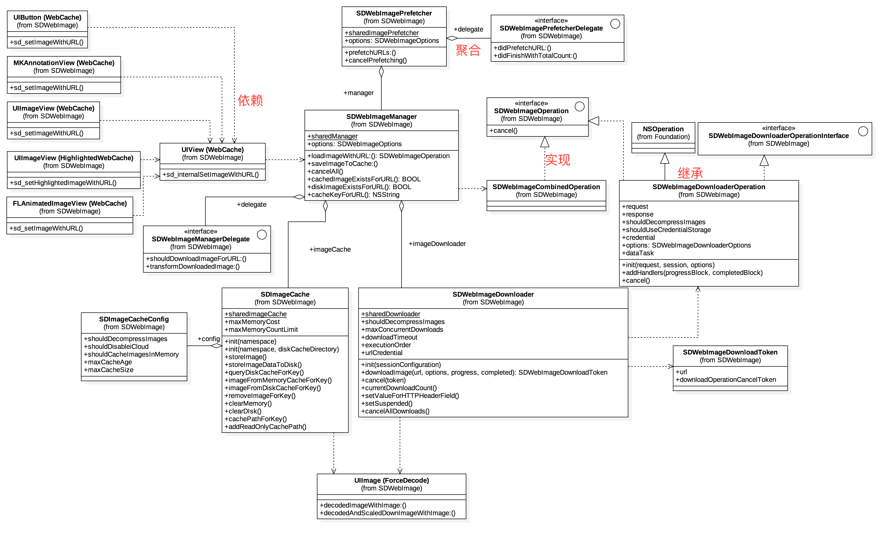
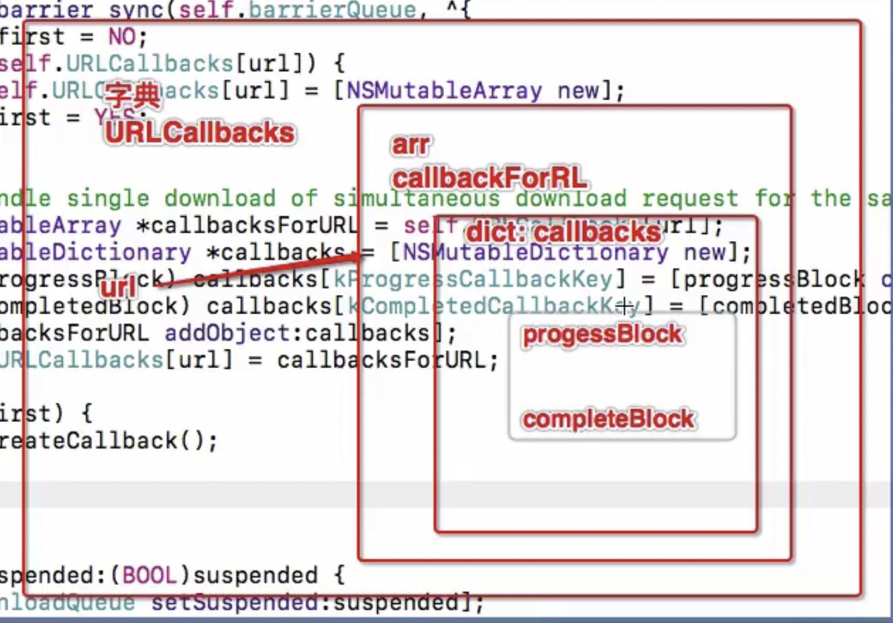

# 核心类



## 管理类 SDWebImageManager

### SDWebImageOptions

- SDWebImageRetryFailed 取消黑名单
- SDWebImageCacheMemoryOnly 只进行内存缓存,也就是下次还会去网上下载
- SDWebImageProgressiveDownload 渐进式下载

## 缓存类 SDImageCache


## 下载类 SDWebImageDownloader


## 操作类 SDWebImageOperation

这个类只有一个文件，是一个协议

```objc
@protocol SDWebImageOperation <NSObject>
- (void)cancel;
@end
```

其他类在使用的时候，需要遵循这个协议，例如下载接口：

```objective-c
- (id <SDWebImageOperation>)downloadImageWithURL:(NSURL *)url
                                         options:(SDWebImageDownloaderOptions)options
                                        progress:(SDWebImageDownloaderProgressBlock)progressBlock
                                       completed:(SDWebImageDownloaderCompletedBlock)completedBlock;
```

在返回的时候，是一个遵循`SDWebImageOperation`协议的id类型数据，其实本质是一个

```objective-c
__block SDWebImageDownloaderOperation *operation;

//SDWebImageDownloaderOperation遵循了SDWebImageOperation协议
@interface SDWebImageDownloaderOperation : NSOperation <SDWebImageOperation, NSURLSessionTaskDelegate, NSURLSessionDataDelegate>
```


# 缓存

### 初始化缓存

```
// 初始化内存缓存：Init the memory cache
_memCache = [[AutoPurgeCache alloc] init];
// 名字是它com.hackemist.SDWebImageCache.default
_memCache.name = fullNamespace;
```

最大缓存时间 **1周**

```
static const NSInteger kDefaultCacheMaxCacheAge = 60 * 60 * 24 * 7; // 1 week
```

### 缓存类

继承自`NSCache`

```objective-c
@interface AutoPurgeCache : NSCache
@end
```

清理机制：当收到内存警告`UIApplicationDidReceiveMemoryWarningNotification`时，清理所有元素

```objective-c
- (id)init
{
    self = [super init];
    if (self) {
        [[NSNotificationCenter defaultCenter] addObserver:self selector:@selector(removeAllObjects) name:UIApplicationDidReceiveMemoryWarningNotification object:nil];
    }
    return self;
}
```

### NSCache

#### 初始化

```objective-c
// 初始化
NSCache *cache = [[NSCache alloc] init];
```

#### 设置最大缓存

当数量超过10个以后，cache自动清理，遵循**<font color='red'>LRU算法</font>**

```
cache.countLimit = 10; 
```

#### 监听清理缓存

设置NSCacheDelegate

```
cache.delegate = self;

- (void)cache:(NSCache *)cache willEvictObject:(id)obj
{
    
}
```


### 清理内存

### 清理磁盘`CleanDisk`

对磁盘的清理主要分为两步：`清除过期文件`和`控制缓存文件的大小`（不超过预设值的缓存）。过程如下：

1. 获取磁盘缓存目录
2. 设置三个Key，`NSURLIsDirectoryKey`，`NSURLContentModificationDateKey`，`NSURLTotalFileAllocatedSizeKey`
3. 使用枚举器遍历文件
4. 从现在开始，减去最大时间，用于提取比较早的文件
5. 创建可变数组，用于存储要删除的文件
6. 清除超过过期时间的文件
7. 以大小为基础进行第二轮的文件存储
8. 将超过过期时间的URL，加入到待删除列表
9. 保留剩下的文件，并计算这些文件的缓存大小（与自己设置的缓存大小比较）
10. 如果超过了自己设置的缓存大小
11. 把缓存的文件，按照大小排序

### 清空磁盘`clearDisk`

删除缓存目录

```objective-c
//清空磁盘缓存
- (void)clearDiskOnCompletion:(SDWebImageNoParamsBlock)completion
{
    // 删除缓存目录
    dispatch_async(self.ioQueue, ^{
        [_fileManager removeItemAtPath:self.diskCachePath error:nil];
        // 创建同名的缓存目录
        [_fileManager createDirectoryAtPath:self.diskCachePath
                withIntermediateDirectories:YES
                                 attributes:nil
                                      error:NULL];

        if (completion) {
            dispatch_async(dispatch_get_main_queue(), ^{
                completion();
            });
        }
    });
}
```


### 保存图片

保存图片共有4个方法，但都最后调用了下面的方法

```objective-c
- (void)storeImage:(UIImage *)image recalculateFromImage:(BOOL)recalculate imageData:(NSData *)imageData forKey:(NSString *)key toDisk:(BOOL)toDisk {
    if (!image || !key) {
        return;
    }
    // 缓存到内存
    if (self.shouldCacheImagesInMemory) {
        NSUInteger cost = SDCacheCostForImage(image);
        [self.memCache setObject:image forKey:key cost:cost];
    }

    // 缓存到磁盘，采用异步操作
    if (toDisk) {
        dispatch_async(self.ioQueue, ^{
            NSData *data = imageData;

            if (image && (recalculate || !data)) {
#if TARGET_OS_IPHONE
                // We need to determine if the image is a PNG or a JPEG
                // PNGs are easier to detect because they have a unique signature (http://www.w3.org/TR/PNG-Structure.html)
                // The first eight bytes of a PNG file always contain the following (decimal) values:
                // 137 80 78 71 13 10 26 10
                // PNG图片有统一的签名较易甄别，前8个字节通常包含：137 80 78 71 13 10 26 10

                // If the imageData is nil (i.e. if trying to save a UIImage directly or the image was transformed on download)
                // and the image has an alpha channel, we will consider it PNG to avoid losing the transparency
                // 如图片的imageData为空（如果试图直接保存一个UIImage 或者 图片是由下载转换得来），且图片含有alpha通道，将进行PNG缓存处理避免失去透明度

                int alphaInfo = CGImageGetAlphaInfo(image.CGImage);
                BOOL hasAlpha = !(alphaInfo == kCGImageAlphaNone ||
                                  alphaInfo == kCGImageAlphaNoneSkipFirst ||
                                  alphaInfo == kCGImageAlphaNoneSkipLast);
                BOOL imageIsPng = hasAlpha;

                // But if we have an image data, we will look at the preffix
                if ([imageData length] >= [kPNGSignatureData length]) {
                    imageIsPng = ImageDataHasPNGPreffix(imageData);
                }

                if (imageIsPng) {
                    data = UIImagePNGRepresentation(image);
                }
                else {
                    data = UIImageJPEGRepresentation(image, (CGFloat)1.0);
                }
#else
                data = [NSBitmapImageRep representationOfImageRepsInArray:image.representations usingType: NSJPEGFileType properties:nil];
#endif
            }
            [self storeImageDataToDisk:data forKey:key];
        });
    }
}
```

### 查找图片

#### 从磁盘中找图片（异步）

这里使用了autoreleasepool，原因是查询接口可能被大量调用，使用autoreleasepool来管理临时变量

```objective-c
//根据key从磁盘缓存中获取图片：异步操作
- (NSOperation *)queryDiskCacheForKey:(NSString *)key done:(SDWebImageQueryCompletedBlock)doneBlock {
    if (!doneBlock) {
        return nil;
    }

    if (!key) {
        doneBlock(nil, SDImageCacheTypeNone);
        return nil;
    }

    // First check the in-memory cache...
    UIImage *image = [self imageFromMemoryCacheForKey:key];
    if (image) {
        doneBlock(image, SDImageCacheTypeMemory);
        return nil;
    }

    NSOperation *operation = [NSOperation new];
    dispatch_async(self.ioQueue, ^{
        if (operation.isCancelled) {
            return;
        }

        @autoreleasepool {
            UIImage *diskImage = [self diskImageForKey:key];
            if (diskImage && self.shouldCacheImagesInMemory) {
                NSUInteger cost = SDCacheCostForImage(diskImage);
                [self.memCache setObject:diskImage forKey:key cost:cost];
            }

            dispatch_async(dispatch_get_main_queue(), ^{
                doneBlock(diskImage, SDImageCacheTypeDisk);
            });
        }
    });

    return operation;
}
```

SDWebImage还创建了一个读写的串行队列`ioQueue`

```
_ioQueue = dispatch_queue_create("com.hackemist.SDWebImageCache", DISPATCH_QUEUE_SERIAL);
```

总结什么时候用同步，什么时候用异步？

- 有返回值时，大部分情况下用`同步`，除非这个返回值跟读写操作无关
- 没有返回值时，用`异步`
- 对磁盘的操作，一般都是`异步`的，除非需要立刻返回磁盘的数据

#### 从磁盘中找图片（同步）

```objc
// 根据key从磁盘缓存中获取图片
- (UIImage *)imageFromDiskCacheForKey:(NSString *)key {
    // First check the in-memory cache...
    UIImage *image = [self imageFromMemoryCacheForKey:key];
    if (image) {
        return image;
    }

    // Second check the disk cache...
    UIImage *diskImage = [self diskImageForKey:key];
    if (diskImage && self.shouldCacheImagesInMemory) {
        NSUInteger cost = SDCacheCostForImage(diskImage);
      	// 将磁盘中的图片，拷贝到缓存中
        [self.memCache setObject:diskImage forKey:key cost:cost];
    }
    return diskImage;
}
```


# 下载

## 基本配置

最大并发数为**<font color='red'>6</font>**

```objective-c
// 最大并发数: 6
_downloadQueue.maxConcurrentOperationCount = 6;
```

超时时间 **15s**

```objective-c
// 下载超时时长
_downloadTimeout = 15.0;
```

支持图片格式

- png
- jpg
- webp 比jpg体积更小
- gif
- tif git中的一张图

SDWebImage根据每个文件的**前8个字节**，来判断是什么类型

## 私有属性

```objc
@interface SDWebImageDownloader () <NSURLSessionTaskDelegate, NSURLSessionDataDelegate>

@property (strong, nonatomic) NSOperationQueue *downloadQueue;
@property (weak, nonatomic) NSOperation *lastAddedOperation;
@property (assign, nonatomic) Class operationClass;
@property (strong, nonatomic) NSMutableDictionary *URLCallbacks;
@property (strong, nonatomic) NSMutableDictionary *HTTPHeaders;
// This queue is used to serialize the handling of the network responses of all the download operation in a single queue
@property (SDDispatchQueueSetterSementics, nonatomic) dispatch_queue_t barrierQueue;

// The session in which data tasks will run
@property (strong, nonatomic) NSURLSession *session;

@end
```


## 取消下载操作

```objective-c
// key = @"UIImageViewImageLoad"
- (void)sd_cancelImageLoadOperationWithKey:(NSString *)key {
    // Cancel in progress downloader from queue
    // 取出当前的这个任务
    NSMutableDictionary *operationDictionary = [self operationDictionary];
    // 根据key取出当前的操作
    id operations = [operationDictionary objectForKey:key];
    // 判断操作不为空的时候进入
    if (operations) {
        // 操作是一个数组话就进行遍历
        if ([operations isKindOfClass:[NSArray class]]) {
            // 循环遍历数组
            for (id <SDWebImageOperation> operation in operations) {
                if (operation) {
                    [operation cancel];
                }
            }
            // 不是数组, 就看它有没有这个协议
        } else if ([operations conformsToProtocol:@protocol(SDWebImageOperation)]){
            [(id<SDWebImageOperation>) operations cancel];
        }
        [operationDictionary removeObjectForKey:key];
    }
}
```

注意，这里的`operationDictionary`是一个关联对象，在方法`operationDictionary`中被关联了上去

```objective-c
static char loadOperationKey;
- (NSMutableDictionary *)operationDictionary {
    NSMutableDictionary *operations = objc_getAssociatedObject(self, &loadOperationKey);
    if (operations) {
        return operations;
    }
    operations = [NSMutableDictionary dictionary];
    objc_setAssociatedObject(self, &loadOperationKey, operations, OBJC_ASSOCIATION_RETAIN_NONATOMIC);
    return operations;
}

```

## 下载队列

### 队列的初始化

```objc
_downloadQueue = [NSOperationQueue new];
        
// 最大并发数: 6
_downloadQueue.maxConcurrentOperationCount = 6;
_downloadQueue.name = @"com.hackemist.SDWebImageDownloader";
```


### 栅栏函数

使用并发队列

```objective-c
_barrierQueue = dispatch_queue_create("com.hackemist.SDWebImageDownloaderBarrierQueue", DISPATCH_QUEUE_CONCURRENT);
```


### 创建下载任务

在创建下载任务的时候，先使用了栅栏函数，做了数据的同步

- 使用同步操作，确保在`createCallback`中塞数据是同步的
- 使用栅栏函数，目的是确保在这之前所有的任务都被执行完了
- 由于涉及到`NSMutableDictionary`的添加操作操作，为了确保线程安全，所以需要用到`栅栏`函数

```objective-c
dispatch_barrier_sync(self.barrierQueue, ^{
        BOOL first = NO;
        if (!self.URLCallbacks[url]) {
            self.URLCallbacks[url] = [NSMutableArray new];
            first = YES;
        }

        // Handle single download of simultaneous download request for the same URL
        NSMutableArray *callbacksForURL = self.URLCallbacks[url];
        NSMutableDictionary *callbacks = [NSMutableDictionary new];
        if (progressBlock) callbacks[kProgressCallbackKey] = [progressBlock copy];
        if (completedBlock) callbacks[kCompletedCallbackKey] = [completedBlock copy];
        [callbacksForURL addObject:callbacks];
        self.URLCallbacks[url] = callbacksForURL;

        if (first) {
            createCallback();
        }
    });
```



这一步做了如下操作：

1. 从`URLCallbacks`回调字典中，获取对应URL的可变数组
2. 创建一个新的字典，字典中存取这个URL新的`process`和`complete`回调
3. 将这个字典，添加到这个URL对应的可变数组中
4. 将这个数组赋值到这个URL对应的字典位置


这样的目的：解决了一个URL被多次重复下载的问题，总是取到最新的一个下载


然后创建了下载任务

```objective-c
[self addProgressCallback:progressBlock completedBlock:completedBlock forURL:url createCallback:^{
        operation = [[wself.operationClass alloc] initWithRequest:request
                                                        inSession:self.session
                                                          options:options
                                                         progress:^(NSInteger receivedSize, NSInteger expectedSize) {
                                                             SDWebImageDownloader *sself = wself;
                                                             if (!sself) return;
                                                             __block NSArray *callbacksForURL;
                                                             dispatch_sync(sself.barrierQueue, ^{
                                                                 callbacksForURL = [sself.URLCallbacks[url] copy];
                                                             });
                                                             for (NSDictionary *callbacks in callbacksForURL) {
                                                                 dispatch_async(dispatch_get_main_queue(), ^{
                                                                     SDWebImageDownloaderProgressBlock callback = callbacks[kProgressCallbackKey];
                                                                     if (callback) callback(receivedSize, expectedSize);
                                                                 });
                                                             }
                                                         }
                                                        completed:^(UIImage *image, NSData *data, NSError *error, BOOL finished) {
                                                            SDWebImageDownloader *sself = wself;
                                                            if (!sself) return;
                                                            __block NSArray *callbacksForURL;
                                                            dispatch_barrier_sync(sself.barrierQueue, ^{
                                                                callbacksForURL = [sself.URLCallbacks[url] copy];
                                                                if (finished) {
                                                                    [sself.URLCallbacks removeObjectForKey:url];
                                                                }
                                                            });
                                                            for (NSDictionary *callbacks in callbacksForURL) {
                                                                SDWebImageDownloaderCompletedBlock callback = callbacks[kCompletedCallbackKey];
                                                                if (callback) callback(image, data, error, finished);
                                                            }
                                                        }
                                                        cancelled:^{
                                                            SDWebImageDownloader *sself = wself;
                                                            if (!sself) return;
                                                            dispatch_barrier_async(sself.barrierQueue, ^{
                                                                [sself.URLCallbacks removeObjectForKey:url];
                                                            });
                                                        }];
        operation.shouldDecompressImages = wself.shouldDecompressImages;
        
        if (wself.urlCredential) {
            operation.credential = wself.urlCredential;
        } else if (wself.username && wself.password) {
            operation.credential = [NSURLCredential credentialWithUser:wself.username password:wself.password persistence:NSURLCredentialPersistenceForSession];
        }
        
        if (options & SDWebImageDownloaderHighPriority) {
            operation.queuePriority = NSOperationQueuePriorityHigh;
        } else if (options & SDWebImageDownloaderLowPriority) {
            operation.queuePriority = NSOperationQueuePriorityLow;
        }

        [wself.downloadQueue addOperation:operation];
        if (wself.executionOrder == SDWebImageDownloaderLIFOExecutionOrder) {
            // Emulate LIFO execution order by systematically adding new operations as last operation's dependency
            [wself.lastAddedOperation addDependency:operation];
            wself.lastAddedOperation = operation;
        }
    }];
```

### 任务的添加

添加任务之后，系统便会自动运行任务，执行operation的`start`方法

```objective-c
 [wself.downloadQueue addOperation:operation];
```

### 任务挂起与取消

```objective-c
- (void)setSuspended:(BOOL)suspended {
    [self.downloadQueue setSuspended:suspended];
}

- (void)cancelAllDownloads {
    [self.downloadQueue cancelAllOperations];
}
```


# 代码Tips

### 1. NS_OPTIONS与NS_ENUM的区别

- NSOPTIONS的数据类型为`NSUInteger`
- NSOPTIONS的枚举项可以多个或
- NSOPTIONS是用C ++ 编译的
- NS_ENUM的数据类型为`NSInteger`
- NS_ENUM的枚举项只能单个

```objective-c
typedef NS_OPTIONS(NSUInteger, SDWebImageDownloaderOptions) {
		SDWebImageDownloaderLowPriority = 1 << 0,
    SDWebImageDownloaderProgressiveDownload = 1 << 1,
    //...
}

typedef NS_ENUM(NSInteger, SDWebImageDownloaderExecutionOrder) {
    SDWebImageDownloaderFIFOExecutionOrder, // 先进先出 (队列) FIFO
    SDWebImageDownloaderLIFOExecutionOrder // 后进先出(栈)
};
```

### 2. 文件迭代器

类似链表的数据结构

```objective-c
dispatch_sync(_ioQueue, ^{
            _fileManager = [NSFileManager new];
        });

NSDirectoryEnumerator *fileEnumerator = [_fileManager enumeratorAtURL:diskCacheURL
                                                   includingPropertiesForKeys:resourceKeys
                                                                      options:NSDirectoryEnumerationSkipsHiddenFiles
                                                                 errorHandler:NULL];

//迭代器的遍历
for (NSURL *fileURL in fileEnumerator) {      
      // 9.获取指定的key的信息, 以字典的方式返回
      NSDictionary *resourceValues = [fileURL resourceValuesForKeys:resourceKeys error:NULL];

      // Skip directories.
      // 10. 判断这个目录,有就直接跳过
      if ([resourceValues[NSURLIsDirectoryKey] boolValue]) {
          continue;
      }

      // Remove files that are older than the expiration date;
      // 11.拿到文件的修改日期
      NSDate *modificationDate = resourceValues[NSURLContentModificationDateKey];

      // 12.记录超过过期日期文件的fileURL
      if ([[modificationDate laterDate:expirationDate] isEqualToDate:expirationDate]) {
          [urlsToDelete addObject:fileURL];
          continue;
      }

      // Store a reference to this file and account for its total size.
      // 14.保存保留下来的文件的引用并计算文件总的大小
      NSNumber *totalAllocatedSize = resourceValues[NSURLTotalFileAllocatedSizeKey];
      currentCacheSize += [totalAllocatedSize unsignedIntegerValue];
      [cacheFiles setObject:resourceValues forKey:fileURL];
  }
```

### 3. 日期比较

`earlierDate`：比较两个日期，返回较早的日期

`laterDate`：比较两个日期，返回较晚的日期

```objective-c
if ([[modificationDate laterDate:expirationDate] isEqualToDate:expirationDate]) {
    [urlsToDelete addObject:fileURL];
    continue;
}

NSDate *date1 = [NSDate dateWithTimeIntervalSince1970:60];
NSDate *date2 = [NSDate dateWithTimeIntervalSince1970:30];
NSDate *date3 = [NSDate dateWithTimeIntervalSince1970:30];
    
NSDate *earlierDate = [date1 earlierDate:date2];
    
NSDate *laterDate = [date1 laterDate:date2];
    
NSLog(@"earlierDate = %@", earlierDate);
NSLog(@"laterDate = %@", laterDate);

------------------------------------------------
earlierDate = 1970-01-01 00:00:30 +0000
laterDate = 1970-01-01 00:01:00 +0000
```

### 4. 文件排序

`NSSortConcurrent`：并行排序

```objc
NSArray *sortedFiles = [cacheFiles keysSortedByValueWithOptions:NSSortConcurrent
                                                            usingComparator:^NSComparisonResult(id obj1, id obj2) {
                                                                return [obj1[NSURLContentModificationDateKey] compare:obj2[NSURLContentModificationDateKey]];
                                                            }];
```

### 5. 获取某个长度 下的二进制文件数据

```objective-c
NSData *data = [NSData dataWithURL:[NSURL URLWithString:@"..."]];
uint8_t c;
// 长度为1
[data getBytes:&c length:1];
```

### 6. 文件读写的同步队列操作

#### 初始化队列及文件管理器

```objective-c
@property (SDDispatchQueueSetterSementics, nonatomic) dispatch_queue_t ioQueue;

// 1. 创建串行队列
// 初始化执行处理输入输出的等待队列：Create IO serial queue
// Create IO serial queue
_ioQueue = dispatch_queue_create("com.hackemist.SDWebImageCache", DISPATCH_QUEUE_SERIAL);


// 2.创建文件管理器
dispatch_sync(_ioQueue, ^{
            _fileManager = [NSFileManager new];
        });
```

#### 异步操作

异步添加到串行队列的任务，是按照添加的顺序执行的。异步只是不会卡住当前的线程。

```objective-c
//根据key从缓存中清除图片
- (void)removeImageForKey:(NSString *)key fromDisk:(BOOL)fromDisk withCompletion:(SDWebImageNoParamsBlock)completion {
    if (key == nil) {
        return;
    }

    // 内存缓存清除
    if (self.shouldCacheImagesInMemory) {
        [self.memCache removeObjectForKey:key];
    }

    // 磁盘缓存清除
    if (fromDisk) {
        dispatch_async(self.ioQueue, ^{
            [_fileManager removeItemAtPath:[self defaultCachePathForKey:key] error:nil];
            
            if (completion) {
                dispatch_async(dispatch_get_main_queue(), ^{
                    completion();
                });
            }
        });
    } else if (completion){
        completion();
    }
    
}


/**
 *  根据key判断是否Image是否存在磁盘中：异步处理
 *
 *  @param key             key
 *  @param completionBlock Image是否存在磁盘中回调
 */
- (void)diskImageExistsWithKey:(NSString *)key completion:(SDWebImageCheckCacheCompletionBlock)completionBlock {
    dispatch_async(_ioQueue, ^{
        BOOL exists = [_fileManager fileExistsAtPath:[self defaultCachePathForKey:key]];

        // fallback because of https://github.com/rs/SDWebImage/pull/976 that added the extension to the disk file name
        // checking the key with and without the extension
        if (!exists) {
            exists = [_fileManager fileExistsAtPath:[[self defaultCachePathForKey:key] stringByDeletingPathExtension]];
        }

        if (completionBlock) {
            dispatch_async(dispatch_get_main_queue(), ^{
                completionBlock(exists);
            });
        }
    });
}


- (void)dealloc {
    [[NSNotificationCenter defaultCenter] removeObserver:self];
  // 释放Queue
    SDDispatchQueueRelease(_ioQueue);
}
```

### 7. 使用inline 与C++混编

`SDWebImageCompat`类中，定义通用方法

```c++
//在头文件 SDWebImageCompat.h 中声明
extern UIImage *SDScaledImageForKey(NSString *key, UIImage *image);

//在 SDWebImageCompat.m 中定义
inline UIImage *SDScaledImageForKey(NSString *key, UIImage *image) {}
```

在其他类`SDImageCache`中，使用这个方法

```c++
// SDImageCache.h 中import
#import "SDWebImageCompat.h"

// SDImageCache.m 中使用
- (UIImage *)scaledImageForKey:(NSString *)key image:(UIImage *)image {
    return SDScaledImageForKey(key, image);
}
```

> 这样写，就不用在SDImageCache的文件中，使用.mm后缀了

### 8. 对操作队列数组加锁

在声明`nonatomic`的数组，不是线程安全的。SDWebImage提供了一个方案

```objective-c
@property (strong, nonatomic) NSMutableArray *runningOperations;

// 添加元素
@synchronized (self.runningOperations) {
    [self.runningOperations addObject:operation];
}
```

### 9. 让数组中的每个元素执行方法

`makeObjectsPerformSelector`接口

```objective-c
- (void)cancelAll {
    @synchronized (self.runningOperations) {
        NSArray *copiedOperations = [self.runningOperations copy];
        [copiedOperations makeObjectsPerformSelector:@selector(cancel)];
        [self.runningOperations removeObjectsInArray:copiedOperations];
    }
}
```

### 10. iCloud备份

```objective-c
NSURL *fileURL = [NSURL fileURLWithPath:cachePathForKey];
    
// 保存数据
[_fileManager createFileAtPath:cachePathForKey contents:imageData attributes:nil];

// 关闭iCloud备份：disable iCloud backup
// disable iCloud backup
if (self.shouldDisableiCloud) {
		// 使用iCloud备份
    [fileURL setResourceValue:[NSNumber numberWithBool:YES] forKey:NSURLIsExcludedFromBackupKey error:nil];
}
```


### 11. 一些Block设计思想

在downLoader的接口中，progressBlock与completeBlock，都是存在了一个字典中。

### 12. dispatch_barrier的使用

使用`dispatch_barrier_sync`和`dispatch_barrier_async`也是看任务需要，barrier本身提供了数据同步的操作，就是等当前队列上所有的任务都执行完，再执行。

如果，要求立刻返回结果，那么用同步

如果，不要求返回结果，那么用异步

```objc

// 初始化，必须是并发队列
_barrierQueue = dispatch_queue_create("com.hackemist.SDWebImageDownloaderBarrierQueue", DISPATCH_QUEUE_CONCURRENT);
        
// copy progressblock，completedBlock
dispatch_barrier_sync(self.barrierQueue, ^{
        BOOL first = NO;
        if (!self.URLCallbacks[url]) {
            self.URLCallbacks[url] = [NSMutableArray new];
            first = YES;
        }

        // Handle single download of simultaneous download request for the same URL
        NSMutableArray *callbacksForURL = self.URLCallbacks[url];
        NSMutableDictionary *callbacks = [NSMutableDictionary new];
        if (progressBlock) callbacks[kProgressCallbackKey] = [progressBlock copy];
        if (completedBlock) callbacks[kCompletedCallbackKey] = [completedBlock copy];
        [callbacksForURL addObject:callbacks];
        self.URLCallbacks[url] = callbacksForURL;

        if (first) {
            createCallback();
        }
    });


// progressBlock
dispatch_sync(sself.barrierQueue, ^{
      callbacksForURL = [sself.URLCallbacks[url] copy];
});
// completedBlock 中 同步读，等之前的任务全部处理完以后，再执行
dispatch_barrier_sync(sself.barrierQueue, ^{
     callbacksForURL = [sself.URLCallbacks[url] copy];
     if (finished) {
        [sself.URLCallbacks removeObjectForKey:url];
     }
});
// cancelBlock 异步取消任务
dispatch_barrier_async(sself.barrierQueue, ^{
                                                                [sself.URLCallbacks removeObjectForKey:url];
                                                            });
```

### 13. 自定义operation

SDWebImage中`SDWebImageDownloaderOperation`是自定义的，继承自`NSOperation`

如果要自定义实现一个`operation`的话，必须实现重写`main`和`start`中的一个：

- start：用于并发。方法执行完毕，finish属性不变，可以控制整个operation 的生命周期。任务完成后，手动cancel调任务即可
- main：用于非并发。方法执行完毕后，operation会从队列中移除。问题：如果有代理方法的回调，那么由于任务被移除了，造成找不到代理的出错

```objective-c
- (void)start {
    // 防止其他线程更改了属性
    @synchronized (self) {
        if (self.isCancelled) {
            self.finished = YES;
            [self reset];
            return;
        }

        NSURLSession *session = self.unownedSession;
        if (!self.unownedSession) {
            NSURLSessionConfiguration *sessionConfig = [NSURLSessionConfiguration defaultSessionConfiguration];
            sessionConfig.timeoutIntervalForRequest = 15;
            
            /**
             *  Create the session for this task
             *  We send nil as delegate queue so that the session creates a serial operation queue for performing all delegate
             *  method calls and completion handler calls.
             */
            self.ownedSession = [NSURLSession sessionWithConfiguration:sessionConfig
                                                              delegate:self
                                                         delegateQueue:nil];
            session = self.ownedSession;
        }
        
        self.dataTask = [session dataTaskWithRequest:self.request];
        self.executing = YES;
        self.thread = [NSThread currentThread];
    }
    
    [self.dataTask resume];

    if (self.dataTask) {
        if (self.progressBlock) {
            self.progressBlock(0, NSURLResponseUnknownLength);
        }
        dispatch_async(dispatch_get_main_queue(), ^{
            [[NSNotificationCenter defaultCenter] postNotificationName:SDWebImageDownloadStartNotification object:self];
        });
    }
    else {
        if (self.completedBlock) {
            self.completedBlock(nil, nil, [NSError errorWithDomain:NSURLErrorDomain code:0 userInfo:@{NSLocalizedDescriptionKey : @"Connection can't be initialized"}], YES);
        }
    }

#if TARGET_OS_IPHONE && __IPHONE_OS_VERSION_MAX_ALLOWED >= __IPHONE_4_0
    Class UIApplicationClass = NSClassFromString(@"UIApplication");
    if(!UIApplicationClass || ![UIApplicationClass respondsToSelector:@selector(sharedApplication)]) {
        return;
    }
    if (self.backgroundTaskId != UIBackgroundTaskInvalid) {
        UIApplication * app = [UIApplication performSelector:@selector(sharedApplication)];
        [app endBackgroundTask:self.backgroundTaskId];
        self.backgroundTaskId = UIBackgroundTaskInvalid;
    }
#endif
}

- (void)cancel {
    @synchronized (self) {
        if (self.thread) {
            [self performSelector:@selector(cancelInternalAndStop) onThread:self.thread withObject:nil waitUntilDone:NO];
        }
        else {
            [self cancelInternal];
        }
    }
}
```

SDWebImage中Downloader有一个session，但真正的网络回调操作，都是给了Operation执行的。

# 参考链接

[SDWebImage为什么要用autoreleasepool](https://www.jianshu.com/p/b1d432bb0f0c)