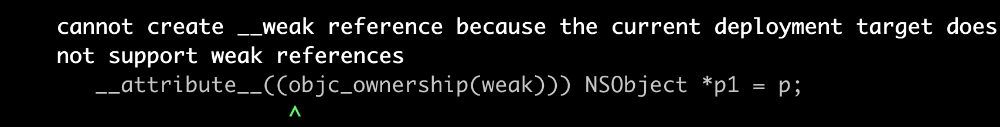

# 准备工作

在Runtime源码的工程下，main.m函数中

```objective-c
int main(int argc, const char * argv[]) {
    @autoreleasepool {
        NSObject *p = [[NSObject alloc] init];
         __weak NSObject *p1 = p;
    }
    return 0;
}
```

如果遇到下面的问题：



用命令行编译

```shell
clang -rewrite-objc -fobjc-arc -stdlib=libc++ -mmacosx-version-min=10.7 -fobjc-runtime=macosx-10.7 -Wno-deprecated-declarations main.m
```

得到的产物如下：

```c++
int main(int argc, const char * argv[]) {
    /* @autoreleasepool */ { __AtAutoreleasePool __autoreleasepool; 
        NSObject *p = ((NSObject *(*)(id, SEL))(void *)objc_msgSend)((id)((NSObject *(*)(id, SEL))(void *)objc_msgSend)((id)objc_getClass("NSObject"), sel_registerName("alloc")), sel_registerName("init"));
         __attribute__((objc_ownership(weak))) NSObject *p1 = p;
    }
    return 0;
}
```

# 流程

弱引用指向时，生成一个weak表，并把弱引用指针，存入这个表中

