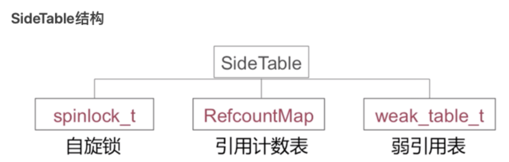
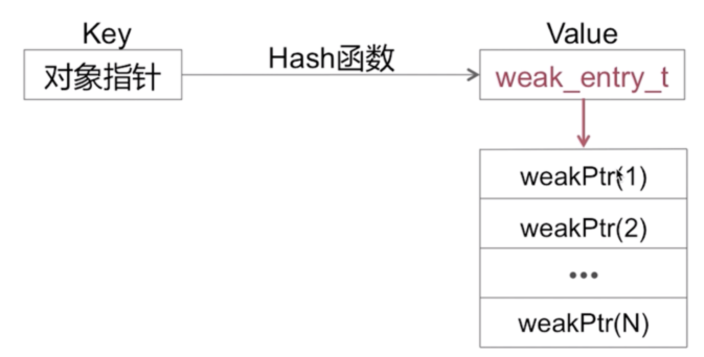

# 内存管理

内存管理有三种方式：

- TaggedPointer：对于一些小对象，比如说NSNumber，NSDate等采用此种方案。当NSString小于**60字节**的也可以运用了该手段

```objective-c
[NSString stringWithFormat:@"abc"]; //taggerpointer
[NSString stringWithFormat:@"abcdfefasdfasdfasdfasdf"]; //CFString
```

- NONPOINTER_ISA：非指针类型，内部结构除了存储类的信息以外，还存储了其他的信息
- POINTER_ISA：只存储了类的信息


## TaggedPointer

目的：节省空间，`NSNumber`这样，原本12个字节的数据（4个指针+8个字节的数据），现在只需要8个字节就能存储（64位系统）

用到了`TaggedPointer`技术方案的代码：

```objective-c
[NSString stringWithFormat:@"%@",@"123"]
NSMutableString *mua = [NSMutableString copy]; //对MutableString执行copy方法
```


- Mac平台，指针的最低位是1；iOS平台，指针的最高位是1
- 节省空间，指针的值不再是一个地址，而是真正的值；也不是对象（没有引用技术那套）
- 内存读写有着3倍的效率，创建时比之前快106倍

### 获取TaggerPointer指针

在iOS 10.14之后苹果对TaggedPointer进行了混淆，所以直接打印tagPointer是打印不出来的。混淆原理：使用objc_debug_taggedpointer_obfuscator对真正的内存地址异或操作

```objc
extern uintptr_t objc_debug_taggedpointer_obfuscator;

uintptr_t _objc_decodeTaggedPointer_(id ptr) {
    NSString *p = [NSString stringWithFormat:@"%ld", ptr];
    return [p longLongValue] ^ objc_debug_taggedpointer_obfuscator;
}

NSNumber *number1 = @1;
NSNumber *number2 = @2;
NSNumber *number3 = @3;
NSLog(@"number1 pointer is %p---真实地址:==0x%lx", number1,_objc_decodeTaggedPointer_(number1));
NSLog(@"number2 pointer is %p---真实地址:==0x%lx", number2,_objc_decodeTaggedPointer_(number2));
NSLog(@"number3 pointer is %p---真实地址:==0x%lx", number3,_objc_decodeTaggedPointer_(number3));
NSString *str3 = [NSString stringWithFormat:@"a"];
NSString *str4 = [NSString stringWithFormat:@"b"];
NSLog(@"str3 pointer is %p---真实地址:==0x%lx", str3,_objc_decodeTaggedPointer_(str3));
NSLog(@"str4 pointer is %p---真实地址:==0x%lx", str4,_objc_decodeTaggedPointer_(str4));
```


## NONPOINTER_ISA

64位架构下iOS应用程序，使用这个方案。目前，iPhone主流的机型和系统，都是基于`NONPOINTER_ISA`布局的。

NONPOINTER_ISA的结构如下：引用计数的值，存储在`extra_rc`这个字段里

```c
//arm64 架构
struct 
{
    uintptr_t nonpointer        : 1;  // 0:普通指针，1:优化过,使用位域存储更多信息
    uintptr_t has_assoc         : 1;  // 对象是否含有或曾经含有关联引用,如果没有,则析构时会更快
    uintptr_t has_cxx_dtor      : 1;  // 表示是否有C++析构函数或OC的dealloc,如果没有,则析构时会更快
    uintptr_t shiftcls          : 33; // 类的指针,存放着 Class、Meta-Class 对象的内存地址信息
    uintptr_t magic             : 6;  // 固定值为 0xd2,用于在调试时分辨对象是否未完成初始化
    uintptr_t weakly_referenced : 1;  // 是否被弱引用指向,如果没有，则析构时更快
    uintptr_t deallocating      : 1;  // 对象是否正在释放
    uintptr_t has_sidetable_rc  : 1;  // 是否需要使用 sidetable 来存储引用计数
    uintptr_t extra_rc          : 19;  // 引用计数能够用 19 个二进制位存储时，直接存储在这里
 };
```


## 散列表 SideTables

> 为了管理所有对象的引用计数和weak指针，苹果创建了一个全局的SideTables，虽然名字后面有个"s"不过他其实是一个全局的Hash表，里面的内容装的都是SideTable结构体而已。它使用对象的内存地址当它的key。管理引用计数和weak指针就靠它了。
>
> 因为对象引用计数相关操作应该是原子性的。不然如果多个线程同时去写一个对象的引用计数，那就会造成数据错乱，失去了内存管理的意义。同时又因为内存中对象的数量是非常非常庞大的需要非常频繁的操作SideTables，所以不能对整个Hash表加锁。苹果采用了分离锁技术。

- 一个全局的Hash表，存储的SideTable结构体
- 以对象的内存地址为Key
- 采用分离锁技术，自旋锁

### 如何访问散列表



#### 自旋锁

多个sideTable,来提高效率，用分离锁来提高访问效率。`Spinlock_t`自旋锁，是“忙等”的锁。适用于轻量访问
RefcountMap 引用计数表。引用计数表是一个哈希表

#### 弱引用计数表



存储了弱引用对象的所有指针地址，当这个对象的技术为0时，所有的指针置为nil

# 引用计数

## ARC

## MRC

### 初始化时，self.A = [[NSObject alloc] init]

- 引用计数为1

### 赋值

- 类的属性赋值 object.A = A

	- 1. 调用setProperty
	- 2. 对应地址的extra_rc加1

- 局部变量赋值

	- extra_rc不增加

### retain

- 手动让`extra_rc + 1`
- 如果溢出，把 溢出值的**一半**存储到`SideTable`中，剩下的一半存到`extra_rc`中

```objective-c
- (id)retain {
    return ((id)self)->rootRetain();
}
objc_object::rootRetain()
{
    return rootRetain(false, false);
}
ALWAYS_INLINE id 
objc_object::rootRetain(bool tryRetain, bool handleOverflow)
{
    if (isTaggedPointer()) return (id)this;
    bool sideTableLocked = false;
    bool transcribeToSideTable = false;
    isa_t oldisa;
    isa_t newisa;
    do {
        transcribeToSideTable = false;
        //读取操作原子化，根据 CPU 不同实现不同，比如在 x86-64 上就是单纯的直接返回值，而在 arm64 上则使用了 ldxr 指令,获取isa.bits 的值
        oldisa = LoadExclusive(&isa.bits);
        newisa = oldisa;
        //isa是指针类型
        if (slowpath(!newisa.nonpointer)) {
            //asm("clrex" : "=m" (*dst));
            ClearExclusive(&isa.bits);
            if (!tryRetain && sideTableLocked) sidetable_unlock();
            if (tryRetain) return sidetable_tryRetain() ? (id)this : nil;
           //前面的都不会走，直接走这里
            else return sidetable_retain();
        }
        // don't check newisa.fast_rr; we already called any RR overrides
        if (slowpath(tryRetain && newisa.deallocating)) {
            ClearExclusive(&isa.bits);
            if (!tryRetain && sideTableLocked) sidetable_unlock();
            return nil;
        }
        uintptr_t carry;
        newisa.bits = addc(newisa.bits, RC_ONE, 0, &carry);  // extra_rc++
        if (slowpath(carry)) {
            // newisa.extra_rc++ overflowed
            if (!handleOverflow) {//如果溢出并且没有处理过溢出走这里
                ClearExclusive(&isa.bits);
                //又调用一下自己的放rootRetain(tryRetain, true);，把处理过溢出标记为true
                return rootRetain_overflow(tryRetain);
            }
            // Leave half of the retain counts inline and 
            // prepare to copy the other half to the side table.
            if (!tryRetain && !sideTableLocked) sidetable_lock();
            sideTableLocked = true;
            transcribeToSideTable = true;
            newisa.extra_rc = RC_HALF;
            newisa.has_sidetable_rc = true;
          #留下一半的引用计数，然后把另一半放sideTable里面去
        }
    } while (slowpath(!StoreExclusive(&isa.bits, oldisa.bits, newisa.bits)));
    //则将一半的引用计数加sideTable refcnts里面
    if (slowpath(transcribeToSideTable)) {
        // Copy the other half of the retain counts to the side table.
        sidetable_addExtraRC_nolock(RC_HALF);
    }
    if (slowpath(!tryRetain && sideTableLocked)) sidetable_unlock();
    return (id)this;
}
#把引用计数存储在sideTable的RefcountMap里面，这里才是我们关注的重点
id objc_object::sidetable_retain()
{
#if SUPPORT_NONPOINTER_ISA
    assert(!isa.nonpointer);
#endif
    SideTable& table = SideTables()[this];
    table.lock();
    size_t& refcntStorage = table.refcnts[this];
    if (! (refcntStorage & SIDE_TABLE_RC_PINNED)) {
        refcntStorage += SIDE_TABLE_RC_ONE;
    }
    table.unlock();
    return (id)this;
}

```

### retainCount

- `non_pointer_isa`:返回的是extra_rc + 1 + sideTable，不是extra_rc。所以即使引用计数为0，调用这个方法时，仍然是1
- `ponter_isa`：返回的是 sideTableCount

```objective-c
- (NSUInteger)retainCount {
    return ((id)self)->rootRetainCount();
}


inline uintptr_t 
objc_object::rootRetainCount()
{
    if (isTaggedPointer()) return (uintptr_t)this;
    sidetable_lock();
    isa_t bits = LoadExclusive(&isa.bits);
    ClearExclusive(&isa.bits);
    if (bits.nonpointer) {//非指针类型
        //存储在isa中extra_rc+1
        uintptr_t rc = 1 + bits.extra_rc;
        if (bits.has_sidetable_rc) {
            rc += sidetable_getExtraRC_nolock();
        }
        sidetable_unlock();
        return rc;
    }
    sidetable_unlock();
    //指针类型的返回这个
    return sidetable_retainCount();
}

```

### release

- 手动让extra_rc - 1
- pointer_isa：从sideTable中取计数，然后-1
- nonpointer_isa，先从extra_rc - 1，如果溢出，从sideTable 取出RC_HALF，把能够借到的值都给extra_rc；借不到的话，就销毁

```objc
- (oneway void)release {
    ((id)self)->rootRelease();
}
ALWAYS_INLINE bool 
objc_object::rootRelease()
{
    return rootRelease(true, false);
}
ALWAYS_INLINE bool 
objc_object::rootRelease(bool performDealloc, bool handleUnderflow)
{
    if (isTaggedPointer()) return false;
    bool sideTableLocked = false;
    isa_t oldisa;
    isa_t newisa;
 retry:
    do {
        oldisa = LoadExclusive(&isa.bits);
        newisa = oldisa;
        //指针类型sidetable_release
        if (slowpath(!newisa.nonpointer)) {
            ClearExclusive(&isa.bits);
            if (sideTableLocked) sidetable_unlock();
            return sidetable_release(performDealloc);
        }
        // don't check newisa.fast_rr; we already called any RR overrides
        uintptr_t carry;
        newisa.bits = subc(newisa.bits, RC_ONE, 0, &carry);  // extra_rc--
        //相减后下溢出
        if (slowpath(carry)) {
            // don't ClearExclusive()
            goto underflow;
        }
    } while (slowpath(!StoreReleaseExclusive(&isa.bits, 
                                             oldisa.bits, newisa.bits)));
    if (slowpath(sideTableLocked)) sidetable_unlock();
    return false;
 underflow:
    // newisa.extra_rc-- underflowed: borrow from side table or deallocate
    // abandon newisa to undo the decrement
    newisa = oldisa;
    if (slowpath(newisa.has_sidetable_rc)) {
        if (!handleUnderflow) {
            ClearExclusive(&isa.bits);
            //再执行rootRelease一次，处理下溢出
            return rootRelease_underflow(performDealloc);
        }
        // Transfer retain count from side table to inline storage.
        if (!sideTableLocked) {
            ClearExclusive(&isa.bits);
            sidetable_lock();
            sideTableLocked = true;
            // Need to start over to avoid a race against 
            // the nonpointer -> raw pointer transition.
            goto retry;
        }
//下面是从 sideTable 借 RC_HALF 的引用计数放到 extra_rc 上, 借不到的情况，对象需要被销毁了
        // Try to remove some retain counts from the side table.        
        size_t borrowed = sidetable_subExtraRC_nolock(RC_HALF);
        // To avoid races, has_sidetable_rc must remain set 
        // even if the side table count is now zero.
        if (borrowed > 0) {
            // Side table retain count decreased.
            // Try to add them to the inline count.
            newisa.extra_rc = borrowed - 1;  // redo the original decrement too
            bool stored = StoreReleaseExclusive(&isa.bits, 
                                                oldisa.bits, newisa.bits);
            if (!stored) {
                // Inline update failed. 
                // Try it again right now. This prevents livelock on LL/SC 
                // architectures where the side table access itself may have 
                // dropped the reservation.
                isa_t oldisa2 = LoadExclusive(&isa.bits);
                isa_t newisa2 = oldisa2;
                if (newisa2.nonpointer) {
                    uintptr_t overflow;
                    newisa2.bits = 
                        addc(newisa2.bits, RC_ONE * (borrowed-1), 0, &overflow);
                    if (!overflow) {
                        stored = StoreReleaseExclusive(&isa.bits, oldisa2.bits, 
                                                       newisa2.bits);
                    }
                }
            }
            if (!stored) {
                // Inline update failed.
                // Put the retains back in the side table.
                sidetable_addExtraRC_nolock(borrowed);
                goto retry;
            }
            // Decrement successful after borrowing from side table.
            // This decrement cannot be the deallocating decrement - the side 
            // table lock and has_sidetable_rc bit ensure that if everyone 
            // else tried to -release while we worked, the last one would block.
            sidetable_unlock();
            return false;
        }
        else {
            // Side table is empty after all. Fall-through to the dealloc path.
        }
    }
    // Really deallocate.
    if (slowpath(newisa.deallocating)) {
        ClearExclusive(&isa.bits);
        if (sideTableLocked) sidetable_unlock();
        return overrelease_error();
        // does not actually return
    }
    newisa.deallocating = true;
    if (!StoreExclusive(&isa.bits, oldisa.bits, newisa.bits)) goto retry;
    if (slowpath(sideTableLocked)) sidetable_unlock();
    __sync_synchronize();
    if (performDealloc) {
        ((void(*)(objc_object *, SEL))objc_msgSend)(this, SEL_dealloc);
    }
    return true;
}
```


## autoreleasepool

首先，先明确，`autoreleasepool`和`autorelease`对象，前者是管理后者的一个内存管理池。也就是说，autoreleasepool是管理autorelease对象的。


autorelease对象有哪些？

- 图像文件读入到NSData对象，并生成UIImage对象，改变该对象尺寸后生成新的UIImage对象
- NSMutableArray中的arrayWithCapacity类方法

```objective-c
id array = [[NSMutableArray alloc] arrayWithCapacity:1];

//等价于
id array = [[[NSMutableArray alloc] arrayWithCapacity:1] autorelease];
```

- `stringWithFormat`创建的字符串

总结来说：

通常<font color='red'>**非alloc、new、copy、mutableCopy**</font>出来的对象都是autorelease的，比如`[UIImage imageNamed:]`、`[NSString stringWithFormat]`、`[NSMutableArray array]`等。（会加入到最近的autorelease pool哈）

> 所以哦，不是autoreleasepool可以自动监测对象的创建，而是你对象创建的时候被ARC默认加了`return [obj autorelease]`，就被放进AutoReleasePage啦

## __autorelease修饰符

- **`__autorelease` 修饰符并不像 weak 有个弱引用表，他不会被自动清理指针**
- __autorelease也是**强引用**


打印注册到autoreleasepool中的对象`_objc_autoreleasePoolPrint(void)`

```objc
dispatch_async(dispatch_get_global_queue(0, 0), ^{
  id array = [NSMutableArray arrayWithCapacity:1];
  id __unsafe_unretained array_1 = [NSMutableArray array];
  id array_2 = [NSMutableArray array];
  id __weak weakArray = [NSMutableArray arrayWithCapacity:1];
  id __unsafe_unretained unsaferetainedArray = [NSMutableArray arrayWithCapacity:1];
  NSLog(@"array: %p", array);
  NSLog(@"array_1: %p", array_1);
  NSLog(@"array_2: %p", array_2);
  NSLog(@"weakArray: %p", weakArray);
  NSLog(@"unsaferetainedArray: %p", unsaferetainedArray);

  extern void _objc_autoreleasePoolPrint(void);  // 打印注册到autoreleasePool中的对象
  _objc_autoreleasePoolPrint();
}
```


在《Effective Objective-C 2.0》中有写道伪代码实现：

`objc_autoreleaseReturnValue`

```
id objc_autoreleaseReturnValue(id object) {
    if ( // caller will retain object) { // 如果调用者retain
          set_flag(object); // 设置标志
          return object; // 返回 object
    } else {
          return [object autorelease];    // 如果调用者没有retain 就返回[object autorelease]
    }
}
```

`objc_retainAutoreleasedReturnValue`

```kotlin
id objc_retainAutoreleasedReturnValue(id object) {
    if (get_flag(object))  { // 查看是否有标志
        clear_flag(object); // 如果有，先清除标志
        return object; ///< No retain // 直接返回 object
    } else {
        return [object retain]; // 如果没有标志，就说明在自动释放池中，retain
    }
}
```

参考文档：

[[iOS] __autorelease的碎碎念&疑惑](https://www.jianshu.com/p/1a9847c5215b)

[[iOS] @autoreleasepool是干神马的](https://www.jianshu.com/p/b6cfbeabfb14)

[objc_autoreleaseReturnValue & objc_retainAutoreleasedReturnValue](https://www.jianshu.com/p/5ec8fdef8e7e)

[iOS基础：再次思考引用计数和autorelease](https://www.jianshu.com/p/e920d1ff570c)


## 应用场景

### 循环优化

```objective-c
for (int i = 0; i < 100000000; i++) {
  UIImage *image = [UIImage imageNamed:@"logo"]; //不是局部对象
}

//外部有个autoreleasepool
```

这个内存爆的原因其实就是`image`作为**局部变量**，创建的是一个autorelease对象。产生了大量的autorelease对象，他们释放的时机，是最外部的autoreleasepool（此时，假设没有其他`autoreleasepool`修饰的话，就是主程序的`autoreleasepool`，那么就会等到下一个runloop再销毁）。在不特殊处理的时候会在`runLoop`休眠时再被销毁，不会立即销毁。

```objective-c
for (int i = 0; i < 100000000; i++) {
  @autoreleasepool{
    UIImage *image = [UIImage imageNamed:@"logo"];
  }
}
```

如果你的应用程序或者线程是要长期运行的，或者长期在后台中运行的任务，因为任务运行中runloop是不会休眠的，如果产生大量需要autorelease的对象，需要手动`@autoreleasepool`，否则不会立刻释放导致内存增加。


# 参考文档

[Objective-C Automatic Reference Counting (ARC)](http://clang.llvm.org/docs/AutomaticReferenceCounting.html)

[关于__autoreleasing，你真的懂了吗？](https://blog.csdn.net/junjun150013652/article/details/53149145)

[objc_autoreleaseReturnValue & objc_retainAutoreleasedReturnValue](https://www.jianshu.com/p/5ec8fdef8e7e)

[__unsafe_unretained & __weak & __autoreleasing 都有什么区别](https://www.jianshu.com/p/824649d6f0c1)

