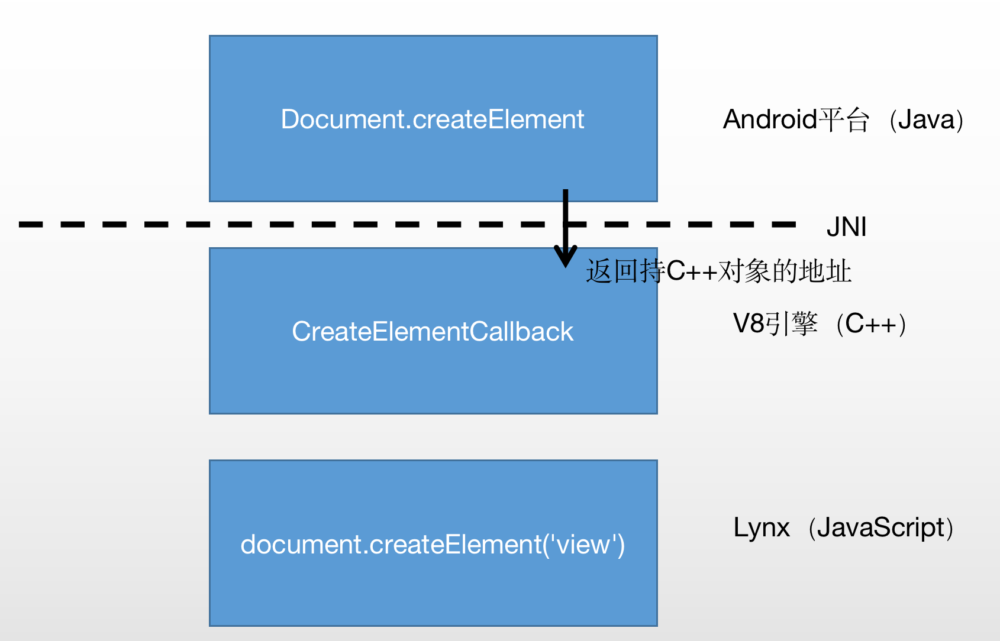

# 序

我从去年4月开始，接触公司的动态化技术。当时，百度地图内部流行两套动态化的技术方案：

- 手百研发，类似于RN的San框架，移动端叫Talos
- 地图自研，类似美团的Mach（马赫）方案，Mystique。


那么怎么去调研一个动态化的框架呢？首先还是从使用开始，写过动态化代码的一些开发。主要是前端脚本语言（例如js，css），还有配置等等。

研究动态化绕不开几个点：

- 动态的特性如何实现
  - 代码如何编译并运行起来
  - 如何实现远程下载，热更新等等（压缩，解压）
- 渲染的机制
  - 如何渲染节点
  - 如何节点如何上屏
  - 如何布局
- 通信的机制
  - NA -> 动态化模板
  - 数据如何加载

在深入一些，各个动态化的框架

- 有什么优缺点
- 如何做性能优化（主要是渲染）
- 如何做性能指标建设的


一般常常听到的名词有AST，DSL等等。


# Lynx

Lynx框架是字节推出的，使用平台UI来渲染，并使用CSS来布局。使用同一份JS代码来驱动。

渲染：平台

布局：CSS

事务驱动：JS

lynx-cli提供了基本的工程模板和打包工具

## 特性

使用VUE.js作为开发框架，与RN相比

- 首屏直接展示，效果更好
- 强大的交互动画
- 更快的JSBinding

## Lynx工作流程

.assets/lynx-native-design.png)

从一个页面打开到展示流程和输入事件到页面响应流程来介绍Lynx的工作流程，当前Lynx使用Vue.js前端框架：

1. 先从Page节点出发。当页面开发完成后，通过lynx-cli进行项目构建，编译过程生成**排版文件(Layout File)和执行文件**。
2. LayoutFile通过解析器Parser生成RenderTree，同时生成Element（JS可控制的元素，处于Binding模块）。
3. RenderTree通过排版引擎LayoutEngine计算**布局信息**，与对应的Platform层的UI进行**位置信息同步**，最终由各平台渲染View并绘制上屏。
4. 在首屏排版流程进行完，会执行JS文件，正式进入到应用页面的生命周期。
5. 当屏幕接收到响应事件，由事件处理模块进行手势识别，通过PlatformUI 将事件传同步到Render层，通过Binding同步到JS。
6. 当涉及到实时动画操作，由PlatformUI将事件同步传递给动画处理引擎AnimateVirtualMachine。引擎将根据AnimateScript（交互动画执行脚本，通过JS设置给交互动画引擎），执行平台View动画。

## Lynx架构

**Runtime**: JS层是所有JS业务和显示相关的逻辑都在Runtime中执行，Runtime是JS逻辑与各平台原生代码交互的基础。Runtime实现了基础的JSBridge，并通过JSBridge为JS添加了一些基础类型和对象，例如Navigator，Log，Screen，Document，Element，Body等

**Render**：Render层是实现显示相关的逻辑，Runtime将显示相关的逻辑。Render层会根据Runtime层调用element的操作节点的API后生成的RenderTree，进行排版。Render层包含一个排版引擎，支持使用flex排版进行排版。**<font color='red'>Render层与Runtime运行在同一个线程(JS线程)</font>**，Render层会根据排版结果与Platform层跨线程通行，将排版结果和一些显示属性传递给Platform层。

**Platform**：

-  实现层，分别基于iOS和Android平台的实现，并生成ViewTree
- 事件转发层（系统事件传给Render）

Platform层是各自iOS和Android平台的实现层，Platform层会根据Render层中RenderTree生成各自平台的ViewTree并用于真正在平台上的显示。Platform层会接受Render层传递过来的排版和显示属性，并转换成平台View的属性进行设置。同时Platorm层也会接受系统事件，例如点击，滚动等等事件，并将事件传递给Render层，再通过Render层传递给Runtime并且触发需要响应的逻辑。

**LayoutFile**： LayoutFile是在编译过程中生成的首屏排版文件，Render层会根据排版文件生成RenderTree，LayoutFile类似于Android中用于排版的XML文件。

**AnimateScript**： AnimateScript是用于执行交互动画的一个可执行文件，AnimateScript是JS的一个子集(请参看[lepus语法](https://hxxft.github.io/lynx-book/design-doc/lepus.html))，负责及时响应系统事件并产生相应的动画。

.assets/lynx-native-detail.png)

## 核心技术

### JSBinding

什么是JSBinding？建立JS与Native间的桥梁，通过JS引擎来通信。常用的JS引擎有

- JavaScriptCore（苹果推）
- Chome推出的V8引擎

需要关注点：

- binding的过程（JS对应的NA对象是如何创建的）
- 线程是否安全
- 内存管理

#### 举个例子


分析一下两个引擎中，初始化环境以及Extension的方式

- 如何初始化环境及运行上下文
- 如何关联 c++ 对象和 JS 对象
- 如何创建对象，并注册到上下文中
- 如何向在 JS 引擎对象原型中静态注册变量和方法的钩子
- 如何向在 JS 引擎对象中动态注册方法钩子
- 如何销毁虚拟机

> 静态注册指的是对 JS 的原型 prototype 设置属性、方法及钩子函数，从持有该原型的构造函数创建的对象均有设置的方法和属性及钩子函数。
>
> 动态注册指直接对 JS 对象设置方法的钩子函数，仅有被设置过的对象才拥有被设置的方法。动态注册属性钩子函数的方式在 JS 引擎中暂时没有提供直接的方式.

以V8为例

1. 初始化

```
V8::InitializeICUDefaultLocation(argv[0]);
V8::InitializeExternalStartupData(argv[0]);
v8::Platform* platform = v8::platform::CreateDefaultPlatform();
V8::InitializePlatform(platform);
v8::V8::Initialize();
```

2. 创建全局对象global，获取JS上下文

```
// 创建isolate
v8::Isolate* isolate = v8::Isolate::New(create_params);
v8::Isolate::Scope isolate_scope(isolate);
v8::HandleScope handle_scope(isolate);
// 创建global 对象模板
v8::Local <v8::ObjectTemplate> global_template = v8::ObjectTemplate::New(isolate);
// 创建 JS 运行上下文 context
v8::Local <v8::Context> context = v8::Context::New(isolate, nullptr, global_template);
v8::Context::Scope context_scope(context);
//  context 中获取 global 对象
v8::Local<v8::Object> global = context->Global();
```

3. 创建Example对象的构造函数模板，在构造函数模板中获取原型模板，并设置静态方法和变量的钩子

```
// 创建 example 的构造函数模板, 使用该 c++ 类的初始化函数作为参数（函数钩子），初始化构造器函数模
// 板。即当调用构造函数创建对象时，会调用该钩子函数做构造处理
v8::Local<v8::FunctionTemplate> example_tpl = v8::FunctionTemplate::New(isolate);
// 设置构造函数模板的类名
example_tpl->SetClassName(V8Helper::ConvertToV8String(isolate, "Example"));
// 设置内部关联 c++ 对象的数量为 1
example_tpl->InstanceTemplate()->SetInternalFieldCount(1);
// 设置构造函数模板中的原型模板的对应函数名的钩子
example_tpl->PrototypeTemplate()->Set(V8Helper::ConvertToV8String(isolate, "testStatic"), v8::FunctionTemplate::New(isolate, TestStaticCallback));
// 设置构造函数模板中的原型模板的属性的 Get 和 Set 钩子方法
example_tpl->PrototypeTemplate()->SetAccessor(V8Helper::ConvertToV8String(isolate, "num"), GetNumCallback, SetNumCallback);
```

4. 用于静态注册的函数钩子，包括 testStatic 方法钩子和 num 的 get / set 钩子

```
// example.testStatic() 调用时对应的 c++ 函数钩子
static void TestStaticCallback(const v8::FunctionCallbackInfo <v8::Value> &args) {
    Example* example = static_cast<Example*>(args.Holder()->GetAlignedPointerFromInternalField(0));
    example->TestStatic();
}

// console.log(example.num) 调用时对应触发的 c++ 钩子函数
static void GetNumCallback(v8::Local<v8::String> property, const PropertyCallbackInfo<Value>& info) {
    Example* example = static_cast<Example*>(args.Holder()->GetAlignedPointerFromInternalField(0));
    int num = example->num();
    info.GetReturnValue().Set(v8::Number::New(isolate, num));
}

// example.num = 99 时会触发该的 c++ 函数钩子
static void SetNumCallback(v8::Local<v8::String> property, v8::Local<v8::Value> value, const PropertyCallbackInfo<void>& info) {
    if (value->IsInt32()) {
        Example* example = static_cast<Example*>(args.Holder()->GetAlignedPointerFromInternalField(0));
        example->set_num(value->ToInt32())
    }
}
```

5. 根据函数模板创建 example 对象，关联对应 c++ 对象，动态注册方法钩子

```
// 在函数模板中获取可调用的函数
v8::Local<v8::Function> example_constructor = example_tpl->GetFunction(context).ToLocalChecked();
// 调用函数的创建对象的方法，创建 JS 引擎的 example 对象
v8::Local<v8::Object> example =
    example_constructor->NewInstance(context, 0, nullptr).ToLocalChecked();
// 关联 JS 引擎对象和 c++ 对象
handle->SetAlignedPointerInInternalField(0, this);
// 动态注册函数钩子
v8::Local<v8::Function> dynamic_test_func = v8::FunctionTemplate::New(TestDynamicCallback, args.Data())->GetFunction();
v8::Local<v8::String> dynamic_test_name = v8::String::NewFromUtf8(isolate, "testDynamic", v8::NewStringType::kNormal).ToLocalChecked();
dynamic_test_func->SetName(dynamic_test_name);
example->Set(dynamic_test_name, dynamic_test_func);

// example.testDynamic() 调用时对应的 c++ 函数钩子
static void TestDynamicCallback(const v8::FunctionCallbackInfo <v8::Value> &args) {
    Example* example = static_cast<Example*>(args.Holder()->GetAlignedPointerFromInternalField(0));
    example->TestDynamic();
}
```

6. 将 example 对象作为变量添加到 global 的属性中

```
v8::Local<v8::String> example_v8_str = v8::String::NewFromUtf8(isolate, "example", v8::NewStringType::kNormal).ToLocalChecked()
global->Set(context, example_v8_str, example).FromJust();
```

7. 如何销毁虚拟机 对于普通的销毁步骤来说，v8引擎对于虚拟机的销毁分为销毁 Context 和销毁 Isolate ，一般v8的 context 会使用 v8::Persistent\ 持有，在调用 v8::Persistent 的 Reset 方法之后，当前 context 中使用扩展方式注册的对象可能不会被完全回收，因此需要自己手动进行回收


以JSC为例

1. 初始化 JSC 的环境

   ```c++
   JSContextGroupRef context_group = JSContextGroupCreate();
   ```

2. 创建 global 类定义，据此创建 global 类，根据 global 类创建 JS 运行上下文 context，从 context 中获取 global 对象

   ```c++
   JSClassDefinition global_class_definition = kJSClassDefinitionEmpty;
   JSClassRef global_class = JSClassCreate(&global_definition);
   JSContextRef context = JSGlobalContextCreateInGroup(context_group, global_class);
   JSObjectRef global = JSContextGetGlobalObject(context);
   ```

3. 创建 example 类定义，向类定义设置静态方法和变量的钩子

   ```c++
   // 定义将要 Extension 的静态方法，其中包含函数钩子
   static JSStaticFunction s_examplle_function_[] = {
       {"testStatic", TestStaticCallback, kJSClassAttributeNone},
       { 0, 0, 0 }
   };
   // 定义将要 Extension 的变量，其中包含 get 和 set 函数钩子
   static JSStaticValue s_example_values_[] = {
       {"num", GetNumCallback, SetNumCallback, kJSPropertyAttributeReadOnly | kJSPropertyAttributeDontDelete },
       { 0, 0, 0, 0 }
   };
   // 创建 example 类的定义
   JSClassDefinition example_class_definition = kJSClassDefinitionEmpty;
   // 设置类的对应函数名和参数名的钩子
   example_class_definition.staticFunctions = s_console_function_;
   example_class_definition.staticValues = s_console_values_;
   // 设置类的名称
   example_class_definition.className = "Example";
   ```

   用于静态注册的函数钩子，包括 testStatic 方法钩子和 num 的 get / set 钩子

   ```c++
   // example.test() 调用时对应的 c++ 函数钩子
   static JSValueRef TestStaticCallback(JSContextRef ctx, JSObjectRef function, JSObjectRef thisObject, size_t argumentCount, const JSValueRef arguments[], JSValueRef* exception) {
       // 获取 JS 引擎对象中持有的 c++ 对象
       Example* example = static_cast<Example*>(JSObjectGetPrivate(object));
       example->TestStatic();
   }
   
   // console.log(example.num) 调用时对应触发的 c++ 钩子函数
   static JSValueRef GetNumCallback(JSContextRef ctx, JSObjectRef object, JSStringRef propertyName, JSValueRef* exception) {
       Example* example = static_cast<Example*>(JSObjectGetPrivate(object));
       int num = obj->num();
       return JSValueMakeNumber(ctx, num);
   }
   
   // example.num = 99 时会触发该的 c++ 函数钩子
   static bool SetNumCallback(JSContextRef ctx, JSObjectRef object, JSStringRef propertyName, JSValueRef value, JSValueRef* exception) {
       Example* example = static_cast<Example*>(JSObjectGetPrivate(object));
       obj->set_num(JSValueToNumber(ctx, value, NULL));
   }
   ```

   4. 根据类定义创建类，根据类创建 example 对象，关联对应 c++ 对象，动态注册方法钩子

   ```c++
   // 创建 JS 引擎的类
   JSClassRef example_class_ref = JSClassCreate(&example_class_definition);
   JSObjectRef example = JSObjectMake(context, example_class_ref, NULL);
   // 关联 c++ 对象和 JS 引擎对象
   JSObjectSetPrivate(context, example, this)
   JSClassRelease(example_class_ref);
   // 动态注册函数钩子
   JSStringRef dynamic_test_func_name = JSStringCreateWithUTF8CString("testDynamic");
   JSObjectRef dynamic_test_func = JSObjectMakeFunctionWithCallback(context, dynamic_test_func_name, TestDynamicCallback);
   JSObjectSetProperty(context, example, dynamic_test_func_name, dynamic_test_func, kJSPropertyAttributeDontDelete, NULL);
   JSStringRelease(dynamic_test_func_name);
   ```

   用于于动态注册的 testDynamic 的函数钩子

   ```c++
   // example.testDynamic() 调用时对应的 c++ 函数钩子
   static JSValueRef TestDynamicCallback(JSContextRef ctx, JSObjectRef function, JSObjectRef thisObject, size_t argumentCount, const JSValueRef arguments[], JSValueRef* exception) {
       Example* example = static_cast<Example*>(JSObjectGetPrivate(object));
       example->TestDynamic();
   }
   ```

   5. 将 exmaple 对象作为变量添加到 global 的属性中

   ```c++
   JSStringRef example_str_ref = JSStringCreateWithUTF8CString("example");
   JSObjectSetProperty(context, global, example_str_ref, example, kJSPropertyAttributeDontDelete, NULL);
   JSStringRelease(example_str_ref);
   ```

   6. 如何销毁虚拟机 JSC引擎中对于虚拟机的销毁相对比较简单，只需要通过调用 JSGlobalContextRelease 和 JSContextGroupRelease 来分别对 Context 和 Context Group 即可，内存中使用扩展方式注册的对象都会在销毁过程中调用 Finalize 回调

#### 线程安全

JS的 context **并非是线程安全的，因此一个 context 不能在多个线程之间共享**，以避免遇见未知错误。对于应用来说可能需要使用多个 JS Context，而使用多个 Context 的方式有两种，独占式和共享式。

#### 对象声明周期

在建立binding过程中，不可避免的会建立本地对象（C++对象或者平台对象，OC、Android）与JS对象的关系。

一切由 JS 引擎提供或创建的对象的生命周期管理需要由其**内部的 GC 机制**把控，JS 引擎提供了两个接口管理 JS 对象在 GC 机制上的行为，一个是持久化操作帮助 JS 对象脱离 GC 管理，一个是使 JS 对象回归 GC 管理。JS 对象在其生命周期内所出现的行为均可以监听（加钩子），例如 JS 对象的初始化和析构监听。V8 引擎和 JSC 引擎涉及的知识和接口均不相同，但是在概念上是一致的，下面看一下两个平台上的区别

##### **V8 引擎监听和管理对象生命周期的方法**

使用上会经常出现 Handle（句柄）的用法，这是引擎对于其对象访问和管理的方式，Handle 提供在堆上的 JS 对象位置的引用。当一个 JS 对象在 JS 上已经无法访问，同时没有任何的句柄指向他，则被认为可被 GC 回收，这是引擎提供句柄的意义。有两种句柄

- 局部句柄：存放在栈上面，它的生命周期仅存在于一个句柄域中（handle scope），当程序跳出函数块，句柄域析构，局部句柄也随之被释放，指向 JS 对象的句柄数量随之减少
- 持久句柄：和局部句柄一样提供了一个引用指向堆上分配的 JS 对象，但对于其引用的生命周期管理与局部句柄不一样。持久句柄存放在全局区，因此生命周期不受局部区域块的影响，能够在其的生命周期内在多个函数中多次使用，既 JS 对象脱离 GC 管理。持久句柄可以通过 `Persistent::New`方法由局部句柄生成，也可以通过 `Local::New` 方法生成局部句柄。可以通过 `Persistent::SetWeak` 方法进行弱持久化，同时也可以通过 `Persistent::Reset` 方法去持久化


##### **JSC 引擎管理对象 GC 行为的接口**

JSC 引擎上常用于和 JS 打交道的对象包括 JSContextGroupRef / JSContextRef / JSValueRef / JSObjectRef / JSStringRef / JSClassRef 等，对于这些对象的内存管理的方式和 V8 引擎上的方式有所不同。在 JSC 引擎上直接接触到的分为包装和指针，而指针部分由引擎 GC 管理，**需要开发者手动管理**。

JSStringRef、 JSContextRef、JSContextGroupRef、JSClassRef 就是典型的不受管理的指针，当开发者创建了它们之后，**必须在不需要使用的时候释放它们的内存，否则会出现内存泄露。**请看下面的示例。

```c++
JSContextGroupRef context_group = JSContextGroupCreate();
JSClassRef global_class = JSClassCreate(&kJSClassDefinitionEmpty);
JSContextRef context = JSGlobalContextCreateInGroup(context_group, global_class);
JSStringRef str = JSStringCreateWithUTF8CString("try");
// 手动回收内存
JSClassRelease(golbal_class);
JSStringRelease(str);
JSGlobalContextRelease(context);
JSContextGroupRelease(context_group);
```

JSValueRef 代表着 JS 对象（ JSObjectRef 也是一个 JSValueRef ） 是由 JSC 引擎中的 GC 机制管理的，当 JSValueRef 创建出来后，当需要超出当前函数块在全局区域或者堆上继续操作，则需要通过 `JSValueProtect` 对 JSValueRef 进行持久化的操作，JS 对象将脱离 GC 的管理。`JSValueUnprotect` 是 JSC 引擎提供的对于 JSValueRef 去持久化的 API。持久化和去持久化必须成对出现，否则会出现内存泄露。

```c++
// 假设已经初始化上下文
JSContextRef context; 
JSObjectRef object = JSObjectMake(context, NULL, NULL);
// 持久化操作
JSValueProtect(context, object);
// 去持久化操作
JSValueUnprotect(context, object);
```

JSC 中没有弱持久化的概念，通过类定义创建出来的对象都可以监听其被 GC 的事件，


#### Lynx是如何实现binding的？

##### 早期版本

用V8在Android平台实现

.assets/binding1.png)


基础类图

.assets/image-20230212004608418-6133970-6133982.png)

**整体流程**

JS Binding 担任了两个不同平台间交流的使者，是整个 Lynx 框架的基石。JS Binding 整体流程主要包括 JS Binding 初始化流程、JS 调用拓展 API 流程和 JS Binding 结束流程。

在页面启动时，JS Binding 会进行初始化操作，JS 上下文中就能具备了使用 Lynx 框架能力的功能，初始化流程如下

1. 初始化环境：Android 层通过 JNI 调用 JSContext::Initialize 方法进行引擎环境和上下文初始化。
2. 属性、函数的binding：调用 ElementObject、ConsoleObject 等 c++ 对象的 BindingClass 方法初始化与 JNI 相关的变量，如 jclass 和 jMethodID，以便后续调用 Java 方法；创建对应类的构造器函数模板，向函数模板中注册钩子。
3. 建立好内存管理：创建 DocumentObject、ConsoleObject 的 c++ 对象，通过 JNI 方法 NewGlobalRef 持久化对应的 Java object 对象，并将自身的地址交给 Java 对象持有，建立 c++ 对象和 Java 对象的关系。
4. 注册监听：通过 DocumentObject、ConsoleObject 的构造器函数模板创建 JS 对象，如 document、console 等，关联 c++ 对象到 JS 对象中。c++ 对象将 JS 对象持久化，注册析构监听。建立 c++ 对象和 JS 对象的关系。
5. 将拓展的 JS 对象注册到 JS 上下文中。

说明，由于V8引擎是C++写的，所以有一个  Java 对象 - C++ 对象 - JS对象的一个过程

当 JS 中通过 document.createElement('view') 方法时，会简洁调用到 Java 层接口并返回具体结果，具体流程如下

1. V8 引擎在运行到对应方法时，回调 DocumentObject 的 CreateElementCallback 静态方法钩子。
2. 在 CreateElementCallback 方法中，获取 JS 引擎对象中绑定的本地对象 DocumentObject，调用其 CreateElement 方法。
3. 在 DocumentObject::CreateElement 方法中，通过 JNI 接口和已经初始化的 jMethod 和调用 Java 对象的 createElement 方法。
4. 在 Java Document.createElement 方法中，创建 Element 对象并返回其持有的 c++ 指针 ElementObject 地址。
5. 在 DocumentObject::CreateElement 方法中，强转获得 Java Element 对象持有的 ElementObject 指正地址并返回。
6. 在 CreateElementCallback 方法中，返回 ElementObject 中持有的持久化 JS 对象。
7. JS 中获得 document.createElement('view') 调用结果 element。



Lynx 页面退出代表着 JS Binding 的结束，Android 层通过 JNI 释放 JSContext 内存，进而释放 JS 对象、c++ 对象和 Java 对象所占用的内存。触发析构函数将完成以下操作

1. 释放所有持有的构造器函数模板，触发 V8 引擎 GC。
2. JS 对象 GC 触发函数钩子 JavaObjectWrap::WeakCallback，释放持久化 jobject 对象，释放本身 c++ 指针。


## PR稿

[Lynx：来自字节跳动的高性能跨端框架](https://view.inews.qq.com/a/20211211A018UP00)

