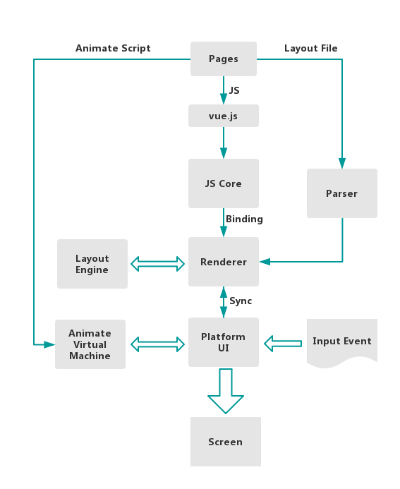

# 序

我从去年4月开始，接触公司的动态化技术。当时，百度地图内部流行两套动态化的技术方案：

- 手百研发，类似于RN的San框架，移动端叫Talos
- 地图自研，类似美团的Mach（马赫）方案，Mystique。

那么怎么去调研一个动态化的框架呢？首先还是从使用开始，写过动态化代码的一些开发。主要是前端脚本语言（例如js，css），还有配置等等。

研究动态化绕不开几个点：

- 动态的特性如何实现
  - 代码如何编译并运行起来
  - 如何实现远程下载，热更新等等（压缩，解压）
- 渲染的机制
  - 如何渲染节点
  - 如何节点如何上屏
  - 如何布局
- 通信的机制
  - NA -> 动态化模板
  - 数据如何加载

在深入一些，各个动态化的框架

- 有什么优缺点
- 如何做性能优化（主要是渲染）
- 如何做性能指标建设的

一般常常听到的名词有AST，DSL等等。

# Lynx

Lynx框架是字节推出的，使用平台UI来渲染，并使用CSS来布局。使用同一份JS代码来驱动

