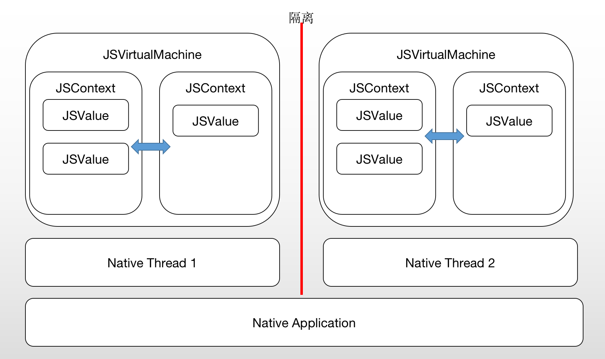

研究动态化，研究Weex或者RN方案等，研究和JavaScript语言相关的技术，就绕不开JavaScript引擎。目前，市场上主流的JavaScript引擎有两个：

- JavaScriptCore
- V8

在RN、Weex系列中，DSL采用前端的JavaScript。Weex需要在APP中嵌入SDK，使用Web开发语言，研发人员需要有一定的前端基础（CSS/JavaScript/HTML)。JavaScriptCore使得DSL语法和渲染分开，能够让JavaScript语言去驱动Navtive实现效果。

Weex技术方案流程图


​	

- Weex前端语言 VUE（类似于开发微信小程序，本质还是HTML语言，但是标签和数据通信有自己的一套规则）、Rax
- 编译后，整个代码是一个JS Bundle
- 在NA端经过解析，构建虚拟视图树，布局
- 最后由iOS、Android双端的渲染引擎完成展示

# JavaScriptCore（JSC）

苹果Safiri中的内置JavaScript引擎，是基于webkit，以C/C++语言实现。目前JSC已经开源，有Objective-C的接口。但Weex中的JSC并不使用在WebKit中（说白了就是自己单独集成了一份JSC）

## JSC的结构

- JSVirtualMachine：在单个JSVirtualMachine内部，**是单线程的**。为了支持并行性，就得开多个JSVM。每个JSVM有自己的内存管理。无法处理不同JSVM之间的通信。
- JSContext：一个运行JS代码的执行环境。与JSVM不同，可以在多个JSContext之间传递对象
- JSValue：JSC中的主要数据类型，表示任何可能的JS值



## 执行过程

OC调用JS的方法，这儿不细讲了，网上有很多。可以看下其实就是：

- 创建JS执行环境
- 执行JS代码

JS调用OC的方法。OC的block赋值给JSContext对象的一个标识符时，JSC会自动将该block封装在一个JS函数中。这个函数名称就是标识符。

```objective-c
context[@"yourJSFunctionName"] = ^(NSString *input){
    // native 实现
}

[context eveluateScript:@"yourFunctionName('test')"];
```


## JavaScript调用

### 使用block

#### 内存管理

block本身会对对象有强引用，JSContext对其**所有变量也有强引用**。

建议：在所有block语句块内，避免出现对JSContext或者任何JSValue的引用。相反，使用获取当前上下文`[JSContext currentContext]`并传递您任何需要的值作为参数。

### JSExport协议

#### 在JavaScript中注入OC对象

在JS代码中使用OC自定义的类、实例方法、属性等，需要接收JSExport协议。

在JS中，继承是通过原型链的方式来实现的。在一个JS执行上下文都暴露在OC勒种，JS执行上下文为其创建了一个与之对应的prototype。比如OC的最高抽象类是NSObject，JS最高抽象类是prototype对象。

| OC中的@property | JS中的property                                               |
| --------------- | ------------------------------------------------------------ |
| Readonly        | Writeable : false<br>enumerable：false<br>configurable：true |
| Readwrite       | Writeable : true<br/>enumerable：true<br/>configurable：true |

OC的类与JS对象不是一一对应的关系，还存在一个wrapper的概念。但是基本可以认为是直接对应关系。

#### 在JavaScript中注入OC方法和属性

默认情况下，OC的实例方法、类方法、property属性不会自动暴露到JS中，需要手动设置。在OC中所有接受JSExport协议的这些方法、property，都会被JS打包成一个方法列表，然后暴露到JS中。

另外，说明一下，JavaScript虽然是面向对象的语言，但是却没有类的概念。在JavaScript中，**不会通过创建类来创建对象**！！！


## 总结

JSC设计的三个标准

- 自动化：JSVM的创建销毁，内存管理，OC对象与JS对象转换，都已经配置好
- 安全：js是动态语言，即使语法错误，也不会出现app的crash。对象转化过程中，因为类型不一致也不会崩溃
- 高保真：泾渭分明。写OC就是OC语法，写JS就是JS语法。