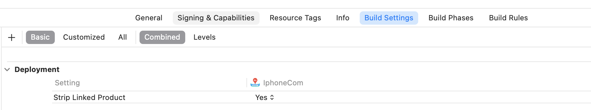
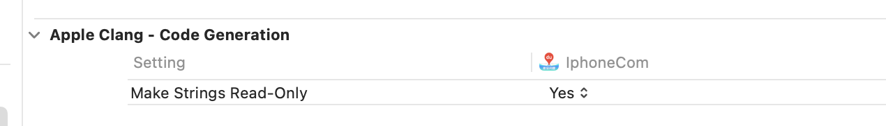
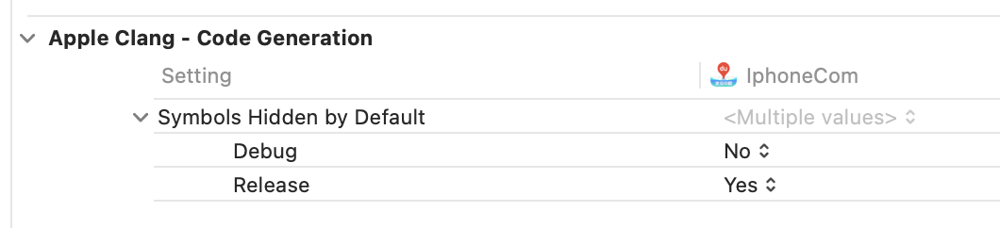

# 包大小瘦身三部曲（一）

## 瘦身的三个主要思路

按照删减文件对整体包大小的增益，排序（排名越靠前，表示删除以后对包体积缩小越明显）：
- 图片资源
- 无用类、方法
- 无用文件（未被引入的问题）

# 可执行文件

## 编译器优化

### 去除符号信息

#### **Strip Linked Product**

Xcode 提供给我们 Strip Linked Product 来去除不需要的符号信息。去除了符号信息之后我们就只能使用 **dSYM** 来进行符号化了，所以需要将 Debug Information Format 修改为 DWARF with dSYM file。

在 Archive 的时候 Xcode 总是会把 Deployment Postprocessing 设置为 YES 。所以我们可以打开 Strip Linked Product 并且把 Deployment Postprocessing 设置为 NO，而不用担心调试的时候会影响断点和符号化，同时打包的时候又会自动去除符号信息。

#### Make Strings Read-Only

Build Settings -> Make Strings Read-Only设置为YES

Make Strings Read-Only (GCC_REUSE_STRINGS), Reuse string literals. 就是复用字符串字面量，提到复用，顾名思义就是减少生成不必要的，也是优化的一种形式。

####  Symbols Hidden by Default

Debug模式下设置为NO，Release下设置为YES.。

Symbols Hidden by Default会把所有符号都定义成"private extern"，移除符号信息。

### 去除异常支持

Build Settings中去掉异常支持，Enable C++ Exceptions和Enable Objective-C Exceptions设置为NO，Other C Flags添加-fno-exceptions；

# 资源

# 参考文档

[iOS 安装包瘦身 （上篇）](https://zhuanlan.zhihu.com/p/52572207)

[iOS安装包大小优化](https://www.jianshu.com/p/a76ba49b270f)

