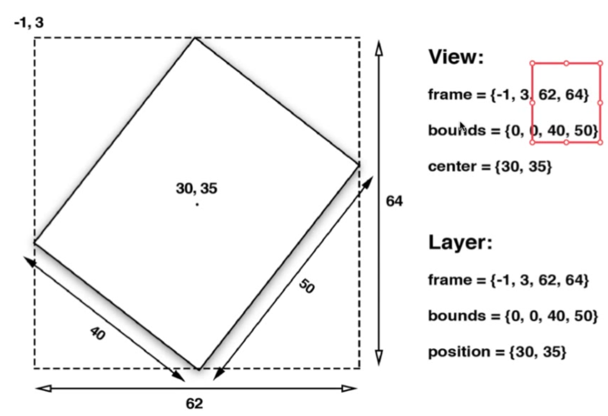
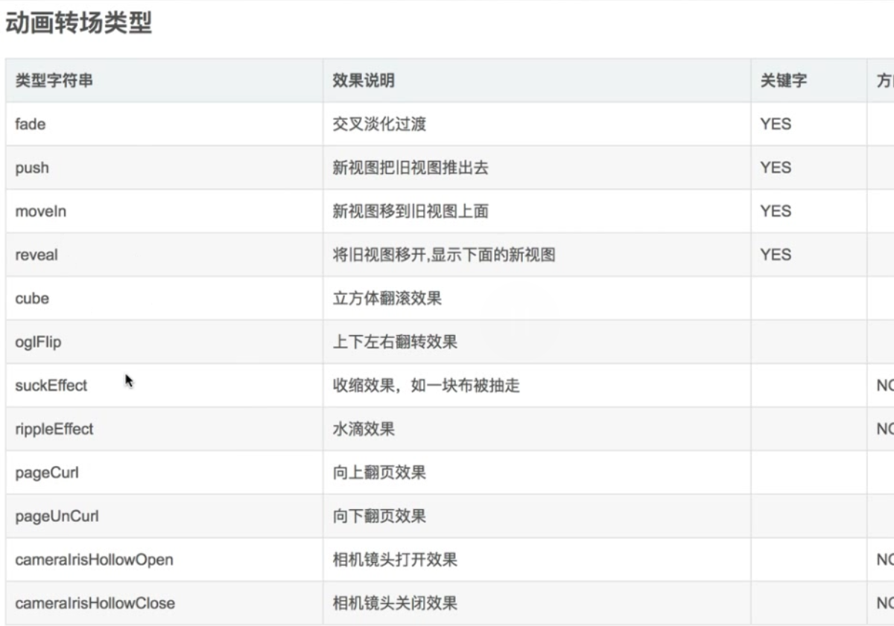

# CoreAnimation

## 面试

- `CALayer`与`UIView`的区别
  1. `UIView`属于`UIKit`框架，`CALayer`属于`QuartzCore`框架（跨平台框架）
  2. UIView负责交互，CALayer负责绘制
  3. 访问的UIView的属性，实际是CALayer的属性


> 因为CAL ayer还需要用在Mac平台上。Mac平台与iOS平台交互方式有差异

- Bounds 与 frame的宽高是否一定相同

不一定，如下图。旋转一定角度后，bounds还是（40，50），而frame变成了（62，64）



- anchorPoint 和 Position的区别

# 三种动画

- 动画的三步骤：

1. 初始化动画对象
2. 设置需要修改的动画属性的值（位置、大小等）
3. 动画添加到CALayer上（所有的动画都是添加到CALayer上，不是UIView）


- 你看到的都是假象，真正的View没有变化？ 

动画作用在Layer上，所以Layer的位置移动，但是UIVew还在原地。点击事件的位置，并不会移动


- presentationLayer和modelLayer

```
NSLog(@"stop-%@",NSStringFromCGRect(_redView.layer.presentationLayer.frame)); //返回屏幕上的frame
NSLog(@"stop-%@",NSStringFromCGRect(_redView.layer.modelLayer.frame));        
```

模型层用来存储数据，并不立刻刷新，例如设置background、frame、center等，都是设置的模型层；


- postion是Layer的中心点，对应UIView中的center

- 建议在添加动画的时候，就把UIView的最终位置写下来。这样是推荐的

  ```objective-c
  - (void)viewDidLoad {
      [super viewDidLoad];
      // Do any additional setup after loading the view, typically from a nib.
      UITapGestureRecognizer *tap = [[UITapGestureRecognizer alloc] initWithTarget:self action:@selector(tapAction:)];
      [_redView addGestureRecognizer:tap];
  }
  - (void)touchesBegan:(NSSet<UITouch *> *)touches withEvent:(UIEvent *)event{
  		// 推荐！！！
     _redView.frame = CGRectMake(0, 400, 100, 100); 
  }
  ```

  

- 隐式动画 & 显式动画

  直接设置的CALayer的frame，再次设置的时候，CALayer会有动画。

  隐式动画：默认时间0.25s，位置，颜色，大小

  显式动画：

  ```objective-c
  - (void)viewDidLoad {
      [super viewDidLoad];
      CALayer *layer = [CALayer layer];
      layer.frame = CGRectMake(200, 0, 100, 100);
      //可移植行。跨平台
      layer.backgroundColor = [UIColor yellowColor].CGColor;
      _layer = layer;
      [self.view.layer addSublayer:layer];
  }
  
  - (void)touchesBegan:(NSSet<UITouch *> *)touches withEvent:(UIEvent *)event{
  		//此处有动画
      _layer.frame = CGRectMake(200, 400, 100, 100);
      
  }
  ```

  > 必须是独立的CALayer才有动画，UIView自带的根CALayer没有隐式动画的

- `toValue`的建议

  如果动画的终点位置已经确定，不建议用`toValue`去确定结束的位置。而是直接用`fromValue`即可。因为用了`toValue`之后，还要设置别的属性`removedOnCompletion`和`fillMode`，防止动画回到原点。如下：

  ```objective-c
  // 推荐在这里设置动画的终点位置
  shapeLayer.path = bigPath.CGPath;  
  if (_isPush) {
        anim.fromValue = (id)smallPath.CGPath;
    }else{
        anim.fromValue = (id)bigPath.CGPath;
    }
  //    anim.toValue = bigPath; //toValue一般是不写的，只写fromValue
    anim.delegate = self;
    [shapeLayer addAnimation:anim forKey:nil];
  ```

  

## CAAnimationGroup

动画组

- 位置变化`anim.keyPath = @"position";`
- 颜色变化`colorAnim.keyPath = @"backgroundColor";`
- 大小变化`sizeAnim.keyPath = @"transform.scale";`
- 

```objective-c
UIBezierPath *path = [UIBezierPath bezierPath];
  [path moveToPoint:CGPointMake(50, 200)];
  [path addCurveToPoint:CGPointMake(300, 200) controlPoint1:CGPointMake(180, 100) controlPoint2:CGPointMake(200, 300)];
  //需要添加在layer上
  CAShapeLayer *shapeLayer = [CAShapeLayer layer];
  shapeLayer.path = path.CGPath;
  shapeLayer.fillColor = nil;
  shapeLayer.strokeColor = [UIColor redColor].CGColor;
  [self.view.layer addSublayer:shapeLayer];

  CALayer *colorLayer = [CALayer layer];
  colorLayer.frame = CGRectMake(0, 0, 60, 60);
  colorLayer.position = CGPointMake(50, 200);
  colorLayer.backgroundColor = [UIColor blueColor].CGColor;
  [self.view.layer addSublayer:colorLayer];

  //    过山车的动画
  CAKeyframeAnimation *anim = [CAKeyframeAnimation animation];
  anim.keyPath = @"position";
  anim.path = path.CGPath;
//    anim.duration = 4.0f;
//    anim.removedOnCompletion = NO;
//    anim.fillMode = kCAFillModeForwards;
//    anim.rotationMode = kCAAnimationRotateAuto;
//    [colorLayer addAnimation:anim forKey:nil];
//    改变大小
  CABasicAnimation *sizeAnim = [CABasicAnimation animation];
  sizeAnim.keyPath = @"transform.scale";
  sizeAnim.toValue = @.5;
//    sizeAnim.duration = 4.0;
//    sizeAnim.fillMode = kCAFillModeForwards;
//    sizeAnim.removedOnCompletion = NO;
//
//    [colorLayer addAnimation:sizeAnim forKey:nil];

//    修改颜色
  CGFloat red = arc4random() / (CGFloat)INT_MAX;
  CGFloat green = arc4random() / (CGFloat)INT_MAX;
  CGFloat blue = arc4random() / (CGFloat)INT_MAX;
  UIColor *color = [UIColor colorWithRed:red green:green blue:blue alpha:1];

  CABasicAnimation *colorAnim = [CABasicAnimation animation];
  colorAnim.keyPath = @"backgroundColor";
  colorAnim.toValue = (id)color.CGColor;
//    colorAnim.duration = 4.0f;
//    colorAnim.fillMode = kCAFillModeForwards;
//    colorAnim.removedOnCompletion = NO;
//    [colorLayer addAnimation:colorAnim forKey:nil];

//动画组，相当于把上面的注释部分整合到了一起
  CAAnimationGroup *group = [CAAnimationGroup animation];
  group.animations = @[anim, sizeAnim, colorAnim];
  group.duration = 4.0f;
  group.fillMode = kCAFillModeForwards;
  group.removedOnCompletion = NO;
  [colorLayer addAnimation:group forKey:nil];
```


## CAProeprtyAnimation

### CABasicAnimation

- 添加动画

  ```objective-c
  addAnimation: forKey:
  ```

  添加完动画后，会默认**删除动画**，所以会回到原来的位置

- 动画保持

  ```objective-c
  anim.removedOnCompletion = NO;   //不要移除动画
  anim.fillMode = kCAFillModeForwards;   //保持最后的状态
  ```

  

### CAKeyFrameAnimation

```objective-c
CAKeyframeAnimation *anim = [CAKeyframeAnimation animation];
anim.keyPath = @"transform.rotation";
anim.values = @[@angleToRadians(-6), @angleToRadians(6)]; //这里的动画从-6到6
```

- 自动翻转`autoreverses`

```objc
anim.autoreverses = YES;
anim.speed = 2;  //是原来速度的2倍

//与下面的等价
anim.values = @[@angleToRadians(-6), @angleToRadians(6),@angleToRadians(-6)]; //这里的动画从-6到6
```


## CATransition

转场动画，UIViewController用

- pageCurl 翻页动画

```objc
CATransition *anim = [CATransition animation];
anim.type = @"pageCurl";
anim.duration = .5;
//    anim.startProgress = .2;  //动画开始的过程占比，取值范围0-1
//    anim.endProgress = .5;    // 动画结束的过程占比
[_imgView.layer addAnimation:anim forKey:nil];
```


### 转场类型




### 自定义转场动画

#### UINavigationControllerDelegate

UIViewController需要实现UINavigationControllerDelegate的代理

```objective-c
// 有滑动手势
- (nullable id <UIViewControllerInteractiveTransitioning>)navigationController:(UINavigationController *)navigationController interactionControllerForAnimationController:(id <UIViewControllerAnimatedTransitioning>) animationController API_AVAILABLE(ios(7.0));

//无手势
- (nullable id <UIViewControllerAnimatedTransitioning>)navigationController:(UINavigationController *)navigationController animationControllerForOperation:(UINavigationControllerOperation)operation
                                                fromViewController:(UIViewController *)fromVC
                                                  toViewController:(UIViewController *)toVC  API_AVAILABLE(ios(7.0));
```

在Page A中实现无手势的代理

```objective-c
- (id<UIViewControllerAnimatedTransitioning>)navigationController:(UINavigationController *)navigationController animationControllerForOperation:(UINavigationControllerOperation)operation fromViewController:(UIViewController *)fromVC toViewController:(UIViewController *)toVC
{
    // 1. 判断跳转是哪种跳转
    if (operation == UINavigationControllerOperationPush) {
        CircleTransition *trans = [[CircleTransition alloc] init];
        return trans;
    } else {
        return nil;
    }
}
```


#### 转场实现

- 新建负责转场的动画（NSObject对象），并遵循`UIViewControllerAnimatedTransitioning`协议

  ```objective-c
  @interface CircleTransition : NSObject<UIViewControllerAnimatedTransitioning>
  
  @end
  ```

- 实现代理协议

  ```objc
  //在此方法中实现具体的转场动画
  - (void)animateTransition:(id<UIViewControllerContextTransitioning>)transitionContext{}
  ```

- 从上下文`transitionContext`中获取`UIView`和`ViewController`

  ```objective-c
  //2.获取一个view的容器
  UIView *containerView = [transitionContext containerView];
  //3.获取tovc的view，然后添加到容器里面
  UIViewController *toVC = [transitionContext viewControllerForKey:UITransitionContextToViewControllerKey];
  UIViewController *fromeVC = [transitionContext viewControllerForKey:UITransitionContextFromViewControllerKey];
  ```


# 曲线

实现小车在贝塞尔曲线上，做过山车的动画。要点

- 贝塞尔去线上会用
- CAShapeLayer
- 设置锚点
- 设置移动过程中的朝向`kCAAnimationRotateAuto`
- 动画保持

```objc
UIBezierPath *path = [UIBezierPath bezierPath];
//设置起点
[path moveToPoint:CGPointMake(50, 200)];  
// 终点，控制点1，控制点2
[path addCurveToPoint:CGPointMake(300, 200) controlPoint1:CGPointMake(180, 100) controlPoint2:CGPointMake(200, 300)];

CALayer *carLayer = [CALayer layer];
carLayer.frame = CGRectMake(16, 200-30, 36, 36);
carLayer.contents = (id)[UIImage imageNamed:@"car"].CGImage;  //在CALayer上添加图片
carLayer.anchorPoint = CGPointMake(.5, .8);
[self.view.layer addSublayer:carLayer];

//需要添加在layer上
CAShapeLayer *shapeLayer = [CAShapeLayer layer];
shapeLayer.path = path.CGPath;  //添加贝塞尔圆滑
shapeLayer.fillColor = nil;
shapeLayer.strokeColor = [UIColor redColor].CGColor;
[self.view.layer addSublayer:shapeLayer];

//    过山车的动画
CAKeyframeAnimation *anim = [CAKeyframeAnimation animation];
anim.keyPath = @"position";
anim.path = path.CGPath;     //设置贝塞尔的路径
anim.duration = 4.0f;
anim.removedOnCompletion = NO;
anim.fillMode = kCAFillModeForwards;
anim.rotationMode = kCAAnimationRotateAuto;   //自动跟随方向
[carLayer addAnimation:anim forKey:nil];
```

> CAShapeLayer比CALayer好，底层有硬件加速！
>
> kCAAnimationRotateAutoReverse 自动翻转，就是把原来的图，镜像一下

# 其他动效

## 粒子效果 CAEmitterLayer

```objc
- (void)explosion{
    _emitterLayer = [CAEmitterLayer layer];
    CAEmitterCell *cell = [[CAEmitterCell alloc] init];
    cell.name = @"explosionCell";
    cell.lifetime = .7;
    cell.birthRate = 4000;
    cell.velocity = 50;
    cell.velocityRange = 15;
    cell.scale = .03;
    cell.scaleRange = .02;
    cell.contents = (id)[UIImage imageNamed:@"sparkle"].CGImage;
    
    _emitterLayer.name = @"explosionLayer";
    _emitterLayer.emitterShape = kCAEmitterLayerCircle;
    _emitterLayer.emitterMode = kCAEmitterLayerOutline;
    _emitterLayer.emitterSize = CGSizeMake(25, 0);
    _emitterLayer.emitterCells = @[cell];
    _emitterLayer.renderMode = kCAEmitterLayerOldestFirst;
    _emitterLayer.masksToBounds = NO;
    _emitterLayer.birthRate = 0;
    _emitterLayer.zPosition = 0;
    _emitterLayer.position = CGPointMake(CGRectGetWidth(_likeBtn.bounds)/2, CGRectGetHeight(_likeBtn.bounds)/2);
    
    [_likeBtn.layer addSublayer:_emitterLayer];
    
}
```


## 文本 CATextLayer

```
- (void)textLayer{
    CATextLayer *textLayer = [CATextLayer layer];
    textLayer.frame = CGRectMake(100, 100, 200, 50);
    textLayer.backgroundColor = [UIColor orangeColor].CGColor;
//    textLayer.string = @"hello world";
    textLayer.alignmentMode = kCAAlignmentCenter;
    textLayer.fontSize = [UIFont systemFontOfSize:20.0].pointSize;
    textLayer.foregroundColor = [UIColor blackColor].CGColor;
    [self.view.layer addSublayer:textLayer];
    
    NSMutableAttributedString *str = [[NSMutableAttributedString alloc] initWithString:@"hello world"];
    NSDictionary *attribs = @{(id)kCTForegroundColorAttributeName: (id)[UIColor redColor].CGColor};
    [str setAttributes:attribs range:NSMakeRange(0, 5)];
    textLayer.string = str;
    
}
```

## 物理引擎 UIDynamicAnimator

实现自由落体等动画：

- iOS 7可用
- 自由落体、碰撞、吸附等效果
- `UIDynamicAnimator`负责添加行为，关联`UIView`

```objective-c
//容器（行为）
_animtor = [[UIDynamicAnimator alloc] initWithReferenceView:self.view];
//添加自由落体的行为
UIGravityBehavior *gravity = [[UIGravityBehavior alloc] initWithItems:@[_orangeView]];
[_animtor addBehavior:gravity];
//添加碰撞行为
UICollisionBehavior *collision = [[UICollisionBehavior alloc] initWithItems:@[_orangeView]];
// 到达屏幕边界时结束
collision.translatesReferenceBoundsIntoBoundary = YES;
[_animtor addBehavior:collision];
//添加弹性系数
UIDynamicItemBehavior *itemBehavior = [[UIDynamicItemBehavior alloc] initWithItems:@[_orangeView]];
itemBehavior.elasticity = .6;
[_animtor addBehavior:itemBehavior];
```

拖拽手势

```objective-c
- (void)panAction:(UIPanGestureRecognizer *)ges{
    if (ges.state == UIGestureRecognizerStateBegan) {
        //添加偏移
        UIOffset offset = UIOffsetMake(-30, -30);
        //添加吸附行为
        _attach = [[UIAttachmentBehavior alloc] initWithItem:_orangeView offsetFromCenter:offset attachedToAnchor:[ges locationInView:self.view]];
//        _attach = [[UIAttachmentBehavior alloc] initWithItem:_orangeView attachedToAnchor:[ges locationInView:self.view]];
        [_animtor addBehavior:_attach];
    }else if (ges.state == UIGestureRecognizerStateChanged){
      	// 设置锚点，也就是拖拽点
        [_attach setAnchorPoint:[ges locationInView:self.view]];
    }else if (ges.state == UIGestureRecognizerStateEnded || ges.state == UIGestureRecognizerStateFailed || ges.state == UIGestureRecognizerStateCancelled){
        // 移除吸附行为
        [_animtor removeBehavior:_attach];
    }
}
```

