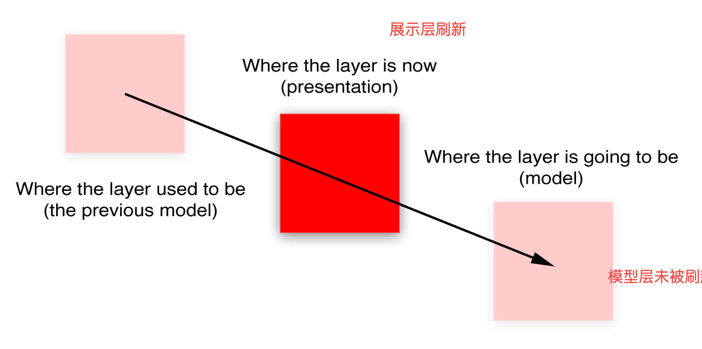

#  CoreAnimation

## 树结构

CoreAnimation作为一个*复合引擎*，将不同的视图层组合在屏幕中，并且存储在**图层树**中，向我们展示了所有屏幕上的一切。
 整个过程其实经历了三个树状结构，才显示到了屏幕上：`图层树（Layer Tree)-->呈现树(Presentation Tree)-->渲染树(Render Tree)`,如图：


## CALayer

 每一个`UIview`都有一个`CALayer`实例的图层属性，也就是所谓的*backing layer*，视图的职责就是创建并管理这个图层，以确保当子视图在层级关系中添加或者被移除的时候，他们关联的图层也同样对应在层级关系树当中有相同的操作。

- `CALayer`与`UIView`的区别
  1. `UIView`属于`UIKit`框架，`CALayer`属于`QuartzCore`框架（跨平台框架）
  2. UIView负责交互，CALayer负责绘制
  3. 访问的UIView的属性，实际是CALayer的属性


> 因为CALayer还需要用在Mac平台上。Mac平台与iOS平台交互方式有差异

## UIView

 `UIView`有三个比较重要的布局属性：`frame`，`bounds`和`center`，`CALayer`对应地叫做`frame`，`bounds`和`position`。

- Bounds 与 frame的宽高是否一定相同

不一定，如下图。旋转一定角度后，bounds还是（40，50），而frame变成了（62，64）。

Frame表示图层的外部坐标（在父视图上占据的空间）

bounds表示内部坐标，（0，0）是图层的左上角

`frame`并不是一个非常清晰的属性，它其实是一个虚拟属性，是根据`bounds`，`position`和`transform`计算而来


- anchorPoint 和 Position的区别

1. anchorPoint 的默认值为(0.5,0.5)，也就是anchorPoint默认在layer的中心点。

2. Postion是 在SuperLayer中的坐标
3. frame，anchorPoint 和 position满足下面的关系

```
position.x = frame.origin.x + anchorPoint.x * bounds.size.width；  
position.y = frame.origin.y + anchorPoint.y * bounds.size.height；
```

### UIView绘制全过程

总的来说, UIView从绘制到Render的过程有如下几步：

- 每一个`UIView`都有一个`layer`
- 每一个`layer`都有个`content`,这个`content`指向的是一块缓存,叫做**`backing store`**.

`UIView`的绘制和渲染是两个过程:

- 当`UIView`被绘制时,CPU执行`drawRect`，通过`context`将数据写入**`backing store`**(下文提到)
- 当**`backing store`**写完后，通过`render server`交给GPU去渲染，将`backing store`中的bitmap数据显示在屏幕上.

上面提到的从`CPU`到`GPU`的过程可用下图表示:


#### CPU 范畴

以UILabel为例

```
UILabel* label = [[UILabel alloc]initWithFrame:CGRectMake(10, 50, 300, 14)];
label.backgroundColor = [UIColor whiteColor];
label.font = [UIFont systemFontOfSize:14.0f];
label.text = @"test";
[self.view addSubview:label];
```

当重写`drawRect`方法的时候，这个Label会被标记为`dirty`.等新的runloop来

```objective-c
// runloop开始
[CATransaction begin];
// 将view加入到  view hierarchy 中

// runloop结束
[CATransaction commit];
```


- 首先`CPU`会为`layer`分配一块内存用来绘制`bitmap`，叫做**`backing store`**
-  创建指向这块`bitmap`缓冲区的指针，叫做`CGContextRef`
-  通过`Core Graphic`的`api`，也叫`Quartz2D`，绘制`bitmap`
-  将`layer`的`content`指向生成的`bitmap`
-  清空`dirty flag`标记
   这样`CPU`的绘制基本上就完成了。当内容发生改变时，bitmap发生变化，需要创建新的backing store

CPU的工作：view -> bitmap

#### GPU范畴

`GPU`处理的单位是`Texture`.

基本上我们控制`GPU`都是通过`OpenGL`来完成的，但是从`bitmap`到`Texture`之间需要一座桥梁，`Core Animation`正好充当了这个角色：
 `Core Animation`对`OpenGL`的`api`有一层封装，当我们要渲染的`layer`已经有了`bitmap content`的时候，这个`content`一般来说是一个`CGImageRef`，`CoreAnimation`会创建一个`OpenGL`的`Texture`并将`CGImageRef（bitmap）`和这个`Texture`绑定，通过`TextureID`来标识。


- CPU把bitmap放到RAM中
- GPU把这块内存搬到VRAM中

GPU的耗时在16.7ms内完成，主要有两个：

- 将数据从RAM中搬到VRAM中
- 将Texture渲染到屏幕上（性能瓶颈）

##### 叠加

```objc
[self.view addsubview:subview];
```

多个纹理拼到一起的过程，对应`UIKit`，是指处理多个`view`合到一起的情况，

如果`view`之间没有叠加，那么`GPU`只需要做普通渲染即可.
如果多个`view`之间有叠加部分，`GPU`需要做`blending`.

加入两个`view`大小相同，一个叠加在另一个上面，那么计算公式如下：

`R` = `S`+`D`*(`1`-`Sa`)

- R最终像素值
- S上面像素值
- D下面像素值
- Sa 透明度（引起额外计算工作）

##### Size

主要是图片的压缩和采样

这个问题，主要是处理`image`带来的，假如内存里有一张`400x400`的图片，要放到`100x100`的`imageview`里，如果不做任何处理，直接丢进去，问题就大了，这意味着，`GPU`需要对大图进行缩放到小的区域显示，需要做像素点的`sampling`，这种`smapling`的代价很高，又需要兼顾`pixel alignment`。 计算量会飙升。

##### 离屏渲染

也就是加入圆角 和 蒙层，需要开辟额外的空间

## Hit Testing

`-hitTest:WithEvent:`方法同样接受一个`CGPoint`类型参数，而不是`BOOL`类型，它返回图层本身，或者包含这个坐标点的叶子节点图层。

- 为什么每次触摸，hittest被调用两次？


The system may tweak the point being hit tested between the calls.

https://lists.apple.com/archives/cocoa-dev/2014/Feb/msg00118.html

- `pointInside`和`hittest`谁先被调用？

`hittest -> pointInside`。`hitTest:withEvent: `中调用`pointInside:withEvent: `方法判断当前的触摸点是否在要命中的范围内

- `hitTest实现思路`

不响应事件：

view.userInteractionEnabled = YES

view.hidden = YES

view 超出 superview 的 bounds

view.alpha < 0.5

```objc
- (UIView*)hitTest:(CGPoint)point withEvent:(UIEvent *)event
{
    // 如果交互未打开，或者透明度小于0.05 或者 视图被隐藏
    if (self.userInteractionEnabled == NO || self.alpha < 0.05 || self.hidden == YES){
        return nil;
    }

    // 如果 touch 的point 在 self 的bounds 内
    if ([self pointInside:point withEvent:event])
    {
        for (UIView *subView in self.subviews)
        {
            //进行坐标转化
            CGPoint coverPoint = [subView convertPoint:point fromView:self];
           // 调用子视图的 hitTest 重复上面的步骤。找到了，返回hitTest view ,没找到返回有自身处理
            UIView *hitTestView = [subView hitTest:coverPoint withEvent:event];
            if (hitTestView){
                return hitTestView;
            }
        }
        return self;
    }
    return nil;
}

```

关键方法：

`[self pointInside:point withEvent:event]`判断点是否在自己的区域内

`CGPoint coverPoint = [subView convertPoint:point fromView:self];`点的坐标系转化，从父view转到子view中

也有方法`[self convertPoint:point toView:self.centerBtn];`，将自己的坐标点，转换到子view中


为什么有的时候，是调用super的逻辑，而不是superView的hitTest?

因为重写hitTest方法的时候，super调用的hitTest，就是系统原来的逻辑。

# 三种动画

## 动画的要点


### 动画的三步骤：

1. 初始化动画对象
2. 设置需要修改的动画属性的值（位置、大小等）
3. 动画添加到CALayer上（所有的动画都是添加到CALayer上，不是UIView）

### 模型层 和 展示层 

动画作用在Layer上，所以Layer的位置移动，但是UIVew还在原地。点击事件的位置，并不会移动

CA就像MVC中的控制器角色。

> 在iOS中，屏幕每秒钟重绘60次。如果动画时长比60分之一秒要长，Core Animation就需要在设置一次新值和新值生效之间，对屏幕上的图层进行重新组织。这意味着`CALayer`除了“真实”值（就是你设置的值）之外，必须要知道当前*显示*在屏幕上的属性值的记录。


当你改变一个图层的属性，属性值的确是立刻更新的（<font color='red'>模型层的数据是立即更新的</font>），但是呈现层的并没有更新。



呈现图层`presentationLayer`：

保存了图层属性的显示值（就是用户能看到的）

用户看到的，是模型图层的复制，能够放映屏幕上的真实值。是模型层的复制

模型图层`modelLayer`：用户交互的图层

我们在屏幕上，初始化一个红色方框，它的位置是`(0,0)`

点击后，执行动画， 移动到`(0,400)`的位置。此时，redView的`modelLayer`没有变化，而`presentationLayer`变化了

```objective-c
@property (weak, nonatomic) IBOutlet UIView *redView;

- (void)viewDidLoad {
    [super viewDidLoad];
    // Do any additional setup after loading the view, typically from a nib.
   
}

- (void)tapAction:(UITapGestureRecognizer *)ges{
    NSLog(@"redview被点击了");
}
- (void)touchesBegan:(NSSet<UITouch *> *)touches withEvent:(UIEvent *)event{
	  // 执行完动画以后，redView的frame不变
    CABasicAnimation *anim = [CABasicAnimation animation];
    anim.keyPath = @"position.y";
    anim.toValue = @400;
  	// 这儿设置了两个动画的属性
    anim.removedOnCompletion = NO;
    anim.fillMode = kCAFillModeForwards;  // 不设置的话，动画会回去
    anim.delegate = self;
    [_redView.layer addAnimation:anim forKey:nil];
}
```


```objective-c
NSLog(@"stop-%@",NSStringFromCGRect(_redView.layer.presentationLayer.frame)); //返回屏幕上的frame
NSLog(@"stop-%@",NSStringFromCGRect(_redView.layer.modelLayer.frame));        //返回原始的frame  

//输出
//2021-03-15 21:09:43.610304+0800 核心动画第一讲01[95205:3098269] start-{{0, 0}, {100, 100}}
//2021-03-15 21:09:43.663480+0800 核心动画第一讲01[95205:3098269] redview被点击了
//2021-03-15 21:09:43.860575+0800 核心动画第一讲01[95205:3098269] stop-redView frame:{{0, 0}, {100, 100}}
//2021-03-15 21:09:43.860683+0800 核心动画第一讲01[95205:3098269] stop-redView modelLayer frame:{{0, 0}, {100, 100}}
//2021-03-15 21:09:43.860874+0800 核心动画第一讲01[95205:3098269] stop-redView presentationLayer frame:{{0, 349.99860227108002}, {100, 100}}
```

结果中，`modelLayer`的<font color='red'>Y轴数据还是0</font>，但`presentationLayer`的数据已经更新了

模型层`modelLayer`用来存储数据，并**不立刻刷新**，例如设置background、frame、center等，都是设置的模型层；

- `postion`是`Layer`的中心点，对应`UIView`中的`center`

- 建议在添加动画的时候，就把UIView的最终位置写下来。这样是推荐的

  ```objective-c
  - (void)viewDidLoad {
      [super viewDidLoad];
      // Do any additional setup after loading the view, typically from a nib.
      UITapGestureRecognizer *tap = [[UITapGestureRecognizer alloc] initWithTarget:self action:@selector(tapAction:)];
      [_redView addGestureRecognizer:tap];
  }
  - (void)touchesBegan:(NSSet<UITouch *> *)touches withEvent:(UIEvent *)event{
  		// 推荐！！！
     _redView.frame = CGRectMake(0, 400, 100, 100); 
  }
  ```

#### 什么时候处理呈现层

- 有一个基于定时器的动画，动画不是因为事件触发的，需要准确知道图层在哪个位置
- 做动画的图层响应用户的输入，需要用呈现层去做hittest

#### 隐式动画 & 显式动画

直接设置的`CALayer`的`frame`，再次设置的时候，CALayer会有动画。

##### [隐式动画：](https://zsisme.gitbooks.io/ios-/content/chapter7/transactions.html)

任何对于CALayer属性的修改,都是隐式事务，都会有动画效果。这样的事务会在runLoop中被提交，也包括UIView的`animateWithDuration:animations:`接口等

1. 默认时间**0.25s**，位置，颜色，大小
2. 必须是**<font color='red'>独立的`layer`</font>**才存在隐式动画
3. <font color='red'>`UIView`自带的根`CALayer`没有**隐式动画**的</font>，动画会直接完成。（对这种图层做动画的唯一办法就是使用`UIView`的动画函数（而不是依赖`CATransaction`），或者继承`UIView`，并覆盖`-actionForLayer:forKey:`方法，或者直接创建一个显式动画）
3. 实现图层的`-actionForLayer:forKey:`委托方法，或者提供一个`actions`字典来控制隐式动画

```objective-c
- (void)viewDidLoad {
    [super viewDidLoad];
    CALayer *layer = [CALayer layer];
    layer.frame = CGRectMake(200, 0, 100, 100);
    layer.backgroundColor = [UIColor yellowColor].CGColor;
    _layer = layer;
    [self.view.layer addSublayer:layer];
}

- (void)touchesBegan:(NSSet<UITouch *> *)touches withEvent:(UIEvent *)event{
  	// 此处也有动画
  	CABasicAnimation *anim = [CABasicAnimation animation];
    anim.keyPath = @"position.y";
    anim.toValue = @400;
    anim.removedOnCompletion = NO;
    anim.fillMode = kCAFillModeForwards;
    anim.delegate = self;
    [_redView.layer addAnimation:anim forKey:nil];
}
```

##### 显式动画

通过明确的调用`begin`,`commit`来提交动画

```objective-c
// 显式动画
[CATransaction begin];

//显式事务默认开启动画效果,kCFBooleanTrue关闭
[CATransaction setValue:(id)kCFBooleanFalse forKey:kCATransactionDisableActions];

//动画执行时间
[CATransaction setValue:[NSNumber numberWithFloat:5.0f] forKey:kCATransactionAnimationDuration];
layer.cornerRadius = (layer.cornerRadius == 0.0f) ? 30.0f : 0.0f;
layer.opacity = (layer.opacity == 1.0f) ? 0.5f : 1.0f;
// 提交动画
[CATransaction commit];
```

> 使用隐式动画是苹果公司推荐的，但是也有问题。就是使用隐式动画后，View会暂时不能接收用户的触摸、滑动等手势。这就造成了当一个列表滚动时，如果对其中的view使用了隐式动画，就会感觉滚动无法主动停止下来，必须等动画结束了才能停止。

#### `toValue`的建议

如果动画的终点位置已经确定，不建议用`toValue`去确定结束的位置。而是直接用`fromValue`即可。因为用了`toValue`之后，还要设置别的属性`removedOnCompletion`和`fillMode`，防止动画回到原点。如下：

```objective-c
// 推荐在这里设置动画的终点位置
shapeLayer.path = bigPath.CGPath;  
if (_isPush) {
      anim.fromValue = (id)smallPath.CGPath;
  }else{
      anim.fromValue = (id)bigPath.CGPath;
  }
//    anim.toValue = bigPath; //toValue一般是不写的，只写fromValue
  anim.delegate = self;
  [shapeLayer addAnimation:anim forKey:nil];
```

### 渲染层（性能调优）

动画和屏幕上组合的图层实际上被一个单独的进程管理，而不是你的应用程序。这个进程就是所谓的*渲染服务*。在iOS5和之前的版本是*SpringBoard*进程（同时管理着iOS的主屏）。在iOS6之后的版本中叫做`BackBoard`。

当运行一段动画时候，这个过程会被四个分离的阶段被打破：

- **布局** - 这是准备你的视图/图层的层级关系，以及设置图层属性（位置，背景色，边框等等）的阶段。---**用户可控**
- **显示** - 这是图层的寄宿图片被绘制的阶段。绘制有可能涉及你的`-drawRect:`和`-drawLayer:inContext:`方法的调用路径。---**用户可**控
- **准备** - 这是Core Animation准备发送动画数据到渲染服务的阶段。这同时也是Core Animation将要执行一些别的事务例如解码动画过程中将要显示的图片的时间点。
- **提交** - 这是最后的阶段，Core Animation打包所有图层和动画属性，然后通过IPC（内部处理通信）发送到渲染服务进行显示。

但是这些仅仅阶段仅仅发生在你的应用程序之内，在动画在屏幕上显示之前仍然有更多的工作。一旦打包的图层和动画到达渲染服务进程，他们会被反序列化来形成另一个叫做<font color='red'>*渲染树*</font>的图层树。使用这个树状结构，渲染服务对动画的每一帧做出如下工作：

- 对所有的图层属性计算中间值，设置OpenGL几何形状（纹理化的三角形）来执行渲染
- 在屏幕上渲染可见的三角形---**(GPU执行)**

  所以一共有六个阶段；最后两个阶段在动画过程中不停地重复。前五个阶段都在软件层面处理（通过CPU），只有最后一个被GPU执行。而且，你真正只能控制前两个阶段：<font color='red'>**布局和显示**</font>。Core Animation框架在内部处理剩下的事务，你也控制不了它。

#### GPU 的耗时操作

- 太多的几何结构 - **栅格化**
- 重绘 - 主要由**重叠的半透明图层**引起。也就是透明度
- 离屏绘制 - 开辟额外空间
- 过大的图片 - 如果视图绘制超出GPU支持的2048x2048或者4096x4096尺寸的纹理，就必须要用CPU在图层每次显示之前对图片预处理，同样也会降低性能。

 #### CPU的耗时操作

- 布局计算 - 如果你的视图层级过于复杂，当视图呈现或者修改的时候，计算图层帧率就会消耗一部分时间。特别是使用iOS6的自动布局机制尤为明显，它应该是比老版的自动调整逻辑加强了CPU的工作。
- 视图懒加载 - iOS只会当视图控制器的视图显示到屏幕上时才会加载它。这对内存使用和程序启动时间很有好处，但是当呈现到屏幕上之前，按下按钮导致的许多工作都会不能被及时响应。比如控制器从数据库中获取数据，或者视图从一个nib文件中加载，或者涉及IO的图片显示（见后续“IO相关操作”），都会比CPU正常操作慢得多。
- Core Graphics绘制 - 如果对视图实现了`-drawRect:`方法，或者`CALayerDelegate`的`-drawLayer:inContext:`方法，那么在绘制任何东西之前都会产生一个巨大的性能开销。为了支持对图层内容的任意绘制，Core Animation必须创建一个内存中等大小的寄宿图片。然后一旦绘制结束之后，必须把图片数据通过IPC传到渲染服务器。在此基础上，Core Graphics绘制就会变得十分缓慢，所以在一个对性能十分挑剔的场景下这样做十分不好。
- 解压图片 - PNG或者JPEG压缩之后的图片文件会比同质量的位图小得多。但是在图片绘制到屏幕上之前，必须把它扩展成完整的未解压的尺寸（通常等同于图片宽 x 长 x 4个字节）。为了节省内存，iOS通常直到真正绘制的时候才去解码图片（14章“图片IO”会更详细讨论）。根据你加载图片的方式，第一次对图层内容赋值的时候（直接或者间接使用`UIImageView`）或者把它绘制到Core Graphics中，都需要对它解压，这样的话，对于一个较大的图片，都会占用一定的时间。

当图层被成功打包，发送到渲染服务器之后，CPU仍然要做如下工作：为了显示屏幕上的图层，Core Animation必须对渲染树种的每个可见图层通过OpenGL循环转换成纹理三角板。由于GPU并不知晓Core Animation图层的任何结构，所以必须要由CPU做这些事情。这里CPU涉及的工作和图层个数成正比，所以如果在你的层级关系中有太多的图层，就会导致CPU没一帧的渲染，即使这些事情不是你的应用程序可控的。


光栅问题

打开光栅化缓存。这将隐式的创建一个位图，各种阴影遮罩等效果也会保存到位图中并缓存起来，从而减少渲染的频度（不是矢量图）

```
shouldRasterize = YES，
```

[shouldRasterize（光栅化）](https://blog.csdn.net/bravegogo/article/details/80494455?utm_source=blogxgwz4)

>  对于经常变动的内容,这个时候不要开启,否则会造成性能的浪费


## CAAnimationGroup

动画组

- 位置变化`anim.keyPath = @"position";`
- 颜色变化`colorAnim.keyPath = @"backgroundColor";`
- 大小变化`sizeAnim.keyPath = @"transform.scale";`

```objective-c
UIBezierPath *path = [UIBezierPath bezierPath];
  [path moveToPoint:CGPointMake(50, 200)];
  [path addCurveToPoint:CGPointMake(300, 200) controlPoint1:CGPointMake(180, 100) controlPoint2:CGPointMake(200, 300)];
  //需要添加在layer上
  CAShapeLayer *shapeLayer = [CAShapeLayer layer];
  shapeLayer.path = path.CGPath;
  shapeLayer.fillColor = nil;
  shapeLayer.strokeColor = [UIColor redColor].CGColor;
  [self.view.layer addSublayer:shapeLayer];

  CALayer *colorLayer = [CALayer layer];
  colorLayer.frame = CGRectMake(0, 0, 60, 60);
  colorLayer.position = CGPointMake(50, 200);
  colorLayer.backgroundColor = [UIColor blueColor].CGColor;
  [self.view.layer addSublayer:colorLayer];

  //    过山车的动画
  CAKeyframeAnimation *anim = [CAKeyframeAnimation animation];
  anim.keyPath = @"position";
  anim.path = path.CGPath;
//    anim.duration = 4.0f;
//    anim.removedOnCompletion = NO;
//    anim.fillMode = kCAFillModeForwards;
//    anim.rotationMode = kCAAnimationRotateAuto;
//    [colorLayer addAnimation:anim forKey:nil];
//    改变大小
  CABasicAnimation *sizeAnim = [CABasicAnimation animation];
  sizeAnim.keyPath = @"transform.scale";
  sizeAnim.toValue = @.5;
//    sizeAnim.duration = 4.0;
//    sizeAnim.fillMode = kCAFillModeForwards;
//    sizeAnim.removedOnCompletion = NO;
//
//    [colorLayer addAnimation:sizeAnim forKey:nil];

//    修改颜色
  CGFloat red = arc4random() / (CGFloat)INT_MAX;
  CGFloat green = arc4random() / (CGFloat)INT_MAX;
  CGFloat blue = arc4random() / (CGFloat)INT_MAX;
  UIColor *color = [UIColor colorWithRed:red green:green blue:blue alpha:1];

  CABasicAnimation *colorAnim = [CABasicAnimation animation];
  colorAnim.keyPath = @"backgroundColor";
  colorAnim.toValue = (id)color.CGColor;
//    colorAnim.duration = 4.0f;
//    colorAnim.fillMode = kCAFillModeForwards;
//    colorAnim.removedOnCompletion = NO;
//    [colorLayer addAnimation:colorAnim forKey:nil];

//动画组，相当于把上面的注释部分整合到了一起
  CAAnimationGroup *group = [CAAnimationGroup animation];
  group.animations = @[anim, sizeAnim, colorAnim];
  group.duration = 4.0f;
  group.fillMode = kCAFillModeForwards;
  group.removedOnCompletion = NO;
  [colorLayer addAnimation:group forKey:nil];
```


## CAProeprtyAnimation

### CABasicAnimation

- 添加动画

  ```objective-c
  addAnimation: forKey:
  ```

  添加完动画后，会默认**删除动画**，所以会回到原来的位置

- 动画保持

  ```objective-c
  anim.removedOnCompletion = NO;   //不要移除动画
  anim.fillMode = kCAFillModeForwards;   //保持最后的状态
  ```

  

### CAKeyFrameAnimation

```objective-c
CAKeyframeAnimation *anim = [CAKeyframeAnimation animation];
anim.keyPath = @"transform.rotation";
anim.values = @[@angleToRadians(-6), @angleToRadians(6)]; //这里的动画从-6到6
```

- 自动翻转`autoreverses`

```objc
anim.autoreverses = YES;
anim.speed = 2;  //是原来速度的2倍

//与下面的等价
anim.values = @[@angleToRadians(-6), @angleToRadians(6),@angleToRadians(-6)]; //这里的动画从-6到6
```


## CATransition

转场动画，UIViewController用

- pageCurl 翻页动画

```objc
CATransition *anim = [CATransition animation];
anim.type = @"pageCurl";
anim.duration = .5;
//    anim.startProgress = .2;  //动画开始的过程占比，取值范围0-1
//    anim.endProgress = .5;    // 动画结束的过程占比
[_imgView.layer addAnimation:anim forKey:nil];
```


### 转场类型


### 自定义转场动画

#### UINavigationControllerDelegate

UIViewController需要实现UINavigationControllerDelegate的代理

```objective-c
// 有滑动手势
- (nullable id <UIViewControllerInteractiveTransitioning>)navigationController:(UINavigationController *)navigationController interactionControllerForAnimationController:(id <UIViewControllerAnimatedTransitioning>) animationController API_AVAILABLE(ios(7.0));

//无手势
- (nullable id <UIViewControllerAnimatedTransitioning>)navigationController:(UINavigationController *)navigationController animationControllerForOperation:(UINavigationControllerOperation)operation
                                                fromViewController:(UIViewController *)fromVC
                                                  toViewController:(UIViewController *)toVC  API_AVAILABLE(ios(7.0));
```

在Page A中实现无手势的代理

```objective-c
- (id<UIViewControllerAnimatedTransitioning>)navigationController:(UINavigationController *)navigationController animationControllerForOperation:(UINavigationControllerOperation)operation fromViewController:(UIViewController *)fromVC toViewController:(UIViewController *)toVC
{
    // 1. 判断跳转是哪种跳转
    if (operation == UINavigationControllerOperationPush) {
        CircleTransition *trans = [[CircleTransition alloc] init];
        return trans;
    } else {
        return nil;
    }
}
```


#### 转场实现

- 新建负责转场的动画（NSObject对象），并遵循`UIViewControllerAnimatedTransitioning`协议

  ```objective-c
  @interface CircleTransition : NSObject<UIViewControllerAnimatedTransitioning>
  
  @end
  ```

- 实现代理协议

  ```objc
  //在此方法中实现具体的转场动画
  - (void)animateTransition:(id<UIViewControllerContextTransitioning>)transitionContext{}
  ```

- 从上下文`transitionContext`中获取`UIView`和`ViewController`

  ```objective-c
  //2.获取一个view的容器
  UIView *containerView = [transitionContext containerView];
  //3.获取tovc的view，然后添加到容器里面
  UIViewController *toVC = [transitionContext viewControllerForKey:UITransitionContextToViewControllerKey];
  UIViewController *fromeVC = [transitionContext viewControllerForKey:UITransitionContextFromViewControllerKey];
  ```


# 曲线

实现小车在贝塞尔曲线上，做过山车的动画。要点

- 贝塞尔去线上会用
- CAShapeLayer
- 设置锚点
- 设置移动过程中的朝向`kCAAnimationRotateAuto`
- 动画保持

```objc
UIBezierPath *path = [UIBezierPath bezierPath];
//设置起点
[path moveToPoint:CGPointMake(50, 200)];  
// 终点，控制点1，控制点2
[path addCurveToPoint:CGPointMake(300, 200) controlPoint1:CGPointMake(180, 100) controlPoint2:CGPointMake(200, 300)];

CALayer *carLayer = [CALayer layer];
carLayer.frame = CGRectMake(16, 200-30, 36, 36);
carLayer.contents = (id)[UIImage imageNamed:@"car"].CGImage;  //在CALayer上添加图片
carLayer.anchorPoint = CGPointMake(.5, .8);
[self.view.layer addSublayer:carLayer];

//需要添加在layer上
CAShapeLayer *shapeLayer = [CAShapeLayer layer];
shapeLayer.path = path.CGPath;  //添加贝塞尔圆滑
shapeLayer.fillColor = nil;
shapeLayer.strokeColor = [UIColor redColor].CGColor;
[self.view.layer addSublayer:shapeLayer];

//    过山车的动画
CAKeyframeAnimation *anim = [CAKeyframeAnimation animation];
anim.keyPath = @"position";
anim.path = path.CGPath;     //设置贝塞尔的路径
anim.duration = 4.0f;
anim.removedOnCompletion = NO;
anim.fillMode = kCAFillModeForwards;
anim.rotationMode = kCAAnimationRotateAuto;   //自动跟随方向
[carLayer addAnimation:anim forKey:nil];
```

> CAShapeLayer比CALayer好，底层有硬件加速！
>
> kCAAnimationRotateAutoReverse 自动翻转，就是把原来的图，镜像一下

# 其他动效

## 粒子效果 CAEmitterLayer

```objc
- (void)explosion{
    _emitterLayer = [CAEmitterLayer layer];
    CAEmitterCell *cell = [[CAEmitterCell alloc] init];
    cell.name = @"explosionCell";
    cell.lifetime = .7;
    cell.birthRate = 4000;
    cell.velocity = 50;
    cell.velocityRange = 15;
    cell.scale = .03;
    cell.scaleRange = .02;
    cell.contents = (id)[UIImage imageNamed:@"sparkle"].CGImage;
    
    _emitterLayer.name = @"explosionLayer";
    _emitterLayer.emitterShape = kCAEmitterLayerCircle;
    _emitterLayer.emitterMode = kCAEmitterLayerOutline;
    _emitterLayer.emitterSize = CGSizeMake(25, 0);
    _emitterLayer.emitterCells = @[cell];
    _emitterLayer.renderMode = kCAEmitterLayerOldestFirst;
    _emitterLayer.masksToBounds = NO;
    _emitterLayer.birthRate = 0;
    _emitterLayer.zPosition = 0;
    _emitterLayer.position = CGPointMake(CGRectGetWidth(_likeBtn.bounds)/2, CGRectGetHeight(_likeBtn.bounds)/2);
    
    [_likeBtn.layer addSublayer:_emitterLayer];
    
}
```


## 文本 CATextLayer

```
- (void)textLayer{
    CATextLayer *textLayer = [CATextLayer layer];
    textLayer.frame = CGRectMake(100, 100, 200, 50);
    textLayer.backgroundColor = [UIColor orangeColor].CGColor;
//    textLayer.string = @"hello world";
    textLayer.alignmentMode = kCAAlignmentCenter;
    textLayer.fontSize = [UIFont systemFontOfSize:20.0].pointSize;
    textLayer.foregroundColor = [UIColor blackColor].CGColor;
    [self.view.layer addSublayer:textLayer];
    
    NSMutableAttributedString *str = [[NSMutableAttributedString alloc] initWithString:@"hello world"];
    NSDictionary *attribs = @{(id)kCTForegroundColorAttributeName: (id)[UIColor redColor].CGColor};
    [str setAttributes:attribs range:NSMakeRange(0, 5)];
    textLayer.string = str;
    
}
```

## 上下跳动动画

实现上下跳动动画：

- 沿着y轴上下跳动，原地->高度->原地
- 重复五次，每次时长1s
- 可监听动画完成回调

```objective-c
CGFloat height = 8;
CGFloat duration = 1.0;
CAKeyframeAnimation * animation = [CAKeyframeAnimation animationWithKeyPath:@"transform.translation.y"];
CGFloat currentTx = _tinyMapTipView.transform.ty;
animation.duration = duration;
animation.values = @[@(currentTx), @(currentTx + height), @(currentTx)];
animation.repeatCount = 5;
animation.keyTimes = @[@(0), @(0.5), @(1.0)];
animation.timingFunction = [CAMediaTimingFunction functionWithName:kCAMediaTimingFunctionLinear];
animation.delegate = self;
[animation setValue:@"kTinyMapViewUpDownAnimation" forKey:@"AnimationKey"];
[myView.layer addAnimation:animation forKey:nil];
```


## 物理引擎 UIDynamicAnimator

实现自由落体等动画：

- iOS 7可用
- 自由落体、碰撞、吸附等效果
- `UIDynamicAnimator`负责添加行为，关联`UIView`

```objective-c
//容器（行为）
_animtor = [[UIDynamicAnimator alloc] initWithReferenceView:self.view];
//添加自由落体的行为
UIGravityBehavior *gravity = [[UIGravityBehavior alloc] initWithItems:@[_orangeView]];
[_animtor addBehavior:gravity];
//添加碰撞行为
UICollisionBehavior *collision = [[UICollisionBehavior alloc] initWithItems:@[_orangeView]];
// 到达屏幕边界时结束
collision.translatesReferenceBoundsIntoBoundary = YES;
[_animtor addBehavior:collision];
//添加弹性系数
UIDynamicItemBehavior *itemBehavior = [[UIDynamicItemBehavior alloc] initWithItems:@[_orangeView]];
itemBehavior.elasticity = .6;
[_animtor addBehavior:itemBehavior];
```

拖拽手势

```objective-c
- (void)panAction:(UIPanGestureRecognizer *)ges{
    if (ges.state == UIGestureRecognizerStateBegan) {
        //添加偏移
        UIOffset offset = UIOffsetMake(-30, -30);
        //添加吸附行为
        _attach = [[UIAttachmentBehavior alloc] initWithItem:_orangeView offsetFromCenter:offset attachedToAnchor:[ges locationInView:self.view]];
//        _attach = [[UIAttachmentBehavior alloc] initWithItem:_orangeView attachedToAnchor:[ges locationInView:self.view]];
        [_animtor addBehavior:_attach];
    }else if (ges.state == UIGestureRecognizerStateChanged){
      	// 设置锚点，也就是拖拽点
        [_attach setAnchorPoint:[ges locationInView:self.view]];
    }else if (ges.state == UIGestureRecognizerStateEnded || ges.state == UIGestureRecognizerStateFailed || ges.state == UIGestureRecognizerStateCancelled){
        // 移除吸附行为
        [_animtor removeBehavior:_attach];
    }
}
```


# 性能


# 参考链接

[图层的树状结构](https://github.com/qunten/iOS-Core-Animation-Advanced-Techniques/blob/master/1-%E5%9B%BE%E5%B1%82%E6%A0%91/%E5%9B%BE%E5%B1%82%E6%A0%91.md)

[iOS Core Animation: Advanced Techniques中文译本](https://zsisme.gitbooks.io/ios-/content/index.html)

[iOS-Core-Animation-Advanced-Techniques](https://github.com/qunten/iOS-Core-Animation-Advanced-Techniques)

[iOS HitTest](https://blog.csdn.net/qq_18505715/article/details/78411052)

[[iOS] 触摸事件传递及响应](https://www.jianshu.com/p/c42bffa97934)

[iOS进阶--UIView的绘制](https://www.jianshu.com/p/a120d6c64d88)

[High performance drawing on iOS — Part 1](https://medium.com/@almalehdev/high-performance-drawing-on-ios-part-1-f3a24a0dcb31)

[High performance drawing on iOS — Part 2](https://medium.com/@almalehdev/high-performance-drawing-on-ios-part-2-2cb2bc957f6)

