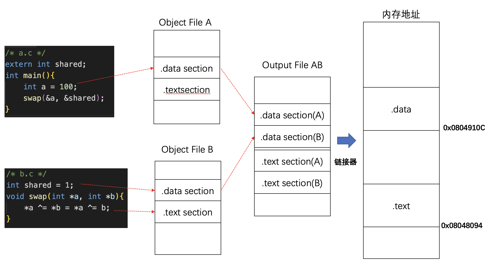
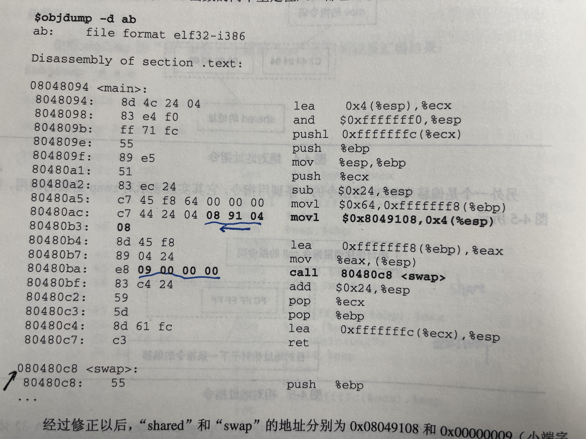
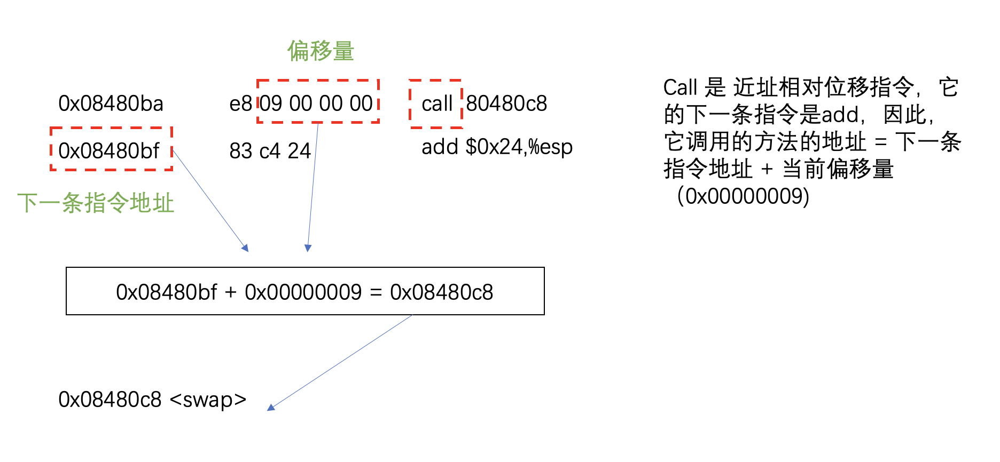
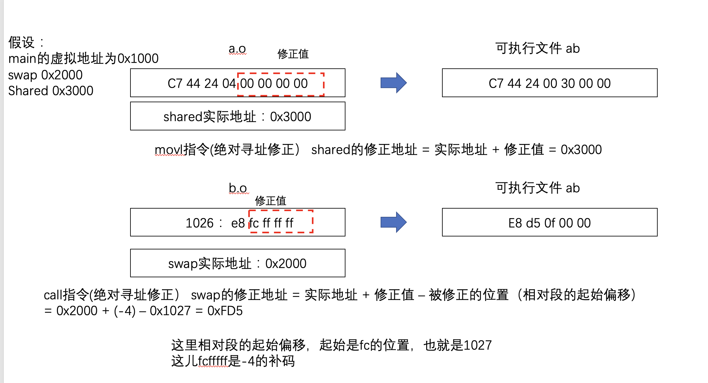

# 静态链接

不同的文件，例如 a.c 和 b.c 在编译之后，会进行**相似段合并**，也就是类型相同的段（例如 a.c 的 .data段与 b.c的.data段合并）

```c
/* a.c */
extern int shared;
int main(){
    int a = 100;
    swap(&a, &shared);
} 
```


```c
/* b.c */
int shared = 1;
void swap(int *a, int *b){
    *a ^= *b = *a ^= b;
}
```

链接器为目标文件分配地址和空间，主要是确定每个段在虚拟内存中的开始位置，这个链接过程分为两步：

- 空间地址分配
- 符号解析与重定位

# 空间地址分配

扫描所有的输入目标文件，获得各个段的长度、属性和位置，并将输入目标文件中的符号表中所有的符号定义和符号引用收集起来，统一放到一个全局符号表。



# 符号解析与重定位

## 重定位

main起始地址为虚拟地址0x00000000

只对 a.o的文件进行反编译的时候，可以看到


## share 方法和 swap方法的地址在哪儿？

看下share的那一行指令

```
18: c7 44 24 04 00 00 00 00
```

其中，前面4个字节是 movl 的指令码，后边的00 00 00 00 是share命令的地址

swap的地址也是一样，用`0xfffffffc`替代


对 a.o 和 b.o的产物连接之后



share方法和swap的方法都被定位到了

swap方法中，用到了call命令，这是一个 近址相对位移调用指令，它后边跟的是调用指令的下一条指令的偏移量



## 重定位表

ELF中有一个重定位表，专门保存这些信息（需要重定位的符号）

重定位入口：每个要被重定位的地方

便宜：入口在重定位的段中的位置


## 符号解析

重定位时，需要确定符号的目标地址

### 指令修正

假设 a.o 和 b.o 链接成最终的可执行文件以后， main()函数的虚拟地址为0x1000, swap函数的虚拟地址为0x2000,shared变量的虚拟地址为0x3000。那么连接器是如何修正那些指令的呢？


