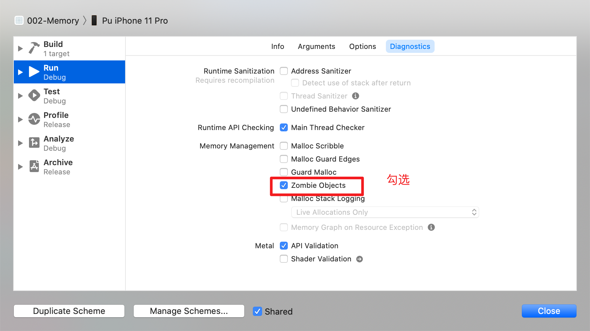
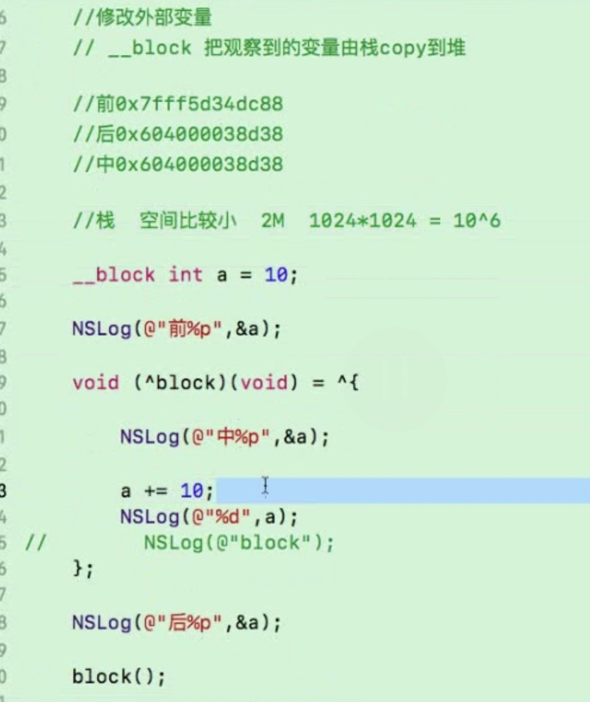
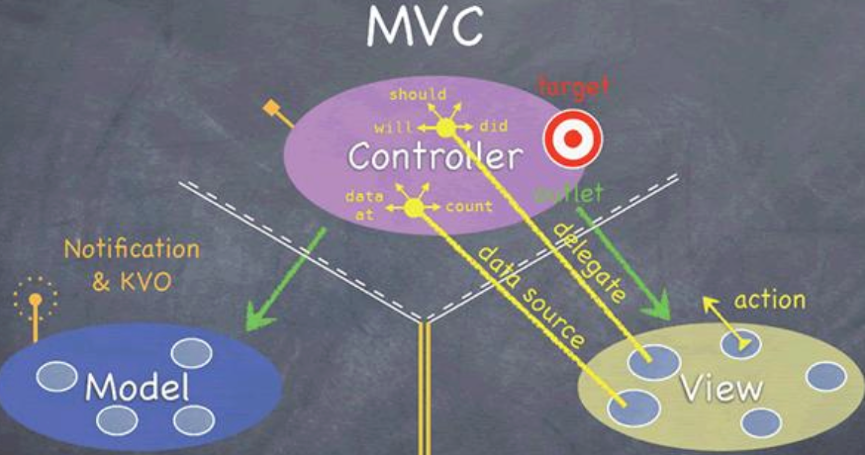

# iOS面试整理

## 内存管理

### 静态检测

- 使用Profile->Analyze
- 打开僵尸对象，检测是否有野指针




### 动态检测

- Instruments工具，使用Leaks
- 第三方工具检测，例如MLeaksFinder，FBRetainCycleDetector

```shell
target '002-Memory' do
  # Uncomment the next line if you're using Swift or would like to use dynamic frameworks
  # use_frameworks!

  # Pods for 002-Memory
  pod 'MLeaksFinder', '~> 1.0.0'
```

注意，工具检测不出隐式的循环引用

```objective-c
//  GVBlockViewController.m

typedef void (^Block)(void);

@interface GVBlockViewController ()
@property (copy, nonatomic) Block block;
@property (strong, nonatomic) GVObject* obj;
@end

@implementation GVBlockViewController

- (void) block1 {
    self.block = ^{
        //[self doSomework];
        _obj = [GVObject new];
    };
}

@end
```


### 让你设计一种机制检测UIViewController的内存泄漏，你会怎么做？

提示：`weak` `runloop`

如果Controller被释放了，但其曾经持有过的子对象如果还存在，那么这些子对象就是泄漏的可疑目标。

一个小示例：子对象（比如view）建立一个对controller的`weak`引用，如果Controller被释放，这个weak引用也随之置为nil。那怎么知道子对象没有被释放呢？用一个单例对象每个一小段时间发出一个ping通知去ping这个子对象，如果子对象还活着就会一个pong通知。所以结论就是：如果子对象的controller已不存在，但还能响应这个ping通知，那么这个对象就是可疑的泄漏对象


## Runtime

### 消息发送机制和消息转发机制

消息发送机制：使用运行时，通过Selector快速去查找IMP的过程

消息转发机制：

1. 动态方法解析

2. 备用接收者

3. 完整的消息转发

### Objc_msgSend

关于`objc_msgSend`的四种写法

```c
id (*sendMessage)(id, SEL, id, id, id) = (id (*)(id, SEL, id, id, id))objc_msgSend;
float (*sendFloatMessage)(id, SEL, id, id, id) = (float (*)(id, SEL, id, id, id))objc_msgSend;
BOOL (*sendBOOLMessage)(id, SEL, id, id, id) = (BOOL (*)(id, SEL, id, id, id))objc_msgSend;
void (*sendVoidMessage)(id, SEL, id, id, id) = (void (*)(id, SEL, id, id, id))objc_msgSend;
```

### 为什么OC不支持重载？

相同的方法有相同的SEL，如果SEL相同的话，IMP地址也相同，而不是跟参数有关（参数不同时，可以C++重载）

### Runtime使用

#### 1. 改变变量值

- 获取变量个数
- 获取所有实例变量`class_copyIvarList()`
- 获取实例变量的名字`ivar_getName()`
- 设置实例变量的某个属性`object_setIvar()`

```objective-c
/// 1. 使用runtime改变实例成员的值
- (void) changeVarName {
    /// 实例变量个数
    unsigned int count = 0;
    
    /// 获取所以的实例变量
    Ivar* ivar = class_copyIvarList([self.persion class], &count);
    
    /// 遍历
    for (int i = 0; i < count; i++) {
        /// 实例变量
        Ivar var = ivar[i];
        
        /// 实例变量名字
        const char * varName = ivar_getName(var);
        
        /// 转化一下
        NSString* name = [NSString stringWithUTF8String:varName];
        if ([name isEqualToString:@"_name"]) {
            object_setIvar(self.persion, var, @"Jerrry");
            break;
        }
    }
}
```


#### 2.交换方法

`method_exchangeImplementations`

#### 3.添加方法

`class_addMethod`

#### 4.为category添加属性

category能添加属性，但是不能生成get和set方法

```objc
@interface Persion (mult)

@property (nonatomic,copy) NSString* nick;

@end


@implementation Persion (mult)

const char* name = "nick";

- (void) setNick:(NSString *)nick {
    objc_setAssociatedObject(self, &name, nick, OBJC_ASSOCIATION_COPY_NONATOMIC);
}

- (NSString*) nick {
    return objc_getAssociatedObject(self, &name);
}

@end
```


## Block

Block的三种类型

global 1.无外部变量使用 2.使用了全局变量 3.使用了静态变量

stack （ARC和MRC有区别） MRC：普通的赋值  ARC：没有强引用（赋值），刚生成就被销毁

malloc MRC调用copy，ARC有强引用

#### 修改外部变量

a的地址在block内变了，原因在于block会把a的地址从栈上拷贝到堆上



## 设计模式





- MVC 中介者模式
- Delegate 代理模式
- KVO观察者模式
- Target-Action 命令模式 


### MVC与MVP的区别及优缺点

MVC

View与Model没有交互，但开发的时候，Model还是会传数据给View，Model和View的耦合性很高


MVVM

View Model 利用KVO双向绑定


MVP（面向协议编程）

优点：

1. View与Model解耦，两者数据由Present层进行传输
2. Present负责数据的获取，或许这个获取可能还是由Model来完成，但是以协议的方式，让View去实现对数据的处理
3. 保密性好，只需要把数据接口暴露

举例：

在`ViewController`中，有网络请求，我们一般会设置数据，`setModel`这种。如下

```objective-c
@implementation ViewController
  
- (void)viewDidLoad {
    [super viewDidLoad];
    // Do any additional setup after loading the view, typically from a nib.
    self getData:params
      successBlk:^(id data){
        [self setModel];
        [self.tableView reloadData]
      }
  		failBlk:^(NSError *error){
			}
}
@end
```

但是有了present之后，通过协议的回调，来填充。

```objective-c
@interface ViewController () <UITableViewDataSource, UserViewDelegate>
@property (weak, nonatomic) IBOutlet UITableView *tableView;
@property (nonatomic, strong) NSArray<UserViewData *> *userViewDatas;
@property (nonatomic, strong) UserPresenter *userPresenter;

@end

@implementation ViewController

- (void)viewDidLoad {
    [super viewDidLoad];
    // Do any additional setup after loading the view, typically from a nib.
    self.userPresenter = [[UserPresenter alloc] init];
    self.tableView.dataSource = self;
    self.userPresenter.delegate = self;
    // 调userPresenter里面的方法
    [self.userPresenter getUsers];
}

#pragma mark - UserViewDelegate
- (void)startloading {
    self.indicator.hidden = NO;
    [self.indicator startAnimating];
}
- (void)finishLoading {
    [self.indicator stopAnimating];
    self.indicator.hidden = YES;

}
#pragma mark - UserViewDelegate
// 用户界面的数据
- (void)setUsers:(NSArray<UserViewData *> *)userViewData {
  	//在设置数据
    self.userViewDatas = userViewData;
    [self.tableView reloadData];
}

// 数据是空的时候,显示
- (void)setEmptyUsers {
    //...
}
@end
```

设置`UserViewDelegate`，遵循这个协议即可

```objective-c
@protocol UserViewDelegate <NSObject>

- (void)startloading;
- (void)finishLoading;

// 用户界面的数据
- (void)setUsers:(NSArray<UserViewData *> *)userViewData;
// 数据是空的时候,显示
- (void)setEmptyUsers;

@end

@interface UserPresenter : NSObject
@property (nonatomic, weak) id<UserViewDelegate> delegate;

- (void)getUsers;
@end

@implementation UserPresenter

- (void)getUsers {
    // 设置网络请求的回调
  if ([self.delegate respondsToSelector:@selector(setUsers:)]) {
       [self.delegate setUsers:userViewDatas];
   }
}
```


## 多线程

### 关键字volatile有什么含意?并给出三个不同的例子

一个定义为`volatile`的变量是说这变量可能会被意想不到地改变，这样，编译器就不会去假设这个变量的值了。精确地说就是，优化器在用到这个变量时必须每次都小心地重新读取这个变量的值，而不是使用保存在寄存器里的备份。下面是`volatile`变量的几个例子：
 • 并行设备的硬件寄存器（如：状态寄存器）；
 •一个中断服务子程序中会访问到的非自动变量(Non-automatic variables)；？？？什么是非自动变量
 • 多线程应用中被几个任务共享的变量。


## 组件化

### 组件间的通讯是通过什么方式来实现的？

组件间通讯使用路由(Router)的方式，自定义的路由方式。Router的设计思路：

- 组件间解耦，没有数据的耦合，在组件间不知道对方接口的情况下设计
- 能够对组件返回的值妥善处理

路由的实现方式如下：

```objc
- (id)performTarget:(NSString *)targetName action:(NSString *)actionName param:(NSDictionary *)para {
    
    // 这个目标的类名字符串
    NSString *targetClassString = [NSString stringWithFormat:@"OCTarget_%@",targetName];
    NSString *actionMethondString = [NSString stringWithFormat:@"action_%@:",actionName];
    
    Class targetClass = NSClassFromString(targetClassString);
  	SEL action = NSSelectorFromString(actionMethondString);
  
    NSObject *target = [[targetClass alloc] init];
    
    // 判断
    if ([target respondsToSelector:action]) {
        return [self safePerformAction:action target:target param:para];
    } else {
        SEL action = NSSelectorFromString(@"notFound:");
        if ([target respondsToSelector:action]) {
            return [self safePerformAction:action target:target param:para];  
        } else {
            return nil;
        }
    }
}

// 1.通过对象调用指定的方法
// 2.传参
- (id)safePerformAction:(SEL)action target:(NSObject *)target param:(NSDictionary *)para {
    // 方法签名
    NSMethodSignature *methodSig = [target methodSignatureForSelector:action];
    
    if (methodSig == nil) {
        return nil;
    }
    
    // 获取这个方法返回值的地址
    const char *retType = [methodSig methodReturnType];
    
    // id 是可以返回任意对象 所以 我们单独处理基本变量. NSInteger Bool Void...
    if (strcmp(retType, @encode(void)) == 0) {
        NSInvocation *invocation = [NSInvocation invocationWithMethodSignature:methodSig];
        
        // 为什么传2? 前面0和1这两个位置已经被target和action给占用了.
        [invocation setArgument:&para atIndex:2];
        [invocation setTarget:target];
        [invocation setSelector:action];
        [invocation invoke];
        
//        NSInteger result = 0;
//        [invocation getReturnValue:&result];
//        return @(result);
        return nil;
    }
    
    if (strcmp(retType, @encode(NSInteger)) == 0) {
        NSInvocation *invocation = [NSInvocation invocationWithMethodSignature:methodSig];
        
        // 为什么传2? 前面0和1这两个位置已经被target和action给占用了.
        [invocation setArgument:&para atIndex:2];
        [invocation setTarget:target];
        [invocation setSelector:action];
        [invocation invoke];
        
        NSInteger result = 0;
        [invocation getReturnValue:&result];
        return @(result);
    }
    
    if (strcmp(retType, @encode(NSUInteger)) == 0) {
        NSInvocation *invocation = [NSInvocation invocationWithMethodSignature:methodSig];
        [invocation setArgument:&para atIndex:2];
        [invocation setTarget:target];
        [invocation setSelector:action];
        [invocation invoke];
        
        NSInteger result = 0;
        [invocation getReturnValue:&result];
        return @(result);
    }
    
    if (strcmp(retType, @encode(BOOL)) == 0) {
        NSInvocation *invocation = [NSInvocation invocationWithMethodSignature:methodSig];
        [invocation setArgument:&para atIndex:2];
        [invocation setTarget:target];
        [invocation setSelector:action];
        [invocation invoke];
        
        NSInteger result = 0;
        [invocation getReturnValue:&result];
        return @(result);
    }
    
    if (strcmp(retType, @encode(CGFloat)) == 0) {
        NSInvocation *invocation = [NSInvocation invocationWithMethodSignature:methodSig];
        [invocation setArgument:&para atIndex:2];
        [invocation setTarget:target];
        [invocation setSelector:action];
        [invocation invoke];
        
        NSInteger result = 0;
        [invocation getReturnValue:&result];
        return @(result);
    }
    
#pragma clang diagnostic push
#pragma clang diagnostic ignored "-Warc-performSelector-leaks"
    return [target performSelector:action withObject:target withObject:para];
#pragma clang diagnostic pop
}
```


## APP

### 怎么解决iOS打包成功后，运行在iPhone端会闪退，黑屏的问题？

- 证书是否正确
- 设备不在开发者账户中
- ipa包中，`embedded.mobileprovision`查看设备号

```
security cms -D -i embedded.mobileprovision > entitlements_full.plist
```

### 静态库与动态库的区别

- 区别

静态库

链接时会被**完整的复制**到可执行文件中，被多次使用就有多份拷贝。比如说，如果一个静态库被两个APP使用，就会有两份拷贝。

动态库

链接时**不复制**，程序运行时由系统动态加载到内存，系统**只加载一次**，多个程序共用，节省内存。


- 打包

静态库

static Library，.a，.framework（在Build Setting中Mach-O Type中设置为静态）

动态库

不支持tbd，dylib的动态库，支持.framework打包，需要Embbed操作。Swift只支持动态库。


### 查看程序的编译步骤命令

对main.m文件编译并运行的时候，会经过哪些步骤？

执行命令如下：

```shell
$clang -ccc-print-phases main.m

#输出如下
+- 0: input, "main.m", objective-c
+- 1: preprocessor, {0}, objective-c-cpp-output
+- 2: compiler, {1}, ir
+- 3: backend, {2}, assembler
+- 4: assembler, {3}, object
+- 5: linker, {4}, image
6: bind-arch, "x86_64", {5}, image
```

1. 输入源代码
2. 预处理
3. 中间代码编译 IR
4. 编译器转汇编，编程机器码
5. 链接可执行文件

### 因为编译不通过，遇到Undefined symbols for archtecture x86_64

使用下面的命令检查，输出库支持的架构

```
$lipo -info XXXX.a
```


### 启动优化

**2、影响启动性能的因素**

1. main()函数之前耗时的影响因素

- 动态库加载越多，启动越慢。
- ObjC类越多，启动越慢
- C的constructor函数越多，启动越慢
- C++静态对象越多，启动越慢
- ObjC的+load越多，启动越慢

1. main()函数之后耗时的影响因素

- 执行main()函数的耗时
- 执行applicationWillFinishLaunching的耗时
- rootViewController及其childViewController的加载、view及其subviews的加载


在main()函数之前，做了哪些事情

## OC的数据结构

### OC中字典的实现原理

哈希表

## 三方库

### SDWebImage

#### 如何清理缓存的？

SDWebImage使用的是磁盘缓存，即文件系统`NSFileManager`

1. 根据时间顺序删除，超过7天
2. 把之前存下来的，未被删除的图片，按照时间顺序存起来，
3. 根据自定义的最大缓存来删除一半，前提是设置了最大缓存

场景：当手机存储空间比较小的时候，需要自定义一个最大缓存


#### 如何处理内存警告

1. `clearMemory`,把缓存`NSCache`全部清空

#### 怎么计算图片成本的？

```objective-c
//计算图片所占内存大小
FOUNDATION_STATIC_INLINE NSUInteger SDCacheCostForImage(UIImage *image) {
    // 计算图片所消耗的内存注意乘以屏幕的比例因子
    return image.size.height * image.size.width * image.scale * image.scale;
}
```

#### 注意：`clearDisk`和`cleanDisk`的区别

`clearDisk`

清空磁盘缓存，删除目录


`cleanDisk`

清理文件，会保留部分文件

### YYKit

#### YYModel

